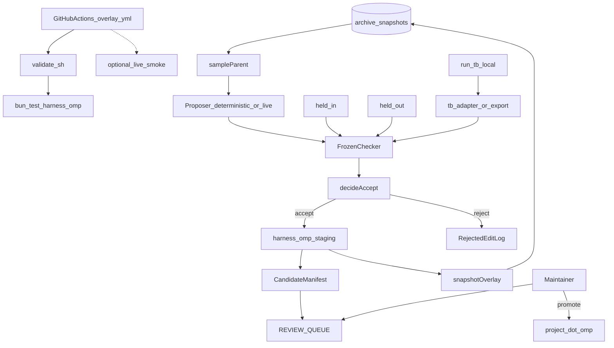
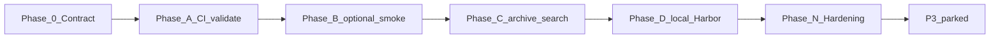

# Improveness — Master Execution Plan (P2)

> Approved execution contract (nawab feature mode). This file **is** the license to implement P2 of the Improveness overlay at `harness/omp/`. It is **not** a license to patch OMP core, push to `can1357/oh-my-pi`, auto-apply candidates to built-ins, or run public Terminal-Bench 2.

> Snapshot of the approved draft: [docs/plans/p2-omp-overlay.md](docs/plans/p2-omp-overlay.md). Edit **this** file when the contract changes.

> Nawab master plan (feature mode). Skills applied: `nawab-plans`, `planning.mdc`, `agentic-system-design`, `system-design-tradeoffs`, `learn-while-building`. Spec Kit still collapsed: no `.specify/` in P2.

> Do not edit Cursor plan files. Do not start DGM/AlphaEvolve/SIA weight updates. Do not treat public Terminal-Bench 2 as evolver fitness.

Source survey: [Lilian Weng, “Harness Engineering for Self-Improvement” (Jul 2026)](https://lilianweng.github.io/posts/2026-07-04-harness/). Seed harness: in-tree [oh-my-pi/](oh-my-pi/). Overlay: [harness/omp/](harness/omp/).

---

## §0 Plan metadata

- **Mode:** feature (major addition to the existing Improveness overlay; OMP stays vendored)
- **Stack:** TypeScript/Bun drivers + Markdown `.omp/` artifacts + root GitHub Actions. Vendored OMP = Bun monorepo (`bun@1.3.14`). Tests: `bun test` under `harness/omp/`.
- **Base branch:** `main`
- **Branch strategy:** continue `cursor/harness-research-docs-4005` (open as [PR #2](https://github.com/Vinayak-RZ/Improveness/pull/2)) unless a reviewer asks for a new `cursor/p2-omp-overlay-4005` after P1 merges
- **Authority docs:** [docs/proposals/00–05](docs/proposals/00-architecture.md); [DECISIONS.md](DECISIONS.md) D5–D12; [KERNEL.md](harness/omp/KERNEL.md); [SURFACES.md](harness/omp/SURFACES.md); [oh-my-pi#7907](https://github.com/can1357/oh-my-pi/issues/7907)
- **Estimated commits:** **11** (major-backend class 10–15; not padded)
- **Lead agent role:** orchestrate, commit, push, update PR #2, integrate subagent output, run gates

**Hard scope vs P1 leftovers:** P1 deferred three items. P2 implements **two and a half**:

| P1 leftover | P2 treatment |
|-------------|--------------|
| Live smoke required in CI | **Required job** = `validate.sh`. Live smoke is an **optional** job that skips without repo secrets (does not fail PRs/forks) |
| Archive-driven evolutionary search | **In scope** — bounded loop; staging + archive + queue only |
| Public Terminal-Bench 2 / Harbor campaign | **Out of scope (P3)** — P2 adds a **local** runner for already-shaped `tb-adapter` tasks |

---

## §1 North star & scope boundary

### Objective

A maintainer can run the P0/P1 overlay gate in GitHub Actions, and a bounded archive-driven search can propose overlay edits that land in `staging/` + `archive/` + `REVIEW_QUEUE.md` — never as auto-applied authority, never against public TB2.

### Deliverables

- `.github/workflows/overlay.yml` — Improveness-owned; runs `harness/omp/scripts/validate.sh` with Bun 1.3.14
- Optional live-smoke workflow job (skip / no-op without secrets)
- `harness/omp/drivers/search.ts` — `sampleParent` → propose → frozen checker → `decideAccept` → stage → snapshot → queue
- Deterministic proposer used by tests and `validate.sh` (no LLM)
- Optional live evolver behind `OMP_LIVE_SEARCH=1` (same skip pattern as smoke)
- `harness/omp/drivers/run-tb-local.ts` — execute Harbor-shaped local tasks; do not pull the public TB2 set
- KERNEL / SURFACES / archive README updated for the search loop
- `validate.sh` extended; PROGRESS / LEARNING / D11–D12

### Non-goals

- No public Terminal-Bench 2 dataset, Harbor cloud campaign, or Docker Harbor install
- No treating TB2 items as evolver fitness (proposal P5)
- No auto-promote from staging → `overlay/.omp/` or `oh-my-pi/packages/`
- No Spec Kit `.specify/`
- No Agent Patterns Catalog ids
- No PR or push to `can1357/oh-my-pi`
- No edits to `system-prompt.md` / `system-prompt.ts` as an improvement surface
- No DGM/AlphaEvolve/SIA/weight updates as the product
- No making live LLM calls a required CI gate
- No rewriting `learn` / memory / autolearn / skills
- No second core `ModelRole` patch unless a P2 gate fails (D9)

### Priority

- **P2 (this wave):** Phases 0, A, B, C, D, N
- **P3 (parked):** public TB2/Harbor campaign; required live-smoke; Spec Kit; catalog ids; search that writes the canonical overlay

---

## §2 Prerequisites & blockers

| Item | Status | Blocks | Resolution |
|------|--------|--------|------------|
| P0 + P1 overlay complete (`validate.sh` 41 tests, 20 fixtures, archive primitive, TB adapter, hidden roles) | done | all P2 phases | [PROGRESS.md](PROGRESS.md) |
| User approves this nawab plan | done (2026-08-15) | Phase 0 | approval recorded; Phase 0 is this commit |
| Bun 1.3.14 for drivers/tests | done in prior wave | Phase A locally | re-verify at Phase A start |
| GitHub Actions on Improveness root | missing (only under `oh-my-pi/.github/`) | Phase A | add root workflow; do **not** reuse OMP `coding-agent-heavy` |
| LLM API keys | optional | none of required P2 gates | live smoke / live search skip without keys |
| Harbor CLI / Docker / TB2 dataset | N/A | nothing | P2 runner is local bash + frozen checker |
| Spec Kit project | N/A | nothing | still collapsed |

**Hard rule:** Phase A does not start until the Phase 0 human checkpoint is cleared. Later phases stay sequential per §7.

---

## §3 Authority & artifact map

| Document | Path | Role |
|----------|------|------|
| This plan | `IMPLEMENTATION_PLAN.md` | Live P2 execution contract |
| P2 snapshot | `docs/plans/p2-omp-overlay.md` | Approved draft; do not treat as live if this file differs |
| KERNEL / SURFACES | `harness/omp/` | Writable by lead only; evolver-forbidden |
| Archive primitive | `harness/omp/drivers/archive.ts` | Read + extend; do not drop `isKernelRel` |
| Self-Harness | `harness/omp/drivers/self-harness.ts` | Reuse `decideAccept` / `stageCandidate` |
| TB adapter | `harness/omp/evals/tb-adapter/` | Local Harbor shape only |
| OMP source | `oh-my-pi/packages/` | Read-only unless a §9 WS-B row is opened |
| OMP workflows | `oh-my-pi/.github/workflows/` | Do not adopt as Improveness gate |
| Spec Kit | `.specify/` | N/A |

Subagents: all authority docs **read-only**. Writable paths unless a spawn says otherwise: `harness/omp/**`, `.github/workflows/overlay.yml`, root authority markdown listed in §12. `oh-my-pi/packages/**` is **read-only**.

---

## §4 Architecture & system map



### Target layout (additions only)

```text
.github/workflows/overlay.yml          # NEW — Improveness gate
harness/omp/
  drivers/
    search.ts                          # NEW — bounded archive loop
    propose.ts                         # NEW — deterministic + optional live
    run-tb-local.ts                    # NEW — local Harbor-shaped runner
    archive.ts                         # existing — keep isKernelRel
    self-harness.ts                    # existing — reuse decide/stage
  tests/
    search.test.ts                     # NEW
    run-tb-local.test.ts               # NEW
  archive/README.md                    # UPDATE — loop exists; promote is human
  PHASE_E_PARKED.md                    # UPDATE or retire after Phase C
```

### Search loop (normative)

```text
runSearch({ repoRoot, stepCap, proposer }):
  if stepCap < 1 or stepCap > MAX_STEP_CAP (8): throw
  for i in 1..stepCap:
    parentId = sampleParent(listArchive(repoRoot))
    work = restoreParentToWorktree(parentId)   # never writes KERNEL / checker / oh-my-pi/packages
    files = proposer.propose({
      parent: work,
      heldInOnly: true,                 # must not read held-out traces or prompts
      writeCheck: assertEvolverWrite
    })
    before/after = frozen checker on held-in + held-out
    decision = decideAccept(...)
    log round (parentId, decision, scores)     # keep rejects (safety rule 4)
    if decision == accept:
      stageCandidate(files)                    # staging/ only
      writeManifest + REVIEW_QUEUE row
      snapshotOverlay({ parentId, fitness: heldOut.passed / heldOut.total })
    # never applyCandidate onto overlay/.omp or oh-my-pi
  stop
```

Default `stepCap = 3`. Hard max `8`. Exceeding the cap throws; it does not keep going.

**Deterministic proposer (required for CI):** applies a known playbook/skill/tool delta from a fixture. No `createAgentSession`. This is the P2 gate.

**Live proposer (optional):** `createAgentSession` with `@evolver`, `restrictToolNames`, `assertEvolverWrite` on every path. Behind `OMP_LIVE_SEARCH=1` + credentials. Not a `validate.sh` blocker.

### Trust boundaries

Unchanged from KERNEL, plus:

- Search driver is a **maintainer tool**. It may write `staging/`, `archive/<id>/`, `REVIEW_QUEUE.md`, and manifests. It may **not** write `evals/checker/`, `KERNEL.md`, `SURFACES.md`, `validate.sh`, `system-prompt.md`/`.ts`, `oh-my-pi/packages/`, or `.github/workflows/`.
- Proposer never sees held-out fixture prompts, traces, or `expected/`.
- Fitness is the frozen checker only — not an LLM judge, not public TB2.
- Human promote remains the only path onto `overlay/.omp/` (D7, D12).

### Core patch rule

Same as D9. P2 has **no pre-scheduled WS-B row**. Candidate trigger: live proposer cannot be constrained without an SDK path allowlist. Until that fails: zero core patches.

---

## §5 Workstreams

- **WS-A OverlayLoop** — owns `harness/omp/**` and root authority markdown — depends on plan approval — lead
- **WS-C CI** — owns `.github/workflows/overlay.yml` only — depends on Phase 0 — lead; no parallel writer on that file
- **WS-B CorePatch** — N/A unless a WS-A gate fails — lead only

### WS-C — CI

- **Objective:** Improveness PRs run the overlay gate without OMP’s heavy suite
- **Phases:** A, B
- **Integration:** workflow calls `harness/omp/scripts/validate.sh`; does not `bun test` inside `oh-my-pi/`

### WS-A — OverlayLoop

- **Objective:** Bounded archive search + local TB runner
- **Phases:** 0, C, D, N
- **Integration:** search reuses archive + Self-Harness; runner reuses `exportHarborTask` + frozen checker

---

## §6 Agent orchestration & subagent spawn map

- **S1** — trigger: Phase A start — type: `explore` — readonly: true — task: confirm there is no root Improveness workflow yet; list what Bun setup action to use (`oven-sh/setup-bun@v2`, bun 1.3.14); confirm we must not trigger `oh-my-pi/.github/workflows/ci.yml` from the overlay workflow — sync: before commit 2 — gate: notes in LEARNING.md
- **S2** — trigger: Phase C start — type: `explore` — readonly: true — task: list existing exports from `archive.ts`, `self-harness.ts`, `allowlist.ts`, `manifest.ts` that search.ts must reuse (do not fork `decideAccept`) — sync: before commit 5 — gate: reuse list in LEARNING.md
- **S3** — trigger: Phase N — type: `security-review` — readonly: true — task: branch diff; search cannot write kernel; workflow does not echo secrets; no TB2 download URL — sync: before Phase N gate
- **S4** — trigger: Phase N — type: `bugbot` — readonly: true — optional if lead already reviewed

**Parallel limit:** 2. S1 and S2 are sequential. S3 and S4 may run together in Phase N.

**File ownership:** lead is the only writer. Subagents do not commit.

### Spawn S1 — CI surface

```text
Full Repository Path: /workspace
Workstream: WS-C
Task: Confirm Improveness has no root .github/workflows. Recommend a minimal Bun 1.3.14 + validate.sh workflow. State why oh-my-pi CI must not be the overlay gate.
Authority: this plan §4 / §10; oh-my-pi/.github/workflows/ci.yml
Return: recommended action versions + job split (required vs optional smoke)
Do NOT: edit files, add OMP coding-agent-heavy jobs
```

### Spawn S2 — search reuse

```text
Full Repository Path: /workspace
Workstream: WS-A
Task: Name the functions search.ts must import from archive.ts, self-harness.ts, allowlist.ts, run-eval.ts, manifest.ts
Authority: this plan §4 search loop; KERNEL.md
Return: import list + any missing helper (e.g. listArchive) that commit 5 must add
Do NOT: edit files, propose auto-apply
```

---

## §7 Phase map & dependencies



- **Phase 0 Contract** — WS-A — commit 1 — depends on approval — exit: IMPLEMENTATION_PLAN.md is this file; D11+D12 written; reviewer can answer “what does P2 ship vs park?”
- **Phase A CI validate** — WS-C — commit 2 — depends on 0 + S1 — exit: `overlay.yml` exists; a dry-run of the job steps is documented; `validate.sh` still exits 0 locally
- **Phase B optional smoke** — WS-C — commit 3 — depends on A — exit: second job cannot fail a PR that lacks secrets; `.env.example` documents both flags
- **Phase C archive search** — WS-A — commits 4–7 — depends on B + S2 — exit: deterministic search accepts a planted win to staging+archive+queue, rejects held-out regression, throws on cap/kernel; no overlay/.omp promote
- **Phase D local Harbor** — WS-A — commits 8–9 — depends on C — exit: runner scores ≥1 exported local task via `test.sh`; README still says not public TB2
- **Phase N Hardening** — all — commits 10–11 — depends on D — exit: `validate.sh` exits 0 including new greps
- **P3 parked** — public TB2, required live-smoke, Spec Kit, catalog ids

Human checkpoint after Phase 0 (contract freeze) and after Phase C (search never promotes) before Phase D.

---

## §8 Todo registry

```yaml
todos:
  - id: p2-phase-0-contract
    content: "Phase 0: copy this plan to IMPLEMENTATION_PLAN.md; write D11/D12"
    status: completed
  - id: p2-phase-a-ci
    content: "Phase A: root overlay.yml runs validate.sh with Bun 1.3.14"
    status: pending
  - id: p2-phase-b-smoke
    content: "Phase B: optional live-smoke job; skip without secrets"
    status: pending
  - id: p2-phase-c-search
    content: "Phase C: bounded archive search; deterministic proposer; human queue"
    status: pending
  - id: p2-phase-d-harbor
    content: "Phase D: local Harbor-shaped runner; no public TB2"
    status: pending
  - id: p2-phase-n-hardening
    content: "Phase N: validate.sh greps + PROGRESS/LEARNING"
    status: pending
  - id: p3-public-tb2
    content: "P3 parked: public Terminal-Bench 2 / Harbor campaign"
    status: pending
```

Rules: `in_progress` only for the single active phase. Do not mark `p3-public-tb2` in_progress in this wave.

---

## §9 Commit matrix

Work class: **major backend feature → 11 rows**. One row = one conventional commit. Tests in the same commit. Next row blocked until the gate passes.

### Phase 0 — Contract (WS-A)

- **1** — WS-A — `docs: adopt P2 overlay execution contract` — copy this file to `IMPLEMENTATION_PLAN.md`; D11 (P2 scope) + D12 (search stages, never promotes) in `DECISIONS.md`; PROGRESS current-phase line — Tests: none — Gate: IMPLEMENTATION_PLAN §1 non-goals include “no public TB2” and “no auto-promote”; D11/D12 present — Agent: lead

**Phase 0 gate:** contract reviewable without the paper. Stop for human checkpoint.

### Phase A — Required CI (WS-C)

- **2** — WS-C — `ci(harness): run overlay validate.sh on GitHub Actions` — `.github/workflows/overlay.yml` — `on: push/pull_request` path-filtered to `harness/omp/**`, `.github/workflows/overlay.yml`, and authority markdown the script diffs; job `validate` uses `oven-sh/setup-bun@v2` with `bun-version: 1.3.14`; `permissions: contents: read`; runs `bash harness/omp/scripts/validate.sh` — Tests: workflow file exists; does not `working-directory: oh-my-pi`; does not call OMP `coding-agent-heavy` — Gate: `rg -q 'validate.sh' .github/workflows/overlay.yml` and local `validate.sh` still 0 — Agent: lead (after S1)

**Phase A gate:** Improveness has its own overlay CI. OMP vendored workflows stay unused.

### Phase B — Optional live smoke (WS-C)

- **3** — WS-C — `ci(harness): add skip-gated live-smoke job` — second job `live-smoke` in the same workflow; runs `bun harness/omp/drivers/live-session-smoke.ts` (or a thin CLI wrapper) only when `OMP_LIVE_SMOKE=1` **and** a secret key is present; otherwise the job is `skipped` or the script returns skip and the job stays green — never `continue-on-error: true` hiding real failures when keys *are* present — update `.env.example` — Tests: document the skip predicate; do not commit secrets — Gate: a PR without secrets still has a green required `validate` job; smoke is not `required` in branch protection (we cannot set protection from here; workflow `validate` is the required-looking job) — Agent: lead

**Phase B gate:** live smoke can run in CI when the maintainer adds secrets; forks/PRs without keys stay green.

### Phase C — Archive-driven search (WS-A)

- **4** — WS-A — `feat(harness): add search step-cap and kernel guards` — `drivers/search.ts` skeleton: `MAX_STEP_CAP = 8`, `assertStepCap`, refuse kernel dest via `isKernelRel` / `assertEvolverWrite`; `listArchive` helper if missing — Tests: `tests/search.test.ts` — cap 0 and cap 9 throw; writing `evals/checker` throws — Gate: `bun test harness/omp/tests/search.test.ts` — Agent: lead (after S2)
- **5** — WS-A — `feat(harness): deterministic archive proposer` — `drivers/propose.ts` — `DeterministicProposer` reads a fixture delta (playbook/skill/tool under overlay paths only); must not import held-out `expected/` or `evals/held-out/**/fixture.json` prompts — Tests: proposer output paths pass `assertEvolverWrite`; a planted “see held-out” read throws — Gate: same test file — Agent: lead
- **6** — WS-A — `feat(harness): wire search to Self-Harness and archive` — `runSearch` implements §4 loop; reuse `decideAccept`, `stageCandidate`, `snapshotOverlay`, `sampleParent`; write reject log under `harness/omp/reports/search/` (gitignored bodies ok; keep one golden reject fixture in tests) — Tests: planted held-in win + held-out pass → staging files + archive `meta.json` parentId; planted held-out regression → no staging write, reject logged — Gate: `bun test harness/omp/tests/search.test.ts` — Agent: lead
- **7** — WS-A — `feat(harness): enqueue accepted search candidates` — on accept, write manifest + a `REVIEW_QUEUE.md` row with `apply to project .omp? = no`; **no** call that copies into `overlay/.omp/` or `oh-my-pi/` — Tests: queue row present; `git diff -- overlay/.omp/playbook` empty in the accept fixture — Gate: `bun test` search + review-queue — Agent: lead

**Phase C gate:** search is evidence generation. Stop for human checkpoint.

Optional live proposer may be a **same-commit** helper behind `OMP_LIVE_SEARCH=1` in commit 5 or 6 if it stays skip-gated and untested by `validate.sh`. Do not add a 12th matrix row for it.

### Phase D — Local Harbor runner (WS-A)

- **8** — WS-A — `feat(harness): run Harbor-shaped local tasks` — `drivers/run-tb-local.ts` — for each selected fixture (default: already-exported `evals/tb-adapter/*` plus on-the-fly `exportHarborTask` for one held-in + one held-out), run `tests/test.sh` with cwd = fixture `repo/`; collect pass/fail — Tests: `tests/run-tb-local.test.ts` — known-fail `no-secrets` repo fails; a known-pass expected workspace passes — Gate: `bun test harness/omp/tests/run-tb-local.test.ts` — Agent: lead
- **9** — WS-A — `docs(harness): local Harbor runner is not public TB2` — update `evals/tb-adapter/README.md`, `SURFACES.md` P5b row; runner must not fetch URLs, clone `terminal-bench`, or invoke a Harbor cloud CLI — Tests: `rg` gate in validate (commit 10) — Gate: README still contains “not a public Terminal-Bench 2” — Agent: lead

**Phase D gate:** local adapter is executable. Public TB2 remains parked.

### Phase N — Validation

- **10** — all — `chore(harness): extend validate.sh for P2 gates` — `validate.sh` also checks: `.github/workflows/overlay.yml` exists and calls `validate.sh`; `search.ts` contains `MAX_STEP_CAP` and `isKernelRel`/`assertEvolverWrite`; `search.ts` does not `writeFileSync` into `evals/checker`; `run-tb-local.ts` has no `terminal-bench` / `harbor` download URL — Gate: `harness/omp/scripts/validate.sh` exits 0 — Agent: lead
- **11** — all — `docs: sync PROGRESS and LEARNING after OMP overlay P2` — PROGRESS, LEARNING, archive README (loop exists; promote is human); retire or rewrite `PHASE_E_PARKED.md` — Tests: none — Gate: PROGRESS shows P2 0–D+N complete; P3 parked — Agent: lead

**Commit contract:** one logical change; never squash two matrix rows; conventional commits; push `cursor/harness-research-docs-4005` after each commit; update PR #2 at end of each phase.

---

## §10 Test & CI strategy

- **Fast** — unit/contract on search cap, kernel deny, deterministic propose, accept/reject, local TB runner — every overlay commit — `bun test harness/omp/tests/`
- **Medium** — `runSearch` with synthetic scores / planted fixtures (no live model) — Phase C+ — `bun test harness/omp/tests/search.test.ts`
- **Slow** — optional live smoke / live search — manual or optional CI job — keys required; not a Phase N blocker
- **OMP core** — do not run `oh-my-pi` `coding-agent-heavy`. Do not add those jobs to `overlay.yml`

**CI (new in P2):**

| Job | Required for PR green? | Secrets | Command |
|-----|------------------------|---------|---------|
| `validate` | yes | none | `bash harness/omp/scripts/validate.sh` |
| `live-smoke` | no | LLM key + `OMP_LIVE_SMOKE=1` | skip-gated smoke driver |

**Contract-first:** commit 4 (cap/kernel) before commit 6 (loop). Commit 8 runner tests before treating adapter as “runnable.”

**Subagents** must not return “done” without naming which fast-tier files they would have run; lead runs the actual tests.

---

## §11 Research log & decisions

- **Plan format** — nawab §0–§18 — D1
- **P2 vs P3 split** — ship CI + bounded search + local runner now; park public TB2 / Spec Kit / required-live-smoke — **D11** — cost, leakage (P5), and AHE “do not tune on the public set”
- **Search authority** — auto-apply vs stage+queue — **stage+queue (D12)** — D7; #7907; Weng reward hacking
- **Live smoke in CI** — required vs skip-gated — **skip-gated** — forks and this cloud environment have no keys; required smoke would make PRs red by default
- **Harbor** — public campaign vs local `instruction.md`+`test.sh` — **local only** — P1 already chose adapter-not-score; Docker/Harbor CLI is out of proportion to the 20-fixture suite
- **Proposer** — live SDK first vs deterministic first — **deterministic first** — Lin et al.: evolver can be cheap; CI must stay keyless
- **Fitness** — LLM judge vs frozen checker — **checker** — adoption step 5; archive already uses numeric fitness
- **Step cap** — unbounded mutate vs hard cap — **cap 3 default / 8 max** — `agentic-system-design` + safety rule 7
- **Workflow location** — extend `oh-my-pi/.github` vs root Improveness workflow — **root** — overlay is not an OMP package change; OMP CI is the wrong gate
- **Reuse** — new accept logic vs `decideAccept` — **reuse** — one predicate; search is a driver, not a second gate

---

## §12 Documentation & artifact sync

- **Plan approved** — Phase 0 commit 1 copies this file to `IMPLEMENTATION_PLAN.md`
- **Phase complete** — `PROGRESS.md`; 2–4 `LEARNING.md` bullets
- **Arch choice** — `DECISIONS.md` D11/D12 in commit 1
- **New surface** — search is a **driver**, not a new AHE component; update SURFACES proposal map + archive README in the same commits that add behavior (7 and 9)
- **KERNEL** — add `drivers/search.ts` may not write kernel paths; add `.github/workflows/overlay.yml` as maintainer-only (evolver-forbidden) in commit 4 or 10
- **Cutover** — N/A

---

## §13 Quality gates & checkpoints

- **Phase 0 done** — IMPLEMENTATION_PLAN is this contract; D11/D12 exist — blocks Phase A
- **Phase A done** — `overlay.yml` calls `validate.sh` — blocks Phase B
- **Phase B done** — smoke job cannot fail keyless PRs — blocks Phase C
- **Phase C done** — search tests: accept→stage+archive+queue; reject held-out; cap/kernel throw — blocks Phase D
- **Phase D done** — local runner tests; README not-TB2 — blocks Phase N
- **Phase N done** — `validate.sh` exits 0 with P2 greps — blocks “P2 complete”
- **PR ready** — fast tier green — blocks asking for review
- **Hardening** — S3: no secrets in workflow logs; no TB2 URL — blocks claiming P2 done

### Human checkpoints

- Approve this plan before Phase 0
- After Phase 0: freeze P2 vs P3 split
- After Phase C: confirm search never promotes
- Never: auto-promote staging; never score the evolver on public TB2

---

## §14 Validation & hardening

### Repo walkthrough

1. Static audit: no secrets in workflow, playbook, traces; search cannot write checker/kernel/`system-prompt`
2. Fast → medium tests under `harness/omp/tests/`
3. Adjacent: search reuses `decideAccept` (no second predicate); CI does not invoke OMP heavy tests
4. ponytail-review on `harness/omp/` + `.github/workflows/overlay.yml`
5. speckit-converge — N/A
6. Extra allowlist/search cases only inside Phase N via plan revision
7. Manual: `validate.sh`; optional `OMP_LIVE_SMOKE=1` smoke if keys exist

### Orchestrator additions (Phase N)

```text
6. .github/workflows/overlay.yml exists and references validate.sh
7. search.ts has MAX_STEP_CAP and a kernel-path guard
8. search.ts does not write evals/checker
9. run-tb-local.ts / tb-export.ts do not mention a public TB2 download URL
```

---

## §15 Rollout & cutover

N/A — no production consumer switch. Enabling CI is merging the workflow to `main` (via PR #2). Rollback of a bad search candidate remains `rollback-candidate.ts`. Disabling search is “do not run `search.ts`.”

Do not publish to npm. Do not open an upstream OMP PR. Do not register a Harbor/TB2 leaderboard run.

---

## §16 Exit criteria

### P2 (must pass)

- [x] IMPLEMENTATION_PLAN.md is this contract; D11 + D12 recorded
- [ ] `.github/workflows/overlay.yml` runs `validate.sh` with Bun 1.3.14
- [ ] Live-smoke CI job cannot fail a keyless PR
- [ ] `runSearch` throws on invalid step cap and kernel writes
- [ ] Deterministic proposer cannot read held-out fixtures
- [ ] Accept path: staging + archive parentId + REVIEW_QUEUE row; `overlay/.omp` unchanged
- [ ] Reject path: held-out regression writes no staging files
- [ ] Local Harbor runner executes adapter `test.sh` against fixture repos
- [ ] Docs still say the adapter is not a public TB2 campaign
- [ ] `harness/omp/scripts/validate.sh` exits 0
- [ ] PROGRESS.md reflects P2 complete; P3 parked
- [ ] PR #2 updated with gate evidence

### P3 (this wave — parked)

- [ ] Public Terminal-Bench 2 / Harbor campaign
- [ ] Live smoke required (red without keys)
- [ ] Spec Kit `.specify/`
- [ ] Agent Patterns Catalog ids
- [ ] Search that writes canonical `overlay/.omp/` without a human

---

## §17 Risks & contingencies

- **Search becomes auto-apply** — med / critical — D12 + commit 7 test that overlay playbook is unchanged — contingency: fail Phase C; do not continue
- **Held-out leakage into proposer** — med / high — commit 5 test; proposer API takes `heldInOnly: true` — contingency: fail Phase C
- **Public TB2 treated as fitness** — med / high — §1 non-goals; commit 9/10 greps — contingency: delete any download/runner that pulls TB2
- **Required live-smoke reddens every PR** — high / med — skip-gated job (D11) — contingency: keep `validate` as the only required job
- **OMP CI accidentally adopted** — low / med — S1; path filters; no `working-directory: oh-my-pi` — contingency: revert workflow
- **Secrets echoed in Actions logs** — med / high — S3; do not `echo` env; smoke prompt is “pong” only — contingency: redact and rotate
- **Unbounded search cost** — med / med — hard cap 8 — contingency: default 3; no retry-on-reject beyond cap
- **Scope creep into Spec Kit / catalog / core** — med / high — §1 — contingency: park as P3; do not add §9 rows without plan revision
- **SDK cannot restrict live proposer paths** — low / high — wrapper + `assertEvolverWrite`; last resort WS-B — contingency: ship deterministic-only and leave live proposer skipped

---

## §18 Execution protocol

```text
1. Load this plan + nawab-plans; ponytail on every code edit
2. Verify §2: plan approved; Bun present before Phase A
3. Per phase in §7:
   a. Restate objective; mark that phase todo in_progress
   b. Spawn S1 (Phase A) or S2 (Phase C) or S3/S4 (Phase N) as specified
   c. For each §9 row in that phase only:
      implement → test → gate → commit → push origin cursor/harness-research-docs-4005
      (never batch two matrix rows)
   d. Integrate subagent notes into LEARNING.md at the sync point
   e. Phase gate → PROGRESS.md → update PR #2
   f. Stop for human checkpoint after Phase 0 and Phase C
4. Do not start P3 in this wave
5. Phase N: §14 walkthrough + validate.sh
6. §15 is N/A
7. Verify §16 P2 → PR #2 body lists gate commands and results
```

After each phase, report: what landed, commit hashes, unpushed count, What you learned (2–4 bullets).

---

## Open questions

None. Defaults in §11 were accepted on approval (2026-08-15):

1. Live smoke stays **skip-gated** (not required).
2. Harbor stays **local adapter runner** (not public TB2).
3. Search **stages + queues** (does not promote).

## Approval

**Mode:** feature  
**Approved:** 2026-08-15. Phase 0 (this commit) adopts the contract.  
Stop for the Phase 0 human checkpoint before Phase A. Lead agent follows **§18 Execution protocol**.
