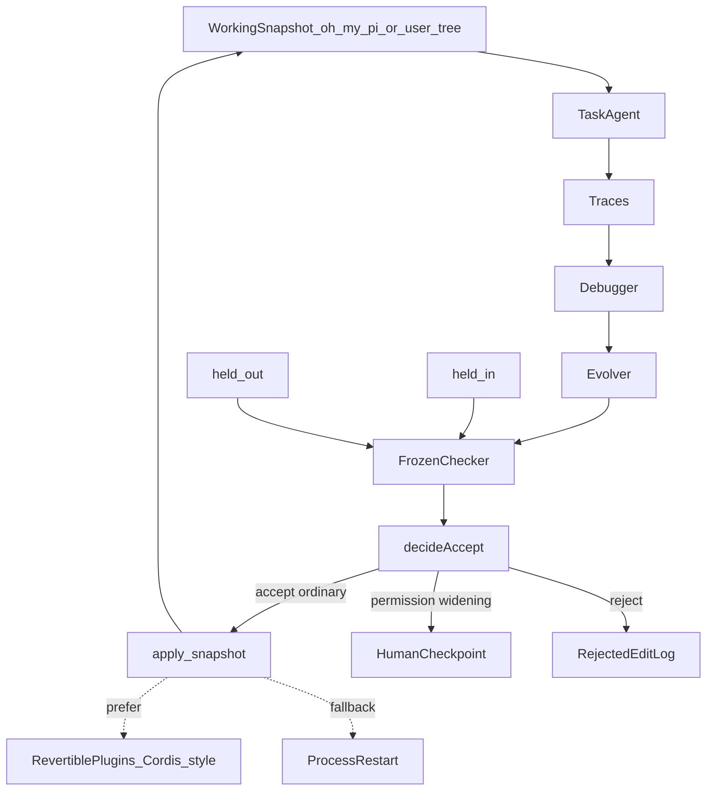
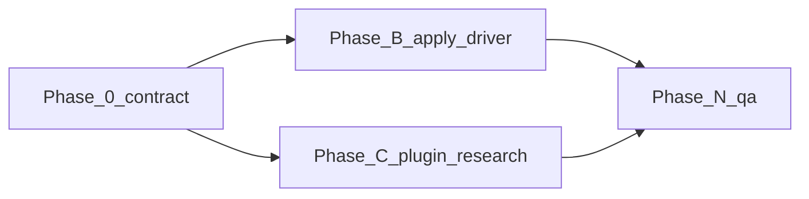

# Improveness — Master Execution Plan (P3 snapshot apply)

> Approved execution contract (nawab feature mode). This file **is** the license to align Improveness with the real product: running it on a **working snapshot** of Oh My Pi (or any agent tree you point at) **changes that harness’s code** after the Self-Harness gate. It is **not** a license to push to `can1357/oh-my-pi`, silence `evals/checker`, evolve `system-prompt.md`, skip the human checkpoint for permission-widening, or treat public Terminal-Bench as evolver fitness.

> P2 overlay contract snapshot: [docs/plans/p2-omp-overlay.md](docs/plans/p2-omp-overlay.md). P3 snapshot: [docs/plans/p3-snapshot-apply.md](docs/plans/p3-snapshot-apply.md). Edit **this** file when the contract changes.

> Nawab master plan (feature mode). Skills applied: `nawab-plans`, `planning.mdc`, `agentic-system-design`, `system-design-tradeoffs`, `learn-while-building`. Spec Kit still collapsed: no `.specify/` in P3.

> Do not edit Cursor plan files. Do not start DGM/AlphaEvolve/SIA weight updates. No public Terminal-Bench 2 as evolver fitness.

Source survey: [Lilian Weng, “Harness Engineering for Self-Improvement” (Jul 2026)](https://lilianweng.github.io/posts/2026-07-04-harness/). Dynamic composition: [Shi et al., spatiotemporal composability](docs/methods/spatiotemporal-composability.md). Seed snapshot: in-tree [oh-my-pi/](oh-my-pi/). Overlay: [harness/omp/](harness/omp/). Product spec: [docs/proposals/06-snapshot-apply.md](docs/proposals/06-snapshot-apply.md).

---

## §0 Plan metadata

| Field | Value |
|-------|-------|
| **Mode** | feature (vision realignment + gated snapshot apply; Cordis research, not a Cordis rewrite) |
| **Stack** | TypeScript/Bun drivers + Markdown `.omp/` artifacts + in-tree OMP snapshot (`bun@1.3.14`). Tests: `bun test` under `harness/omp/`. QA: `bash harness/omp/scripts/qa.sh` |
| **Base branch** | `main` |
| **Feature branch** | `cursor/snapshot-apply-vision-4005` |
| **Authority docs** | [DECISIONS.md](DECISIONS.md) D5–D14; [KERNEL.md](harness/omp/KERNEL.md); [SURFACES.md](harness/omp/SURFACES.md); [06-snapshot-apply.md](docs/proposals/06-snapshot-apply.md) |
| **Estimated commits** | **7** (medium product feature; Phase 0 is this contract) |
| **Lead agent** | Orchestrate, commit, push, open/update PR, run `qa.sh` |

P2 leftover that this wave **does** take: search that only stages. P3 makes accept mutate the working snapshot. Public TB2 stays out of fitness.

---

## §1 North star & scope boundary

### Objective

A person using Oh My Pi (or any agent snapshot) can run Improveness and, after held-in/held-out accept, get **actual code changes** on that working snapshot: tools, skills, orchestration, or the core agentic loop — without writing the checker, the system prompt, or upstream GitHub, and without needing to kill the runtime when a change is revertible.

### Deliverables

- D14 + KERNEL/SURFACES/CACD rewritten for snapshot apply (Phase 0 — this file)
- Method note + references for spatiotemporal composability / Cordis / DeepSeek Harness
- Teaching README vision aligned with D14
- Later: `apply-snapshot` driver (not named `auto-apply.ts`) that writes the working snapshot after `decideAccept`
- Later: allowlist opens snapshot paths except frozen kernel rows
- Later: plugin/HMR research notes against OMP `ExtensionAPI` (no Cordis vendor in this wave unless a later commit matrix row is opened)

### Non-goals

- No public Terminal-Bench 2 dataset, Harbor cloud campaign, or Docker Harbor install
- No treating TB2 items as evolver fitness
- No push or PR to `can1357/oh-my-pi`
- No evolver writes to `evals/checker/`, `system-prompt.md`, `system-prompt.ts`, `approval.ts`, Improveness QA/CI
- No silent permission / network / destructive widening (human checkpoint)
- No rewriting OMP onto Cordis in Phase 0
- No DGM/AlphaEvolve/SIA/weight updates as the product
- No making live LLM calls a required CI gate
- No driver named `auto-apply.ts` (review-queue test forbids that filename)

### Priority

| Priority | Items |
|----------|-------|
| **P0 (this wave)** | Phase 0 contract + D14 docs; Phase B apply driver; Phase N `qa.sh` |
| **P1** | Live `@evolver`; plugin unload / HMR against OMP extensions |
| **P2 (parked)** | Public TB2 as report-only; required live-smoke; Spec Kit |

---

## §2 Prerequisites & blockers

| Item | Status | Blocks | Resolution |
|------|--------|--------|------------|
| P2 overlay complete (CI, search, local-20, CACD, 7 sims) | done | all P3 | [PROGRESS.md](PROGRESS.md) |
| Vision correction (snapshot apply, not overlay-only) | done (user 2026-08-17) | Phase 0 | D14 |
| Cordis paper read | done for Phase 0 | Phase C research | [method note](docs/methods/spatiotemporal-composability.md) |
| `search.ts` still stage-only | current code | Phase B | keep until apply driver; do not pretend D12 is the product |
| Bun 1.3.14 | done | QA | pin in overlay.yml |

**Hard rule:** Phase B does not start until Phase 0 catalog needles pass `qa.sh`.

---

## §3 Authority & artifact map

| Document | Path | Role |
|----------|------|------|
| This plan | `IMPLEMENTATION_PLAN.md` | Live P3 execution contract |
| P2 snapshot | `docs/plans/p2-omp-overlay.md` | Historical; D12-as-shipped |
| P3 snapshot | `docs/plans/p3-snapshot-apply.md` | Copy of this contract at approval |
| KERNEL / SURFACES | `harness/omp/` | Writable by lead only; evolver-forbidden |
| Snapshot apply spec | `docs/proposals/06-snapshot-apply.md` | Product |
| Spatiotemporal note | `docs/methods/spatiotemporal-composability.md` | Runtime research |
| OMP source | `oh-my-pi/` | **Working snapshot** — apply target after gate (D14). Not upstream. |
| Checker | `harness/omp/evals/checker/` | Frozen |
| Spec Kit | `.specify/` | N/A |

Subagents: authority docs read-only unless the spawn says otherwise. Never edit Cursor plan files.

---

## §4 Architecture & system map



### Trust boundaries

- Checker, budgets, model-role map, secrets, Improveness QA: outside the evolver
- Working snapshot tools/skills/orchestration/loop: inside after accept
- Upstream GitHub: outside unless a human asks
- Live unload: preferred; not required for Phase B file apply

### Target layout (unchanged tree, new meaning)

```text
oh-my-pi/                 working snapshot (D14 apply target)
harness/omp/              Improveness loop, overlay, checker, QA
harness/omp/staging/      P2 lag + rollback material
docs/methods/             includes spatiotemporal-composability.md
docs/proposals/06-*.md    snapshot-apply product
```

---

## §5 Workstreams

| ID | Name | Owns paths | Depends on | Lead |
|----|------|------------|------------|------|
| WS-A | Contract | KERNEL, SURFACES, CACD, DECISIONS D14, plan, README | — | lead |
| WS-B | Apply driver | `drivers/apply-snapshot.ts`, allowlist, search hook | Phase 0 green | lead |
| WS-C | Composability research | method note, optional OMP extension unload spike | Phase 0 | lead |

WS-C does **not** vendor Cordis unless a later ADR opens that.

---

## §6 Agent orchestration & subagent spawn map

N/A for Phase 0 — lead writes docs. Phase B may spawn an explore agent on `oh-my-pi/packages/coding-agent` loop/extension files (readonly) before opening allowlist prefixes.

- Parallel limit: 2
- File ownership: one writer per file per commit

---

## §7 Phase map & dependencies



| Phase | Objective | Workstreams | Exit gate |
|-------|-----------|-------------|-----------|
| 0 | D14 contract, catalog needles, teaching README, paper note | WS-A | `qa.sh` green; plan contains `No public Terminal-Bench` and `working snapshot` |
| B | Gated apply onto working snapshot after accept | WS-B | tests: accept writes snapshot; kernel still denied; no `auto-apply.ts` |
| C | Document OMP extension unload gap vs Cordis; optional spike | WS-C | method note still accurate; no required code |
| N | `qa.sh` + catalog + sims | all | `bash harness/omp/scripts/qa.sh` |

Cutover: N/A — Improveness is the repo.

---

## §8 Todo registry

```yaml
todos:
  - id: phase-0-contract
    content: "Phase 0: D14, KERNEL/SURFACES/CACD, P3 plan, spatiotemporal note, README"
    status: in_progress
  - id: phase-b-apply
    content: "Phase B: apply-snapshot driver + allowlist for snapshot paths except kernel"
    status: pending
  - id: phase-c-plugins
    content: "Phase C: OMP extension unload vs Cordis; prefer revertible apply"
    status: pending
  - id: phase-n-qa
    content: "Phase N: qa.sh green after driver changes"
    status: pending
```

---

## §9 Commit matrix

Medium feature → **7** commits target. Phase 0 may land as 1–2 docs commits.

| # | WS | Commit | Contents | Tests | Gate | Agent |
|---|-----|--------|----------|-------|------|-------|
| 1 | A | `docs(vision): adopt D14 snapshot-apply contract` | D14, KERNEL, SURFACES, CACD, plan, catalog, paper note, README | `qa.sh` | catalog needles | lead |
| 2 | B | `feat(omp): apply accepted candidates to working snapshot` | `apply-snapshot.ts`, search hook | unit | kernel denied | lead |
| 3 | B | `feat(omp): open snapshot allowlist except frozen kernel` | `allowlist.ts` | unit | packages tools ok, approval.ts no | lead |
| 4 | C | `docs(omp): OMP extension unload vs Cordis` | method note update / spike notes | none | links resolve | lead |
| 5 | B | `test(omp): gated snapshot apply vs kernel refuse` | sims/tests | `qa.sh` | auto-promote still refuses kernel | lead |
| 6 | A | `docs: PROGRESS/LEARNING Phase B/C` | authority | none | — | lead |
| 7 | all | `chore: P3 validation` | if needed | `qa.sh` | green | lead |

---

## §10 Test & CI strategy

| Tier | Purpose | Trigger | Command |
|------|---------|---------|---------|
| Fast | CACD catalog, unit, sims | every PR | `bash harness/omp/scripts/qa.sh` |
| Medium | local-20 benchmark | optional | `bun harness/omp/drivers/run-benchmark.ts` |
| Slow | live smoke/search | skip without keys | `OMP_LIVE_SMOKE` / `OMP_LIVE_SEARCH` |

CI: `.github/workflows/overlay.yml` installs ripgrep, Bun 1.3.14, runs `validate.sh` via `qa.sh`.

**Contract-first:** catalog needles change in the same commit as the files they name.

---

## §11 Research log & decisions

| Topic | Options | Choice | Source | Record |
|-------|---------|--------|--------|--------|
| Apply target | review-queue forever / working snapshot / upstream PR | working snapshot | user vision 2026-08-17 | D14 |
| Runtime after self-mod | process restart / Cordis-style plugins / containers | prefer plugins; restart fallback | [cordiverse/paper](https://github.com/cordiverse/paper) | method note |
| System prompt | evolve / freeze | freeze | AHE −2.3 pp | KERNEL |
| Public TB2 | fitness / report / never | never as fitness | D11, proposal P5 | this plan |
| #7907 | obey as overlay-only / obey as upstream-only | upstream-only | user vision | D14 |

---

## §12 Documentation & artifact sync

| Event | Update |
|-------|--------|
| Phase 0 | IMPLEMENTATION_PLAN, DECISIONS D14, PROGRESS, LEARNING, README |
| Phase B | KERNEL current-driver note removed or narrowed; SURFACES; CACD Delivery |
| Phase C | spatiotemporal method note |
| Catalog change | `cacd/catalog.ts` same commit |

---

## §13 Quality gates & checkpoints

| Gate | When | Command | Blocks |
|------|------|---------|--------|
| Phase 0 done | this PR | `qa.sh` | Phase B |
| Phase B done | apply driver | `qa.sh` + new tests | Phase N |
| Human | permission widening | REVIEW_QUEUE | apply of *that* class |

### Human checkpoints

- [x] Vision: mutate working snapshot, not overlay-only
- [ ] Phase B: first real snapshot write behind the existing frozen checker
- [ ] Any candidate that widens bash/network/destructive/DAP/`computer`

---

## §14 Validation & hardening

1. `bash harness/omp/scripts/qa.sh`
2. Confirm catalog: `No public Terminal-Bench`, `working snapshot`, `D14`
3. Confirm KERNEL still names `evals/checker`, `system-prompt.md`, `approval.ts`
4. Confirm SURFACES still names `playbook`, `evolver`
5. Confirm REVIEW_QUEUE still contains `no auto-apply`
6. Do not add `drivers/auto-apply.ts`

Orchestrator remains `harness/omp/scripts/qa.sh` (validate.sh + qa-repo + simulate-architectures).

---

## §15 Cutover

N/A — no consumer cutover. Success is: docs match D14, then later `apply-snapshot` mutates `oh-my-pi/` (or a supplied tree) after accept.

---

## §16 Risks

| Risk | Mitigation |
|------|------------|
| Apply writes the checker | KERNEL markers + tests |
| Apply treated as upstream PR | D14 text; never configure `can1357` remote as push target |
| Live OMP session dies on every edit | Phase C; prefer plugins |
| Catalog needles stale | change catalog in the same commit |
| `auto-promote` sim confused with D14 | sim stays “no kernel / no skip-gate”; product is gated snapshot apply |

---

## §17 Open questions (non-blocking)

- Exact allowlist prefixes for the core loop (file list) — Phase B explore
- Whether to implement Cordis vs a thinner disposer registry on `ExtensionAPI`
- User-supplied snapshot root flag (`OMP_SNAPSHOT_ROOT`) vs only in-tree `oh-my-pi/`

---

## §18 Definition of done (P3)

- [x] D14 recorded; D7/D12 kept as historical with product-status banners
- [x] KERNEL/SURFACES/CACD describe working snapshot as apply target
- [x] Spatiotemporal composability method note + references
- [ ] `apply-snapshot` mutates working snapshot after accept
- [ ] Allowlist still denies checker / system-prompt / approval
- [ ] `qa.sh` green
- [ ] No public Terminal-Bench as fitness
