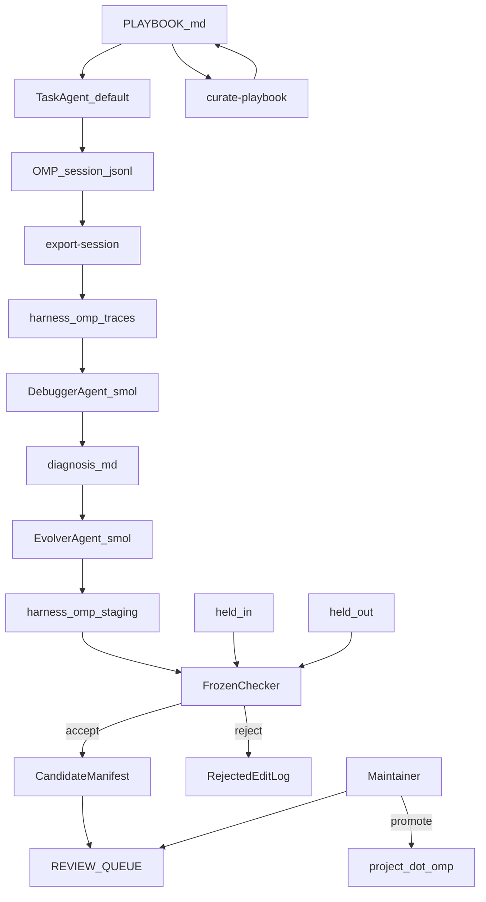
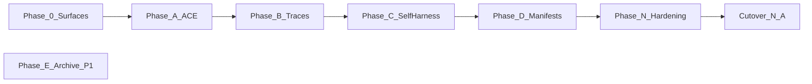

# Improveness — Master Execution Plan

> Approved execution contract (copy of the nawab feature-mode plan). This file **is** the license to implement the Improveness overlay at `harness/omp/`. It is **not** a license to patch OMP core, push to `can1357/oh-my-pi`, or auto-apply candidates to built-ins.

> Nawab master plan (feature mode). Skills applied: `nawab-plans`, `planning.mdc`, `agentic-system-design`, `system-design-tradeoffs`, `learn-while-building`. Spec Kit collapsed: no `.specify/` until a later software constitution.

> Do not edit the Cursor plan file. Update this copy when the contract changes.

# OMP self-improvement — Master Execution Plan

> Nawab master plan (feature mode). Skills applied this revision: `nawab-plans`, `planning.mdc`, `agentic-system-design`, `system-design-tradeoffs`, `learn-while-building`. Spec Kit collapsed: no `.specify/` until a later software constitution.

This document is the **entire execution contract**. After approval, implement **one phase at a time** per §18. Do not treat the earlier sectioned outline as authority; this file supersedes it.

Source survey: [Lilian Weng, “Harness Engineering for Self-Improvement” (Jul 2026)](https://lilianweng.github.io/posts/2026-07-04-harness/). Seed harness: in-tree [oh-my-pi/](oh-my-pi/).

---

## §0 Plan metadata

- **Mode:** feature (major addition to Improveness; OMP is vendored, not a second git root)
- **Stack:** Improveness overlay = TypeScript/Bun drivers + Markdown `.omp/` artifacts. Vendored OMP = Bun monorepo (`@oh-my-pi/pi-coding-agent` 17.3.4). Tests for new code: `bun test` under `harness/omp/`.
- **Base branch:** `main`
- **Branch strategy:** single feature branch `cursor/harness-research-docs-4005` (already open as PR #1)
- **Authority docs:** [docs/proposals/00-architecture.md](docs/proposals/00-architecture.md), [01-generic-harness.md](docs/proposals/01-generic-harness.md), [02-omp-gap-analysis.md](docs/proposals/02-omp-gap-analysis.md), [03-omp-proposed-changes.md](docs/proposals/03-omp-proposed-changes.md), [04-safety.md](docs/proposals/04-safety.md), [05-adoption-order.md](docs/proposals/05-adoption-order.md); [DECISIONS.md](DECISIONS.md) D5–D8; [oh-my-pi#7907](https://github.com/can1357/oh-my-pi/issues/7907)
- **Estimated commits:** **13** (major-backend class 10–15; not padded to 18+)
- **Lead agent role:** orchestrate, commit, push, update PR #1, integrate subagent output, run gates

**Hard scope shift vs prior contract:** [IMPLEMENTATION_PLAN.md](IMPLEMENTATION_PLAN.md) still says “docs and proposals only.” Phase 0 commit 1 **replaces** that file with this nawab contract and records **D9** (overlay-first implementation).

---

## §1 North star & scope boundary

### Objective

A maintainer-gated self-improvement loop on in-tree Oh My Pi: ACE playbook, miner-ready traces, debugger, held-in/held-out Self-Harness, and AHE manifests — without rewriting `SYSTEM.md` or auto-applying candidates to OMP built-ins.

### Deliverables

- `harness/omp/` — Improveness-owned overlay, drivers, evals, staging, review queue
- `oh-my-pi/.omp/` — install/symlink of the overlay for local runs (not a second source of truth)
- Drivers using [oh-my-pi/packages/coding-agent/src/sdk.ts](oh-my-pi/packages/coding-agent/src/sdk.ts) `createAgentSession`
- Frozen checker the evolver cannot write
- Tests + `harness/omp/scripts/validate.sh`
- Updated `IMPLEMENTATION_PLAN.md`, `PROGRESS.md`, `DECISIONS.md` (D9+), `LEARNING.md`

### Non-goals

- No PR or push to `can1357/oh-my-pi`
- No edits to [oh-my-pi/packages/coding-agent/src/prompts/system/system.md](oh-my-pi/packages/coding-agent/src/prompts/system/system.md) as an improvement surface
- No auto-apply to canonical `oh-my-pi/packages/coding-agent/src/tools/*.ts`
- No DGM / AlphaEvolve / SIA / weight updates in P0
- No Terminal-Bench / SWE-bench reproduction
- No reimplementation of existing `learn`, memory, autolearn, or skills
- No Spec Kit `.specify/` in this feature
- No rewriting Rust / hashline / LSP / DAP

### Priority

- **P0:** Phases 0, A, B, C, D, N (surfaces → ACE → traces/debugger → Self-Harness → manifests → hardening)
- **P1:** Phase E archive; live-LLM evals; `modelRoles.debugger` core enum; Terminal-Bench; ≥20-case suite

---

## §2 Prerequisites & blockers

- **In-tree OMP at `oh-my-pi/` (nested git removed)** — status: done — blocks: all — resolution: D8
- **Proposals P1–P7 written** — status: done — blocks: Phase 0 mapping — resolution: [03-omp-proposed-changes.md](docs/proposals/03-omp-proposed-changes.md)
- **User approves this nawab plan** — status: pending — blocks: Phase 0 execution — resolution: approval of this document
- **Bun available for drivers/tests** — status: pending (verify at Phase A start) — blocks: Phase A commit 3 — workaround: if Bun missing, install via OMP `packageManager` pin `bun@1.3.14`; do not start Phase A until `bun --version` works
- **LLM API keys for live `createAgentSession`** — status: optional — blocks: none of P0 — workaround: P0 gates use golden jsonl + deterministic curator/checker; live SDK runs are P1
- **OMP OAuth env placeholders** — status: done — blocks: none — do not restore hardcoded client secrets
- **Spec Kit project** — status: N/A — blocks: nothing

**Hard rule:** no execution phase starts while “user approves this plan” is pending. Phase A does not start if Bun is missing.

---

## §3 Authority & artifact map

- **Weng survey** — external URL — read-only research truth
- **Proposals 00–05** — `docs/proposals/` — read-only product spec (P1–P7, C1–C8, adoption 0–5)
- **This plan** — Cursor plan file — execution contract (writable only on plan revision)
- **IMPLEMENTATION_PLAN.md** — repo root — copy of this contract after Phase 0 commit 1
- **PROGRESS.md / DECISIONS.md / LEARNING.md** — repo root — live status, ADRs, phase learnings
- **KERNEL.md / SURFACES.md** — `harness/omp/` after Phase 0 — writable by lead only; evolver-forbidden
- **OMP source** — `oh-my-pi/packages/` — read-only unless a §9 WS-B row is opened
- **Coding config / nawab skill** — `.cursor/skills/nawab-plans/` — read-only process authority
- **Spec Kit** — `.specify/` — N/A

Subagents: all authority docs **read-only**. Writable paths unless a spawn says otherwise: `harness/omp/**`, root authority markdown listed above. `oh-my-pi/packages/**` is **read-only** until lead opens a WS-B commit row.

---

## §4 Architecture & system map



### Target layout

```text
harness/omp/
  SURFACES.md
  KERNEL.md
  REVIEW_QUEUE.md
  overlay/.omp/
    README.md
    AGENTS.md                 # lists PLAYBOOK.md as context
    playbook/PLAYBOOK.md
    playbook/curator.md
    agents/debugger.md
    agents/evolver.md
    hooks/                    # optional pre-hook excerpt
    skills/                   # evolver-writable later
    tools/                    # project tools only
    manifests/
  drivers/
    curate-playbook.ts
    export-session.ts
    run-eval.ts
    self-harness.ts
    apply-candidate.ts
    rollback-candidate.ts
  evals/
    checker/                  # KERNEL — evolver cannot write
    held-in/
    held-out/
    fixtures/                 # golden jsonl
  staging/
  traces/
  scripts/validate.sh
  tests/
oh-my-pi/                     # vendored; WS-B only if overlay fails
```

Install: symlink or copy `harness/omp/overlay/.omp/` → `oh-my-pi/.omp/` when running locally. Drivers always read/write `harness/omp/`, never `~/.omp/agent/` as source of truth (they may *read* a jsonl path the user points at).

### Trust boundaries

- **Kernel (evolver cannot write):** `evals/checker/**`, `SURFACES.md`, `KERNEL.md`, `system.md`, `system-prompt.ts`, `tools/approval.ts`, `config/model-roles.ts`, `session/role-models.ts`, model-role config, this plan
- **Editable surfaces (after Phase C):** `overlay/.omp/playbook/**`, `overlay/.omp/skills/**`, `overlay/.omp/tools/**`, staging copies of those
- **Secrets:** stay in env (existing `OMP_*` OAuth placeholders). Curator rejects secret-shaped strings
- **Human promote:** only path from staging → project `.omp/` or any OMP package file

### Core patch rule

Touch `oh-my-pi/packages/coding-agent/` only if a phase exit gate cannot be met from overlay + SDK + existing session jsonl. Candidate triggers (open WS-B, do not pre-schedule):

- Schema rejects unknown `modelRoles.debugger` — [model-roles.ts](oh-my-pi/packages/coding-agent/src/config/model-roles.ts), [settings-schema.ts](oh-my-pi/packages/coding-agent/src/config/settings-schema.ts) — Phase B
- Evolver path allowlist too coarse — [approval.ts](oh-my-pi/packages/coding-agent/src/tools/approval.ts) or SDK wrapper — Phase C
- Jsonl missing tool I/O — [session-persistence.ts](oh-my-pi/packages/coding-agent/src/session/session-persistence.ts) — Phase B or D

Until one fails: **zero core patches**.

---

## §5 Workstreams

- **WS-A OverlayLoop** — owns `harness/omp/**` and root authority markdown — depends on plan approval + Bun — lead
- **WS-B CorePatch** — owns named files under `oh-my-pi/packages/coding-agent/` — depends on a failed WS-A gate written into DECISIONS — lead only; no parallel writer

### WS-A — OverlayLoop

- **Objective:** Ship the self-improvement loop outside OMP core
- **Phases:** 0, A, B, C, D, N
- **Integration:** symlink overlay into `oh-my-pi/.omp/` at Phase A gate; drivers remain in `harness/omp/drivers/`

### WS-B — CorePatch

- **Objective:** Minimal OMP source change only after a documented overlay failure
- **Phases:** opened ad hoc inside B or C
- **Integration:** same branch; one revertible commit; still no `system.md` edits

---

## §6 Agent orchestration & subagent spawn map

- **S1** — trigger: Phase B start — type: `explore` — readonly: true — task: confirm jsonl fields in [session-persistence.ts](oh-my-pi/packages/coding-agent/src/session/session-persistence.ts) / [turn-persistence.ts](oh-my-pi/packages/coding-agent/src/session/turn-persistence.ts) are enough for `meta.json`, turns, tool I/O, outcome — sync: before commit 5 — gate: written field list in LEARNING.md
- **S2** — trigger: Phase C start — type: `explore` — readonly: true — task: map `createAgentSession` options for `restrictToolNames`, tool allowlist, custom agents from `.omp/agents` — sync: before commit 8 — gate: option list in LEARNING.md
- **S3** — trigger: Phase N — type: `security-review` — readonly: true — task: branch diff; kernel not writable; no secrets in playbook/traces — sync: before Phase N gate — gate: findings fixed or accepted in DECISIONS
- **S4** — trigger: Phase N — type: `bugbot` — readonly: true — task: review overlay/driver diff — sync: before validate.sh — optional if lead already reviewed

**Parallel limit:** 2. S1 and S2 are sequential (different phases). S3 and S4 may run together in Phase N.

**File ownership:** lead is the only writer. Subagents do not commit.

### Spawn S1 — jsonl completeness

```text
Full Repository Path: /workspace
Workstream: WS-A
Task: List session jsonl event types and whether tool input/output and verifier-like outcome exist
Authority: docs/proposals/03-omp-proposed-changes.md P1; this plan §4
Return: bullet list of fields + gap vs traces/meta.json,turns,tool_calls.jsonl,outcome.json
Do NOT: edit files, propose SYSTEM.md changes, expand to TUI
```

### Spawn S2 — SDK allowlist

```text
Full Repository Path: /workspace
Workstream: WS-A
Task: How to run createAgentSession with a project agent markdown and a restricted tool/path set
Authority: this plan §4 trust boundaries; oh-my-pi/packages/coding-agent/src/sdk.ts
Return: exact option names, example call shape, what cannot be restricted without a core patch
Do NOT: edit files
```

---

## §7 Phase map & dependencies



- **Phase 0 Surfaces** — WS-A — commits 1 — depends on plan approval — exit: reviewer can answer “what may the evolver touch?” from KERNEL.md + SURFACES.md; every P-item maps to a surface or “core later”
- **Phase A ACE** — WS-A — commits 2–4 — depends on 0 + Bun — exit: `bun test harness/omp/tests/curate-playbook.test.ts` green; playbook listed in overlay AGENTS.md; no `system.md` diff
- **Phase B Traces+Debugger** — WS-A — commits 5–6 — depends on A + S1 — exit: golden jsonl → stable trace tree; debugger allowlist test forbids write/edit/bash
- **Phase C Self-Harness** — WS-A — commits 7–9 — depends on B + S2 — exit: planted held-out regression rejected; held-in win that also passes held-out lands in `harness/omp/staging/` only
- **Phase D Manifests** — WS-A — commits 10–11 — depends on C — exit: one staging candidate has manifest + rollback test + REVIEW_QUEUE row
- **Phase N Hardening** — all — commits 12–13 — depends on D — exit: `harness/omp/scripts/validate.sh` exits 0
- **Cutover** — N/A — no consumer switch; overlay install is a local symlink, not a production cutover
- **Phase E Archive** — P1 parked — depends on N + cheap objective fitness — do not start in this wave

Human checkpoint after Phase 0 (surface freeze) and after Phase C (first gate behavior) before Phase D.

---

## §8 Todo registry

```yaml
todos:
  - id: phase-0-surfaces
    content: "Phase 0: SURFACES.md, KERNEL.md, overlay README, D9, replace IMPLEMENTATION_PLAN.md"
    status: pending
  - id: phase-a-ace
    content: "Phase A: ACE playbook scaffold, deterministic curator, context injection"
    status: pending
  - id: phase-b-traces
    content: "Phase B: jsonl exporter + read-only debugger agent"
    status: pending
  - id: phase-c-gate
    content: "Phase C: fixtures, frozen checker, allowlisted evolver, Self-Harness driver"
    status: pending
  - id: phase-d-manifests
    content: "Phase D: candidate manifests, rollback, REVIEW_QUEUE"
    status: pending
  - id: phase-n-hardening
    content: "Phase N: validate.sh, kernel-write audit, ponytail review"
    status: pending
  - id: phase-e-archive
    content: "Phase E (P1, parked): DGM-lite archive of project .omp/ only"
    status: pending
```

Rules: `in_progress` only for the single active phase. Do not mark Phase E in_progress in this wave.

---

## §9 Commit matrix

Work class: **major backend feature → 13 rows**. One row = one conventional commit. Tests in the same commit. Next row blocked until the gate passes.

### Phase 0 — Surfaces (WS-A)

- **1** — WS-A — `docs(harness): declare OMP surfaces and kernel` — `harness/omp/SURFACES.md`, `KERNEL.md`, `overlay/.omp/README.md`; D9 in DECISIONS.md; replace IMPLEMENTATION_PLAN.md with this contract; PROGRESS.md — Tests: checklist that P1–P7 each map to a surface or “core later” — Gate: files exist; KERNEL lists `system.md`, `system-prompt.ts`, `approval.ts`, `model-roles.ts`, `role-models.ts`, `evals/checker` — Agent: lead

**Phase 0 gate:** KERNEL.md + SURFACES.md reviewable without the paper. Stop for human checkpoint.

### Phase A — ACE playbook (WS-A)

- **2** — WS-A — `chore(harness): scaffold ACE playbook overlay` — `overlay/.omp/playbook/PLAYBOOK.md`, `curator.md`, `AGENTS.md` — Tests: none (stubs) — Gate: playbook sections present (strategies, failure modes, repo conventions); curator.md forbids SYSTEM.md and secrets — Agent: lead
- **3** — WS-A — `feat(harness): deterministic playbook curator` — `drivers/curate-playbook.ts`, `tests/curate-playbook.test.ts`, fixture jsonl — Tests: fixture session → expected PLAYBOOK delta; write outside `playbook/` throws — Gate: `bun test harness/omp/tests/curate-playbook.test.ts` — Agent: lead
- **4** — WS-A — `feat(harness): inject playbook via project context` — overlay AGENTS.md / optional `.omp/hooks/pre`; install note for symlink into `oh-my-pi/.omp/` — Tests: assertion that injection path does not touch `system.md` (grep gate in test or validate snippet) — Gate: `git diff -- oh-my-pi/packages/coding-agent/src/prompts/system/system.md` empty — Agent: lead

**Phase A gate:** curator test green; playbook is context, not system prompt. Reuse `learn` / memory / autolearn — do not rebuild them.

### Phase B — Traces and debugger (WS-A)

- **5** — WS-A — `feat(harness): export OMP jsonl to miner traces` — `drivers/export-session.ts`, `tests/export-session.test.ts`, `evals/fixtures/*.jsonl` — Tests: golden jsonl → `traces/<id>/{meta.json,turns/,tool_calls.jsonl,outcome.json}` — Gate: `bun test harness/omp/tests/export-session.test.ts` — Agent: lead (after S1)
- **6** — WS-A — `feat(harness): add read-only debugger agent` — `overlay/.omp/agents/debugger.md`; driver or task-agent recipe; allowlist test — Tests: restricted tool set is read/grep/find only; cannot write PLAYBOOK or source — Gate: `bun test harness/omp/tests/debugger-allowlist.test.ts` — Agent: lead

**Phase B gate:** exporter + debugger allowlist green. If S1 finds jsonl lossy, record D10 and optionally open WS-B (not a pre-allocated row).

### Phase C — Self-Harness gate (WS-A)

- **7** — WS-A — `test(harness): add held-in held-out fixtures and frozen checker` — `evals/held-in/` (3 fixtures), `evals/held-out/` (2 fixtures), `evals/checker/` — Tests: checker scores a known-pass and known-fail fixture without an LLM — Gate: `bun test harness/omp/tests/checker.test.ts` — Agent: lead
- **8** — WS-A — `feat(harness): allowlisted evolver agent` — `overlay/.omp/agents/evolver.md`; path allowlist helper — Tests: writes to playbook/skills/tools allowed; writes to checker, KERNEL, `system.md`, `packages/coding-agent` denied — Gate: `bun test harness/omp/tests/evolver-allowlist.test.ts` — Agent: lead (after S2)
- **9** — WS-A — `feat(harness): Self-Harness driver with staging accept` — `drivers/run-eval.ts`, `drivers/self-harness.ts` — Tests: planted playbook regression fails held-out; synthetic held-in win + held-out pass copies into `staging/` not `oh-my-pi/packages/` — Gate: `bun test harness/omp/tests/self-harness.test.ts` — Agent: lead

**Phase C gate:** accept/reject predicate implemented; checker path listed in KERNEL. Stop for human checkpoint.

Budget: evolver `smol` or `advisor`; task agent `default` (Lin et al. 2026).

### Phase D — Manifests and review queue (WS-A)

- **10** — WS-A — `feat(harness): candidate manifests and rollback` — `overlay/.omp/manifests/` schema, `drivers/apply-candidate.ts`, `drivers/rollback-candidate.ts` — Tests: apply then rollback restores parent hash — Gate: `bun test harness/omp/tests/manifest-rollback.test.ts` — Agent: lead
- **11** — WS-A — `docs(harness): maintainer review queue` — `REVIEW_QUEUE.md` plus one example row from a Phase C staging candidate — Tests: schema fields present (surface, files, parent hash, scores, rollback cmd) — Gate: file exists; no auto-apply script — Agent: lead

**Phase D gate:** one candidate is evidence in the queue, not applied authority.

### Phase N — Validation

- **12** — all — `chore(harness): add validation orchestrator` — `harness/omp/scripts/validate.sh` — Tests: script runs fast-tier tests + kernel grep — Gate: `harness/omp/scripts/validate.sh` exits 0 — Agent: lead
- **13** — all — `docs: sync PROGRESS and LEARNING after OMP overlay P0` — PROGRESS, LEARNING, README pointer to `harness/omp/` — Tests: none — Gate: PROGRESS shows Phases 0–D + N complete; Phase E parked — Agent: lead

**Commit contract:** one logical change; never squash two matrix rows; conventional commits; push this branch after each commit; update PR #1 at end of each phase (and after every turn with code changes).

---

## §10 Test & CI strategy

- **Fast** — unit/contract on curator, exporter, allowlists, checker, rollback — every overlay commit — `bun test harness/omp/tests/`
- **Medium** — Self-Harness driver with synthetic scores (no live model) — Phase C+ — `bun test harness/omp/tests/self-harness.test.ts`
- **Slow** — optional live `createAgentSession` — P1 / manual — only if keys present; not a Phase N blocker
- **OMP core** — only if a WS-B row lands — `bun --cwd oh-my-pi/packages/coding-agent run check` (biome + types). Do **not** run full `oh-my-pi` `bun test` (coding-agent-heavy) as a default gate

**Test locations:** `harness/omp/tests/*.test.ts` + `harness/omp/evals/fixtures/`.  
**Contract-first:** commit 7 (checker + fixtures) before commit 9 (driver). Commit 5 golden jsonl before any debugger that consumes traces.  
**CI:** Improveness has no app CI yet. Phase N validate.sh is the stand-in. Do not add a GitHub Actions matrix in this feature unless a later plan says so.

**Subagents** must not return “done” without naming which fast-tier files they would have run; lead runs the actual tests.

---

## §11 Research log & decisions

- **Plan format** — thin Cursor outline vs nawab §0–§18 — **nawab** — skill `nawab-plans` — D1 (extended: this feature uses the same 18 sections)
- **Where code lives** — patch OMP core vs Improveness `harness/omp/` overlay — **overlay-first** — AHE file-level surfaces; OMP already has `.omp/agents`, hooks, custom tools, `createAgentSession` — **D9** (write in Phase 0)
- **First loop** — ACE-only forever vs ACE then tools/middleware/memory — **ACE first, not only** — AHE prompt-only −2.3 pp; D5
- **Evolver model** — frontier vs mid/small — **smol/advisor** — Lin et al. 2026; D6
- **Auto-apply** — closed loop vs maintainer queue — **queue + held-out** — Weng reward hacking; #7907; D7
- **Debugger role** — new `ModelRole` enum vs project agent markdown — **project agent first** — [task/agents.ts](oh-my-pi/packages/coding-agent/src/task/agents.ts) already loads `.omp/agents/*.md`
- **Session traces** — change persistence format vs post-hoc exporter — **exporter first** — sessions already jsonl under `~/.omp/agent/sessions/`
- **Eval suite** — Terminal-Bench now vs 3–5 local fixtures — **local fixtures** — adoption step 3; TB2 is P1
- **Archive / DGM** — now vs later — **later (Phase E)** — D5; needs cheap objective fitness
- **Reuse memory/learn** — rebuild vs complement with playbook — **complement** — gap analysis; ACE is a new artifact

---

## §12 Documentation & artifact sync

- **Plan approved** — this Cursor plan is authority; Phase 0 commit 1 copies it to `IMPLEMENTATION_PLAN.md`
- **Phase complete** — `PROGRESS.md`; short `LEARNING.md` bullets (2–4); optional `docs/proposals/` note only if a P-item status changes
- **Arch choice** — `DECISIONS.md` (D9 overlay-first; D10+ if WS-B opens)
- **New surface** — update `SURFACES.md` / `KERNEL.md` in the same commit that adds the surface
- **Cutover** — N/A; PR #1 body updated each phase with gate evidence

---

## §13 Quality gates & checkpoints

- **Phase 0 done** — KERNEL + SURFACES exist; P1–P7 mapped — blocks Phase A
- **Phase A done** — curator test; empty `system.md` diff — blocks Phase B
- **Phase B done** — export + debugger allowlist tests — blocks Phase C
- **Phase C done** — checker + evolver allowlist + self-harness tests — blocks Phase D
- **Phase D done** — rollback test + REVIEW_QUEUE row — blocks Phase N
- **Phase N done** — `harness/omp/scripts/validate.sh` — blocks “P0 complete”
- **PR ready** — fast tier green on the branch — blocks asking for review
- **Hardening** — kernel grep + security-review S3 — blocks claiming P0 done

### Human checkpoints

- Approve this plan before Phase 0
- After Phase 0: freeze KERNEL.md (edits only via plan revision)
- After Phase C: confirm accept/reject behavior before manifests
- Never: auto-promote staging to OMP built-ins

---

## §14 Validation & hardening

### Repo walkthrough

1. Static audit: no secrets in playbook/traces/fixtures; OAuth files stay env-only; evolver cannot write checker/kernel/`system.md`
2. Fast → medium tests under `harness/omp/tests/`
3. Adjacent: confirm we did not duplicate `learn` / memory tools; confirm overlay install instructions
4. ponytail-review on `harness/omp/` diff; skip full-repo ponytail-audit of vendored `oh-my-pi/` (out of scope)
5. speckit-converge — N/A (no `.specify/`)
6. Add any missing allowlist/rollback cases found — extra commits only inside Phase N if needed (do not silently expand §9; append a row via plan revision)
7. Manual: symlink overlay, run curator on a fixture jsonl, inspect PLAYBOOK delta

### Orchestrator

`harness/omp/scripts/validate.sh`:

```text
1. bun test harness/omp/tests/
2. grep/rg: no SYSTEM.md writes in drivers or evolver.md
3. KERNEL path list exists and includes checker + approval.ts + system.md
4. git diff --check on harness/omp and authority docs
5. refuse if oh-my-pi/packages/coding-agent/src/prompts/system/system.md is dirty
```

---

## §15 Rollout & cutover

N/A — no production consumer switch. Local “install” is copy or symlink of `harness/omp/overlay/.omp/` → `oh-my-pi/.omp/`. Rollback of a bad overlay candidate is `rollback-candidate.ts` (Phase D), not a deploy revert.

Do not publish to npm or open an upstream OMP PR in this feature.

---

## §16 Exit criteria

### P0 (must pass)

- [ ] KERNEL.md + SURFACES.md answer editable vs frozen without reading Weng
- [ ] Deterministic curator updates PLAYBOOK.md from a fixture and refuses writes outside `playbook/`
- [ ] Playbook is injected as project context; `system.md` unchanged
- [ ] Golden jsonl exports to the trace tree
- [ ] Debugger agent cannot write/edit/bash
- [ ] Frozen checker scores held-in/held-out fixtures
- [ ] Evolver allowlist denies kernel, checker, and `packages/coding-agent`
- [ ] Self-Harness accepts only to `harness/omp/staging/`
- [ ] One candidate has manifest, rollback test, REVIEW_QUEUE row
- [ ] `harness/omp/scripts/validate.sh` exits 0
- [ ] PROGRESS.md reflects 0–D + N complete; Phase E parked
- [ ] PR #1 updated with gate evidence

### P1 (this wave — done)

- [x] Live `createAgentSession` smoke (skip without `OMP_LIVE_SMOKE=1` + keys)
- [x] `debugger` / `evolver` first-class `ModelRole` values (hidden; D10)
- [x] Phase E project-`.omp/` archive (snapshot + parent sampling; no mutate loop)
- [x] Terminal-Bench **adapter** (Harbor-shaped local tasks — not a public TB2 run)
- [x] ≥20-case eval set (12 held-in + 8 held-out)

### Still deferred

- [ ] Public Terminal-Bench 2 / Harbor campaign
- [ ] Live smoke required in CI
- [ ] Archive-driven evolutionary search

---

## §17 Risks & contingencies

- **Jsonl too lossy for traces** — med / high — S1 before commit 5 — contingency: D10 + WS-B persistence patch; still no SYSTEM.md rewrite
- **SDK cannot restrict evolver paths** — med / high — S2 before commit 8 — contingency: wrapper around `createTools` / approval; last resort WS-B
- **ACE-only treated as the product** — med / high — D5; Phase B/C required in P0 — contingency: do not skip to Phase E or ship after A
- **Evolver edits checker** — low / critical — KERNEL + allowlist tests commits 7–8 — contingency: fail Phase C; do not continue
- **Secret leak into playbook** — med / high — curator reject rules; Phase N audit — contingency: redact fixture and add regression test
- **Scope creep into OMP core / TB2 / DGM** — med / high — §1 non-goals — contingency: park as P1, do not add §9 rows without plan revision
- **Full OMP test suite as default gate** — low / med — too heavy, unrelated flakes — contingency: only run coding-agent `check` if WS-B opens
- **Subagent overlap** — low / med — lead-only writes; parallel limit 2 — contingency: serialize

---

## §18 Execution protocol

```text
1. Load this plan + nawab-plans; ponytail on every code edit
2. Verify §2: plan approved; Bun present before Phase A
3. Per phase in §7:
   a. Restate objective; mark that phase todo in_progress
   b. Spawn S1 (Phase B) or S2 (Phase C) or S3/S4 (Phase N) as specified
   c. For each §9 row in that phase only:
      implement → test → gate → commit → push origin cursor/harness-research-docs-4005
      (never batch two matrix rows)
   d. Integrate subagent notes into LEARNING.md at the sync point
   e. Phase gate → PROGRESS.md → update PR #1
   f. Stop for human checkpoint after Phase 0 and Phase C
4. Do not start Phase E in this wave
5. Phase N: §14 walkthrough + validate.sh
6. §15 is N/A
7. Verify §16 P0 → PR #1 body lists gate commands and results
```

After each phase, report: what landed, commit hashes, unpushed count, What you learned (2–4 bullets).

---

## Open questions

None blocking Phase 0. Live-LLM vs golden-only is already decided (golden = P0). Overlay vs core is D9.

## Approval

**Mode:** feature  
Plan ready for review. Approve to begin **Phase 0** (commit 1 only).  
Lead agent follows **§18 Execution protocol**.
