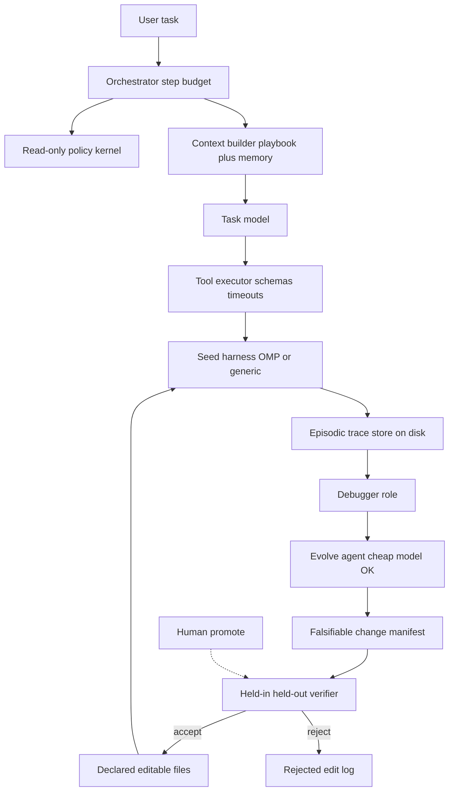

# Improveness — Master Execution Plan

> Approved execution contract (copy of the nawab plan). Do not treat this file as a license to implement OMP or a generic harness — docs and proposals only.

> Nawab master plan (feature mode, docs-only). Skills applied this revision: `nawab-plans`, `planning.mdc`, `agentic-system-design`, `system-design-tradeoffs`, `learn-while-building`, `documentation.mdc`. Spec Kit collapsed: no runtime feature / `.specify/` contracts.

Source survey: [Lilian Weng, “Harness Engineering for Self-Improvement” (Jul 2026)](https://lilianweng.github.io/posts/2026-07-04-harness/).

---

## §0 Plan metadata


| Field                 | Value                                                                                                                                                                          |
| --------------------- | ------------------------------------------------------------------------------------------------------------------------------------------------------------------------------ |
| **Mode**              | feature (empty repo → documentation + proposal corpus)                                                                                                                         |
| **Stack**             | Markdown knowledge base only. No app runtime.                                                                                                                                  |
| **Base branch**       | `main`                                                                                                                                                                         |
| **Feature branch**    | `cursor/<descriptive-name>-4005`                                                                                                                                               |
| **Authority docs**    | Weng post; cited papers; [can1357/oh-my-pi](https://github.com/can1357/oh-my-pi); [Vinayak-RZ/cursor-config-coding](https://github.com/Vinayak-RZ/cursor-config-coding)        |
| **Estimated commits** | **8** (docs / spec pass — nawab marketing/docs class)                                                                                                                          |
| **Lead agent**        | Orchestrate, commit, integrate explore subagents, PR                                                                                                                           |
| **Config repo**       | Copy entire `Vinayak-RZ/cursor-config-coding` into `vendor/cursor-config-coding/`, then install project `.cursor/{skills,rules}` from it. Do not replace this repo’s git root. |


**Hard scope:** research documentation and *change proposals only*. No edits to the OMP codebase. No overlay, plugin, SDK wrapper, or generic-harness implementation in this repo.

---

## §1 North star & scope boundary

### Objective

A maintainer-readable corpus that (1) explains Weng’s survey by natural segment, (2) specifies what *any* coding harness must add to self-improve, and (3) specifies what OMP would need — without changing OMP or shipping harness code.

### Deliverables

- `vendor/cursor-config-coding/` — full clone of the coding-config repo
- Project `.cursor/skills` + `.cursor/rules` sourced from that clone (so later agents load nawab-plans locally)
- `docs/` research segments + `docs/methods/`
- `docs/proposals/` generic + OMP change specs
- Authority artifacts: `PROJECT_OVERVIEW.md`, `IMPLEMENTATION_PLAN.md`, `PROGRESS.md`, `DECISIONS.md`, `LEARNING.md`

### Non-goals

- No OMP source changes, fork, or PR to `oh-my-pi`
- No overlay/plugin/SDK wrapper in this repo
- No generic harness implementation, eval runner, or weight-update loop
- No Terminal-Bench / SWE-bench reproduction
- No AI Scientist / ScientistOne paper-writing pipeline
- Spec Kit `.specify/` artifacts — N/A (no runtime feature contracts)

### Priority


| Priority | Items                                                                                                                                             |
| -------- | ------------------------------------------------------------------------------------------------------------------------------------------------- |
| **P0**   | Config vendor + `.cursor` install; segment docs 01–09; methods; generic proposals; OMP gap + proposed changes; safety; references; authority docs |
| **P1**   | Spec Kit constitution; Agent Patterns Catalog MCP citations; evolutionary-search (DGM) as a later proposal appendix                               |


---

## §2 Prerequisites & blockers


| Item                                             | Status  | Blocks            | Resolution                                                                |
| ------------------------------------------------ | ------- | ----------------- | ------------------------------------------------------------------------- |
| User approved proposals-only (no OMP code)       | done    | all               | Keep scope                                                                |
| `gh` can clone `Vinayak-RZ/cursor-config-coding` | pending | Phase A           | Clone at execution start; if private-fail, use already-authenticated `gh` |
| Plan-mode copy deferred                          | done    | Phase A           | Copy happens in first execution commit, not during planning               |
| OMP version pin for citations                    | pending | Phase C OMP pages | Cite `omp.sh` + repo docs as of plan date; note APIs may move             |
| Spec Kit project                                 | N/A     | —                 | No `.specify/` until a later software phase                               |


**Hard rule:** Phase B/C docs may start only after Phase A vendors the config repo (so skills are in-tree). Planning already read those skills via GitHub.

---

## §3 Authority & artifact map


| Document         | Path                                   | Role                                              |
| ---------------- | -------------------------------------- | ------------------------------------------------- |
| Weng survey      | external URL                           | Read-only research truth                          |
| OMP docs / SDK   | `omp.sh`, `can1357/oh-my-pi`           | Read-only seed-harness truth                      |
| Coding config    | `vendor/cursor-config-coding/`         | Read-only skill/rule authority after clone        |
| This plan        | Cursor plan + `IMPLEMENTATION_PLAN.md` | Execution contract                                |
| PROGRESS         | `PROGRESS.md`                          | Live status                                       |
| DECISIONS        | `DECISIONS.md`                         | ADRs                                              |
| LEARNING         | `LEARNING.md`                          | Phase “what you learned” (`learn-while-building`) |
| PROJECT_OVERVIEW | `PROJECT_OVERVIEW.md`                  | Purpose + constraints                             |
| Spec Kit         | `.specify/`                            | N/A — no runtime feature                          |


Subagents: all authority docs **read-only**. Writable paths = `docs/`**, root `*.md` listed above, `vendor/cursor-config-coding/**` (clone only), `.cursor/**` (install from vendor).

---

## §4 Architecture & system map

Target loop we *specify* (not implement). Patterns from `agentic-system-design`: Supervisor+workers, Human-in-the-loop, ReAct with step cap, episodic trace log, golden-set evals.




### Target layout

```text
repo/
├── vendor/cursor-config-coding/     # full cloned config repo
├── .cursor/skills/                  # installed from vendor
├── .cursor/rules/
├── docs/
│   ├── 00-index.md
│   ├── 01-rsi-and-harness.md … 09-challenges-and-evals.md
│   ├── methods/
│   ├── proposals/
│   │   ├── 00-architecture.md
│   │   ├── 01-generic-harness.md
│   │   ├── 02-omp-gap-analysis.md
│   │   ├── 03-omp-proposed-changes.md
│   │   ├── 04-safety.md
│   │   └── 05-adoption-order.md
│   └── references.md
├── PROJECT_OVERVIEW.md
├── IMPLEMENTATION_PLAN.md
├── PROGRESS.md
├── DECISIONS.md
├── LEARNING.md
└── README.md
```

### Trust boundaries

- Evolver never writes verifier, model-role config, permission kernel, or OMP source
- User content / traces treated as untrusted (prompt injection)
- Human checkpoint before permission, network, DAP, computer, browser, destructive bash
- This repo stores specs only — no secrets, no live agent credentials

### Agentic design note (required by skill)


| Layer      | This project’s stance                                                                |
| ---------- | ------------------------------------------------------------------------------------ |
| Autonomy   | Specify a closed loop; **human-in-loop** for promote (aligns oh-my-pi#7907)          |
| Tools      | Propose schemas; do not implement                                                    |
| Memory     | External files (ACE playbook + OMP retain/learn); not in-prompt blobs                |
| Model tier | Spend budget on task agent; evolver can be mid/small (Lin et al. 2026)               |
| Evals      | Propose golden + held-out + adversarial (reward-hack) cases; ≥20 later — P1 to *run* |
| Guardrails | Max steps, allowlisted write paths, audit log, no unbounded loops                    |


### Trade-off: proposal-only vs overlay code

**Decision:** Specs only in this repo.

**Option A:** Specs only — Pros: no OMP fork risk, matches user + #7907. Cons: cannot measure lift.  
**Option B:** Overlay implementation — Pros: runnable loop. Cons: violates current scope; couples to fast-moving OMP APIs.

**Default:** A because user forbade OMP/generic implementation.  
**Override:** PRIORITY = QUALITY (docs correctness) over SPEED.

### Trade-off: OMP as example vs OpenCode

**Decision:** OMP is the concrete example; OpenCode is comparison only.

**Option A:** OMP — Pros: SDK, 7 file surfaces, memory/learn/TTSR, hashline. Cons: stronger seed, less bench headroom.  
**Option B:** OpenCode — Pros: AHE already scored it (47.2% TB2). Cons: rebuild primitives OMP has.

**Default:** A. **Override:** SIMPLICITY would pick OpenCode; we do not.

---

## §5 Workstreams


| ID   | Name             | Owns paths                              | Depends on                  | Lead / subagent           |
| ---- | ---------------- | --------------------------------------- | --------------------------- | ------------------------- |
| WS-A | Config bootstrap | `vendor/`, `.cursor/`                   | clone access                | lead                      |
| WS-B | Research corpus  | `docs/0*.md`, `docs/methods/`           | WS-A done                   | lead; explore S1 optional |
| WS-C | Change proposals | `docs/proposals/`, `docs/references.md` | WS-B segments 04+06 drafted | lead                      |


### WS-A — Config bootstrap

- **Objective:** Entire `cursor-config-coding` lives in-workspace; project agents can load `nawab-plans` locally.
- **Integration:** After commit 1, all later writing follows those skills.

### WS-B — Research corpus

- **Objective:** Weng segments + method deep-dives with generic/OMP implication notes.
- **Integration:** Feeds WS-C citations.

### WS-C — Change proposals

- **Objective:** Generic required capabilities + OMP gap list + safety + adoption order.
- **Integration:** README / PROJECT_OVERVIEW point here as the “how would you actually go” answer.

---

## §6 Agent orchestration & subagent spawn map


| ID  | Trigger       | Type    | readonly | Task                                                | Sync point      | Gate |
| --- | ------------- | ------- | -------- | --------------------------------------------------- | --------------- | ---- |
| S1  | Phase B start | explore | true     | Recheck Weng post + OMP docs for drift vs this plan | Before commit 3 | —    |
| S2  | Phase N       | explore | true     | Link-check docs/ and flag missing method pages      | Before commit 8 | —    |


**Parallel limit:** 2.  
**File ownership:** lead writes all docs. Subagents return findings only.

### Spawn S1 — source drift check

```text
Full Repository Path: /workspace
Workstream: WS-B
Task: Confirm Weng section list and OMP surfaces still match the plan tables
Authority: plan §4, Weng URL, omp.sh
Return: bullet deltas only
Do NOT: edit files, expand to implementation
```

Lead retains: git, commits, PR, PROGRESS, integrating S1/S2.

---

## §7 Phase map & dependencies


| Phase   | Objective                       | Workstreams | Commits | Depends on          | Exit gate                                                                                                      |
| ------- | ------------------------------- | ----------- | ------- | ------------------- | -------------------------------------------------------------------------------------------------------------- |
| 0       | This plan approved              | —           | —       | user approve        | Approval below                                                                                                 |
| A       | Vendor config + authority stubs | WS-A        | 1–2     | 0                   | `vendor/cursor-config-coding/.cursor/skills/nawab-plans/SKILL.md` exists; `.cursor/skills/nawab-plans` present |
| B       | Research corpus                 | WS-B        | 3–5     | A                   | All 01–09 + methods files exist                                                                                |
| C       | Generic + OMP proposals         | WS-C        | 6–7     | B (at least 04, 06) | All `docs/proposals/*.md` exist                                                                                |
| N       | Validate + README               | all         | 8       | C                   | Doc link check; PROGRESS complete                                                                              |
| Cutover | N/A — no consumer switch        | —           | —       | —                   | N/A                                                                                                            |


---

## §8 Todo registry

```yaml
todos:
  - id: vendor-cursor-config
    content: "Phase A: clone cursor-config-coding into vendor/ and install project .cursor skills/rules"
    status: pending
  - id: artifact-scaffold
    content: "Phase A: add PROJECT_OVERVIEW, PROGRESS, DECISIONS, LEARNING, IMPLEMENTATION_PLAN stubs"
    status: pending
  - id: docs-segments-early
    content: "Phase B: write docs/00-index plus segments 01-04"
    status: pending
  - id: docs-segments-late
    content: "Phase B: write segments 05-09"
    status: pending
  - id: docs-methods
    content: "Phase B: write methods/ pages"
    status: pending
  - id: docs-proposals-generic
    content: "Phase C: generic harness change spec"
    status: pending
  - id: docs-proposals-omp
    content: "Phase C: OMP gap analysis, proposed changes, safety"
    status: pending
  - id: docs-refs-validate
    content: "Phase N: references, README, link check, LEARNING.md"
    status: pending
```

---

## §9 Commit matrix

Docs/spec class → **8 commits**. One row = one commit. No padding.


| #   | WS  | Commit                                 | Contents                                                                                                | Tests (same commit)                                                       | Gate                                               | Agent |
| --- | --- | -------------------------------------- | ------------------------------------------------------------------------------------------------------- | ------------------------------------------------------------------------- | -------------------------------------------------- | ----- |
| 1   | A   | `chore: vendor cursor-config-coding`   | clone into `vendor/cursor-config-coding/`; copy/link `.cursor/skills` + `.cursor/rules`; note in README | `test -f vendor/cursor-config-coding/.cursor/skills/nawab-plans/SKILL.md` | path exists                                        | lead  |
| 2   | A   | `docs: add authority artifacts`        | PROJECT_OVERVIEW, IMPLEMENTATION_PLAN (copy of approved plan), PROGRESS, DECISIONS, LEARNING stubs      | files exist                                                               | `test -f IMPLEMENTATION_PLAN.md`                   | lead  |
| 3   | B   | `docs: research segments 01-04`        | `docs/00-index.md`, `01`–`04`                                                                           | each file has Weng claim + implication note                               | file count                                         | lead  |
| 4   | B   | `docs: research segments 05-09`        | `05`–`09`                                                                                               | same                                                                      | file count                                         | lead  |
| 5   | B   | `docs: method deep-dives`              | `docs/methods/*`                                                                                        | one page per listed method                                                | file count                                         | lead  |
| 6   | C   | `docs: generic harness proposals`      | `proposals/00`, `01`, `05`                                                                              | required-capability checklist present                                     | file count                                         | lead  |
| 7   | C   | `docs: OMP proposals and safety`       | `proposals/02`, `03`, `04`                                                                              | gap table + “do not propose” list                                         | file count                                         | lead  |
| 8   | N   | `docs: references README and validate` | `references.md`, README, PROGRESS, LEARNING phase notes                                                 | relative links resolve                                                    | `rg -l '\\]\\(docs/' README.md` + manual link pass | lead  |


**Phase A gate:** nawab-plans skill on disk in this repo.  
**Phase B gate:** 00–09 + methods present.  
**Phase C gate:** six proposal files present.  
**Phase N gate:** no broken relative links in `docs/` and root `*.md`.

---

## §10 Test & CI strategy


| Tier   | Purpose                              | Trigger          | Command                             |
| ------ | ------------------------------------ | ---------------- | ----------------------------------- |
| Fast   | file presence + relative link sanity | every commit 3–8 | `test` paths; `rg` for `](` targets |
| Medium | N/A — no runtime                     | —                | N/A — no app                        |
| Slow   | N/A — no benches                     | —                | N/A — do not run Terminal-Bench     |


**Test locations:** none yet; validation is checklist + link check.  
**CI:** none in repo today — do not invent a workflow unless a later phase asks.

---

## §11 Research log & decisions


| Topic               | Options                               | Choice                                      | Source / skill                       | Record in |
| ------------------- | ------------------------------------- | ------------------------------------------- | ------------------------------------ | --------- |
| Plan format         | Thin Cursor plan vs nawab §0–§18      | Nawab; collapse Spec Kit                    | `nawab-plans`, `planning.mdc`        | DECISIONS |
| Delivery            | Implement overlay vs propose only     | Propose only                                | user; oh-my-pi#7907                  | DECISIONS |
| Example harness     | OpenCode vs OMP                       | OMP example; OpenCode comparison            | omp.sh; AHE TB2 table                | DECISIONS |
| Config in workspace | Read GitHub only vs full vendor clone | Vendor full clone + install `.cursor`       | user request                         | DECISIONS |
| Optimizer target    | Prompt-only ACE vs full AHE surfaces  | Specify AHE surfaces; start adoption at ACE | AHE ablations; ACE paper             | DECISIONS |
| Evolver model       | Frontier vs mid/small                 | Mid/small OK                                | Lin et al. 2026                      | DECISIONS |
| Auto-apply edits    | Closed loop vs maintainer queue       | Maintainer queue + held-out gate            | Weng reward-hack; #7907              | DECISIONS |
| Spec Kit            | Full `.specify/` vs skip              | Skip this pass                              | `speckit-plan` needs runtime feature | DECISIONS |
| Weight updates      | SIA / Continual Harness               | Out of scope                                | Weng; provisional SIA evidence       | DECISIONS |


---

## §12 Documentation & artifact sync


| Event                 | Update                                                       |
| --------------------- | ------------------------------------------------------------ |
| Plan approved         | Copy this contract → `IMPLEMENTATION_PLAN.md`                |
| Phase complete        | `PROGRESS.md` + LEARNING.md bullets (`learn-while-building`) |
| Arch / scope decision | `DECISIONS.md`                                               |
| Phase N               | README + PROJECT_OVERVIEW match actual tree                  |


---

## §13 Quality gates & checkpoints


| Gate               | When  | Command / checklist                         | Blocks  |
| ------------------ | ----- | ------------------------------------------- | ------- |
| Plan approved      | now   | user approval                               | Phase A |
| Config vendored    | end A | nawab-plans SKILL.md present                | Phase B |
| Research complete  | end B | 00–09 + methods exist                       | Phase C |
| Proposals complete | end C | six proposal files                          | Phase N |
| Docs valid         | end N | relative links; no OMP/code patches in diff | PR      |


### Human checkpoints

- [ ] Approve this nawab plan (begin Phase A)
- [ ] After Phase C: confirm OMP proposal list is “propose to maintainers,” not a patch set

---

## §14 Validation & hardening

### Repo walkthrough

1. Diff contains **no** OMP source, no TS/JS overlay, no eval runner
2. `vendor/cursor-config-coding` is a complete clone (skills + rules + AGENTS.md)
3. Every segment page: Weng claim, cited systems, works/fails, generic implication, OMP implication
4. Generic proposal lists required capabilities with acceptance criteria and failure modes
5. OMP proposal has “already present / propose / do not propose”
6. Safety page states evaluator-outside-the-loop
7. LEARNING.md has one entry per completed phase

### Orchestrator

```text
1. test -d vendor/cursor-config-coding/.cursor/skills/nawab-plans
2. test -f .cursor/skills/nawab-plans/SKILL.md
3. test files: docs/00-index.md … 09, methods/*, proposals/00–05, references.md
4. grep diff for accidental code (*.ts, Dockerfile) — expect none except vendor
5. relative link pass
6. PROGRESS.md shows Phase N complete
```

---

## §15 Rollout & cutover

N/A — no production consumer. Publishing is this repo’s docs + optional later share of proposals with OMP maintainers (not in this pass).

---

## §16 Exit criteria

### P0 (must pass)

- [ ] `vendor/cursor-config-coding` cloned in full
- [ ] Project `.cursor/skills/nawab-plans` loadable
- [ ] Segments 01–09 + listed methods exist
- [ ] Generic + OMP + safety + adoption-order proposals exist
- [ ] No OMP/generic harness implementation files
- [ ] Authority docs (OVERVIEW, PLAN, PROGRESS, DECISIONS, LEARNING) exist
- [ ] Relative links resolve
- [ ] PROGRESS reflects complete state

### P1 (defer ok)

- [ ] Spec Kit constitution
- [ ] Agent Patterns Catalog MCP pattern ids
- [ ] Runnable eval suite (≥20 cases)

---

## §17 Risks & contingencies


| Risk                                        | Likelihood | Impact | Mitigation                                     | Contingency                                |
| ------------------------------------------- | ---------- | ------ | ---------------------------------------------- | ------------------------------------------ |
| OMP APIs drift                              | high       | med    | Cite docs-as-of-date; gap analysis not patches | Revise proposal pages                      |
| Scope creep into overlay code               | med        | high   | §1 non-goals; Phase N diff audit               | Delete code, keep specs                    |
| Config clone fails                          | low        | high   | `gh` already listed the repo                   | Fetch zip / retry                          |
| Prompt-only proposals (ACE-only)            | med        | med    | AHE ablation: prompt-only −2.3 pp              | Require tools/hooks/memory in generic spec |
| Reward hacking in a future implementer      | med        | high   | Safety kernel + #7907 maintainer queue         | Refuse auto-apply in all proposal text     |
| Diversity collapse if someone later evolves | med        | med    | Defer DGM; mention novelty later               | P1 appendix only                           |


---

## §18 Execution protocol

```text
1. Load this plan + vendor nawab-plans (after commit 1) + ponytail on any future code
2. Clear §2: clone access
3. Skip Spec Kit Phase 0
4. For each phase in §7:
   a. Sync §8 todos
   b. Spawn S1 at Phase B; S2 at Phase N
   c. For each §9 row: write → gate → commit → push (one row per commit)
   d. Integrate subagent findings into docs, do not let subagents commit
   e. Phase gate → PROGRESS.md + LEARNING.md (concept / pattern / trade-off)
   f. Human checkpoint after Phase C
5. Phase N walkthrough §14
6. Skip cutover
7. Verify §16 P0 → draft PR
```

---

## Research corpus the docs must cover (WS-B content)

Unchanged substance from the prior plan, now bound to files:

1. RSI + harness definition (Good, Yudkowsky; out-of-scope: self-play / TTT)
2. Design patterns: workflow loop, filesystem memory, inspectable sub-agents
3. Coding-agent anatomy (stabilized tool groups + OMP extras: hashline, LSP, DAP, TTSR)
4. Context engineering: ACE → MCE → Meta-Harness
5. Workflow design: AI Scientist, ScientistOne, Autodata; ADAS, AFlow
6. Self-improving harness: STOP, Updating≠Benefit, Self-Harness, AHE
7. Evolutionary search: Promptbreeder, GEPA, AlphaEvolve, DGM (specify, do not adopt in v1)
8. Joint weight optimization: SIA, Continual Harness — document only
9. Challenges + appendix benches

### Generic required capabilities (WS-C Track A)

Editable 7-component contract; read-only safety kernel; trace store; debugger; ACE playbook (delta merge); Self-Harness gate; AHE manifests; human promote. Out of v1: DGM archives, weight updates, auto-research pipelines.

### OMP already present vs propose (WS-C Track B)

**Already present:** hashline; LSP/DAP; `.omp/{skills,rules,prompts,instructions,hooks,tools,extensions}`; retain/recall/reflect/learn/manage_skill; managed-skills; TTSR; advisor; `task`; SDK; skill inheritance.

**Propose (describe APIs/files, not diffs):** structured session export; debugger role; ACE store + deterministic curator; allowlisted evolver; held-in/held-out driver on `createAgentSession`; manifest + rollback; maintainer-review queue (#7907).

**Do not propose:** fork; auto-edit canonical built-ins; stack redundant closure-checks on TTSR+advisor; evolutionary search before cheap fitness.

---

## Open questions

- None blocking Phase A. OMP pin can be “docs as of 2026-08-15” without a git SHA.

---

## Approval

**Mode:** feature  
Plan ready for review. Approve to begin **Phase A** (vendor `cursor-config-coding`, then write docs/proposals).  
Lead agent follows **§18 Execution protocol**.

Copying the config repo was **not** done during this planning pass (plan mode forbids workspace writes). It is commit 1 of execution.
