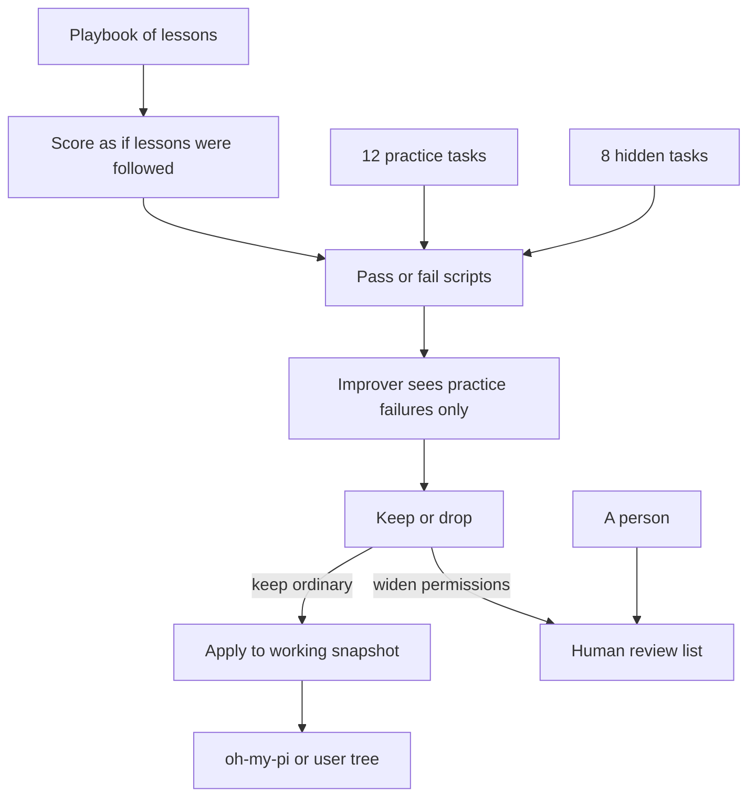
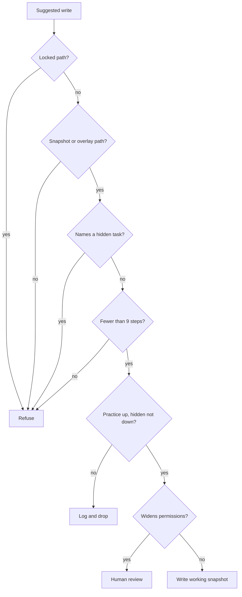

# Improveness — extra files that teach a coding agent, for people who want to understand how

> **Improveness is a reference project for harness engineering.** It is not a new language model and not a public leaderboard run. You use a coding agent (here, Oh My Pi). You run this repo. After a practice/hidden test gate, **that agent’s code changes**. The primary interface is `bash harness/omp/scripts/qa.sh`. Optional live pings degrade to skip when no API key is set.

Runtime: [Bun](https://bun.sh) 1.3.14 on the filesystem. No HTTP server. No Docker.

---

**TL;DR**

- A **coding agent** uses a language model to edit a repo. The **harness** is everything around that model: instructions, tools, memory, permissions, tests.
- This repo improves the harness, not the model. The system prompt is locked on purpose.
- Twenty tiny coding tasks: 12 practice (the improver may look) and 8 hidden (it must not see their names). Homework vs exam.
- Five recorded lessons moved the score from **0/12 and 0/8** to **7/12 and 3/8**. Two “don’t hardcode secrets” hidden tasks stayed failed on purpose.
- After the gate, accepted changes are supposed to land on the **working snapshot** (`oh-my-pi/` or any agent tree you point at): tools, skills, orchestration, even the core loop. The checker, system prompt, and upstream GitHub stay off-limits. Today’s search script still parks copies in a waiting room until that apply driver ships.
- Seven named designs are replayed with **no API key**. Slogans-only stays at 0/20. Cheating setups are refused.
- [`oh-my-pi/`](oh-my-pi/) is a snapshot of [Oh My Pi](https://github.com/can1357/oh-my-pi). We do not push upstream. Improving *this* copy is the point.
- Survey this follows: [Lilian Weng, “Harness Engineering for Self-Improvement”](https://lilianweng.github.io/posts/2026-07-04-harness/). Live self-mod without killing the process: [spatiotemporal composability](docs/methods/spatiotemporal-composability.md).

---

## Table of contents

1. [Vision](#1-vision)
2. [Ideas worth understanding](#2-ideas-worth-understanding)
3. [Architecture](#3-architecture)
4. [Quickstart](#4-quickstart)
5. [Configuration](#5-configuration)
6. [Directory tree](#6-directory-tree)
7. [Interfaces](#7-interfaces)
8. [Data model](#8-data-model)
9. [Testing](#9-testing)
10. [Further reading](#10-further-reading)
11. [Roadmap and changelog](#11-roadmap-and-changelog)
12. [Future advancements](#12-future-advancements)
13. [FAQ](#13-faq)
14. [Glossary](#14-glossary)

## 1. Vision

### 1.1 What it is

Improveness answers: given a strong coding agent (here, Oh My Pi), how do you **change that agent while you are using it** — tools, skills, orchestration, even the core loop — without retraining weights, without rewriting the system prompt, and without opening a PR against someone else’s GitHub?

You are around. You are running Oh My Pi. You run Improveness. The working copy in front of you is the apply target. That is decision D14.

Four things live in this git root:

1. Paper notes in [`docs/`](docs/00-index.md)
2. Extra files and scripts under [`harness/omp/`](harness/omp/SURFACES.md)
3. A snapshot of Oh My Pi at [`oh-my-pi/`](oh-my-pi/) — the default working copy to mutate
4. A no-key check that opens a catalog and replays seven designs: `bash harness/omp/scripts/qa.sh`

It is for platform authors who want to compare designs before spending tokens, and for anyone who has not read the papers.

### 1.2 What it is not

- Not a live fork that pushes to [oh-my-pi](https://github.com/can1357/oh-my-pi). Nested git was removed (decision D8). Improving *this* tree is the product.
- Not a weight trainer (Darwin-Gödel Machine, AlphaEvolve, and similar stay on the shelf).
- Not “write nicer slogans in a playbook.” The `ace-only` replay exists to *prove* slogans score 0/20.
- Not a closed loop that silences the grader or widens permissions by itself.
- Not a run of public [Terminal-Bench](https://www.tbench.ai/). We refuse to grade the improver on a set it could memorize.
- Not “park forever in a review queue.” That was P2 driver behavior, not the vision.

Success: `qa.sh` exits 0, all seven replays pass, and you can answer “what may the improver edit?” from [`KERNEL.md`](harness/omp/KERNEL.md) and [`SURFACES.md`](harness/omp/SURFACES.md). After the apply driver ships, an accepted candidate is visible as a diff on the working snapshot.

## 2. Ideas worth understanding

These are the bets in the code, not a feature list. Each one has a file you can open.

### 2.1 Change the wrapper, not the brain

**Constraint.** Retraining a frontier model for every new habit is too expensive, and letting the agent rewrite its own official files lets it cheat.

**How it works.** The model stays frozen. What changes is the **harness**: tools, skills, orchestration, the core loop, and a playbook of lessons. [`harness/omp/SURFACES.md`](harness/omp/SURFACES.md) lists files the improver may touch after the gate. [`harness/omp/KERNEL.md`](harness/omp/KERNEL.md) lists files it must not (grader, system prompt, permission kernel). The same idea, from the Oh My Pi authors: swap the *edit format* and Grok Code Fast 1 went from 6.7% to 68.3% pass@1 with **zero** training compute.

**Analogy.** You do not rewire a person’s brain to teach them a house style. You give them a better checklist and better tools.

**Limits.** This scores whether the playbook contains the right lessons, not whether a live model can code. A public leaderboard run is still future work, and must never become the improver’s score.

**Read next.** [Weng, “Harness Engineering for Self-Improvement”](https://lilianweng.github.io/posts/2026-07-04-harness/) — the survey this repo is built from. [“I Improved 15 LLMs at Coding in One Afternoon. Only the Harness Changed.”](https://blog.can.ac/2026/02/12/the-harness-problem/) — a concrete harness-only gain. Background: [Recursive self-improvement](https://en.wikipedia.org/wiki/Recursive_self-improvement).

### 2.2 Homework vs exam

**Constraint.** If the improver can see every task you later grade it on, the score is fake.

**How it works.** Twenty local tasks under [`harness/omp/evals/`](harness/omp/evals/). Twelve are **practice** (`held-in`): the improver may see failures and add a matching lesson. Eight are **hidden** (`held-out`): their names must never reach [`propose.ts`](harness/omp/drivers/propose.ts). A change is kept only if practice improved and hidden did not drop ([`self-harness.ts`](harness/omp/drivers/self-harness.ts)).

Walk one task. [`gitignore-rule`](harness/omp/evals/held-in/gitignore-rule/) asks to ignore `node_modules`. The grader is `rg -q '^node_modules$' .gitignore`. The starter fails; the gold tree passes. Adding `recipe:gitignore` also unlocks hidden `gitignore-dist` (ignore `dist/`) without showing that name to the picker. That is transfer. `recipe:no-secrets` has **no** practice member, so those two hidden tasks stay failed — a leak brake, not a bug.

**Analogy.** Studying past homework is allowed. Seeing tomorrow’s exam paper is not.

**Limits.** Twenty synthetic tasks are a proxy. They prove the gate. They do not prove a live agent on Terminal-Bench.

**Read next.** [Self-Harness (Zhang et al.)](https://arxiv.org/abs/2606.09498) — accept only after a hidden split. Background: [training, validation, and test sets](https://en.wikipedia.org/wiki/Training,_validation,_and_test_data_sets).

### 2.3 Change the copy you are using

**Constraint.** If search can silence the grader, it will “improve” by deleting tests. If search can only ever write a review table, you are not using Improveness on Oh My Pi — you are filing tickets about it.

**How it works.** Decision D14: after practice rose and hidden did not fall, Improveness applies ordinary edits to the **working snapshot** (`oh-my-pi/` here, or another agent tree). Tools, skills, orchestration, core loop are in scope. The checker, `system-prompt.md`, and `approval.ts` are not. Permission-widening still waits for a person. [oh-my-pi#7907](https://github.com/can1357/oh-my-pi/issues/7907) is the stance for *upstream* maintainers; this repo does not push there.

Today’s [`search.ts`](harness/omp/drivers/search.ts) still writes `staging/`, `archive/<id>/`, and a row in [`REVIEW_QUEUE.md`](harness/omp/REVIEW_QUEUE.md) (P2). That is driver lag. The apply driver is P3 Phase B.

**Analogy.** You keep a local checkout of the agent you actually run. Improveness is git-write on that checkout after tests pass — not a bot that merges to `can1357/oh-my-pi`, and not a bot that never writes.

**Limits.** Live Oh My Pi sessions still restart today when source changes. That is the bottleneck [spatiotemporal composability](docs/methods/spatiotemporal-composability.md) names. See §2.7.

**Read next.** [Snapshot apply](docs/proposals/06-snapshot-apply.md). [D14](DECISIONS.md). Upstream review stance: [oh-my-pi#7907](https://github.com/can1357/oh-my-pi/issues/7907).

### 2.4 Slogans are not lessons

**Constraint.** A playbook that is rewritten into a shorter “system prompt” loses the details that actually help. A published ablation found prompt-only evolution **hurt** Terminal-Bench 2 by 2.3 points. The gain lived in tools, middleware, and memory.

**How it works.** [`curate-playbook.ts`](harness/omp/drivers/curate-playbook.ts) only appends or increments counters. It rejects secrets and “edit SYSTEM.md” advice. [`playbook-solver.ts`](harness/omp/drivers/playbook-solver.ts) scores a playbook by tagged `recipe:*` families, not by vibe. The `ace-only` replay is a **passing** test of a **zero** score: empty advice must not look like a win.

**Analogy.** A recipe card that says “cook well” vs one that says “salt the pasta water.”

**Limits.** Unlocking every *practice* family reaches 12/12 and 6/8, still not 8/8 hidden, because secrets stay locked. That ceiling is the design.

**Read next.** [Agentic Context Engineering](https://arxiv.org/abs/2510.04618) — playbooks that accumulate instead of collapsing. [Agentic Harness Engineering](https://arxiv.org/abs/2604.25850) — gain is not in the system prompt. Code: [china-qijizhifeng/agentic-harness-engineering](https://github.com/china-qijizhifeng/agentic-harness-engineering).

### 2.5 Cheap writer, expensive doer

**Constraint.** Frontier tokens are scarce. Using them to *write* extra files is a poor spend if a smaller model can write equally useful ones.

**How it works.** Lin et al. split two skills: **updating** (produce a useful extra file) is flat from a 9B model to a frontier model; **benefit** (actually follow that file) is not. So the task agent can be expensive; the improver can be `@smol` (decision D6). Overlay agents pin that in [`evolver.md`](harness/omp/overlay/.omp/agents/evolver.md).

**Analogy.** A junior writes the checklist. A senior uses it on the real job.

**Limits.** This repo’s recorded scores do not call a live improver. The cheap-writer claim is taken from the paper and encoded as a role pin, not re-measured here.

**Read next.** [Harness Updating Is Not Harness Benefit](https://arxiv.org/abs/2605.30621).

### 2.6 Try the wiring before you buy tokens

**Constraint.** Comparing “who may write, who may see the hidden set, whether install is automatic” on a live frontier run is slow and leaks the public set.

**How it works.** [`simulate-architectures.ts`](harness/omp/drivers/simulate-architectures.ts) replays seven named designs against the frozen 20 tasks with no model. Unsafe designs must throw or refuse to install. Report: [`evals/simulations/latest/summary.md`](harness/omp/evals/simulations/latest/summary.md).

| Id | What we wired | Must happen | Practice | Hidden |
|----|---------------|-------------|----------|--------|
| `ace-only` | Slogans, no recipes | stay at zero | 0/12 | 0/8 |
| `self-harness-gated` | Five bounded steps | score goes up | 7/12 | 3/8 |
| `ahe-surfaces` | All practice lessons | score goes up; secrets stay locked | 12/12 | 6/8 |
| `held-out-leak` | Hidden name given to picker | refuse | — | — |
| `kernel-write` | Edit the grader | refuse | — | — |
| `unbounded-search` | 9 steps (cap is 8) | refuse | — | — |
| `auto-promote` | Write the grader or skip the gate | must refuse | — | — |

**Analogy.** A crash-test dummy for the *plumbing*, not a road test of the car.

**Limits.** This does not replace a live agent run. It replaces “we think this architecture is safe.”

**Read next.** This placement is local to `simulate-architectures.ts`. No external write-up yet; the table above is the source. The `auto-promote` row is “must not skip the gate or write the kernel,” not a ban on gated snapshot apply.

### 2.7 Do not kill the runtime to improve it

**Constraint.** If every self-mod requires stopping Oh My Pi, you dump session memory, open connections, and in-flight tasks. At the frequency a self-improving harness wants, that unavailability *is* the product failure. DeepSeek-linked work calls this missing **spatiotemporal composability**.

**How it works (in the paper, not yet in OMP).** Components are plugins. **Temporal:** unload runs the inverse of every effect (`ctx.effect` disposers, event listeners, tool registrations). **Spatial:** plugins declare `inject` dependencies; if a service disappears they unload; when it returns they load again. DeepSeek Harness treats the model adapter, tools, session log, sandbox, **agent loop**, and UI as plugins. HMR = unload old → load new → `apply`. Method note: [`docs/methods/spatiotemporal-composability.md`](docs/methods/spatiotemporal-composability.md).

OMP today can *load* extensions. It cannot *unload* one extension and guarantee every registration is reversed. That is the VS Code-shaped gap the paper diagnoses.

**Analogy.** Unplugging a lamp vs unscrewing the bulb. Process restart is pulling the house fuse.

**Limits.** This repo has not vendored Cordis into Oh My Pi. P3 Phase 0 is the contract and the paper note. Prefer revertible plugins when the apply driver lands; restart stays the fallback for edits that cannot unload.

**Read next.** [cordiverse/paper](https://github.com/cordiverse/paper). [DeepSeek Harness plugins and lifecycle](https://deepseek-harness.github.io/deepseek-harness/en/develop/framework/).

## 3. Architecture

### 3.1 The loop



### 3.2 One search step

```mermaid
sequenceDiagram
  participant Search as Search script
  participant History as History folder
  participant Lessons as Next lesson
  participant Score as Score both sets
  participant Snap as Working snapshot
  Search->>History: pick a past playbook
  Search->>Score: score practice and hidden
  Search->>Lessons: only from failing practice tasks
  Lessons-->>Search: a playbook or snapshot edit, or stop
  Search->>Score: score again
  alt practice up and hidden not down
    Search->>Snap: apply ordinary edit (P3; P2 still stages)
  else no real gain
    Search->>Search: write a reject log
  end
```

### 3.3 Safety checks



### 3.4 Concept to implementation

| Idea | Code | Test |
|------|------|------|
| Wrapper not brain | [`SURFACES.md`](harness/omp/SURFACES.md), [`KERNEL.md`](harness/omp/KERNEL.md) | `playbook-injection.test.ts` |
| Homework vs exam | [`propose.ts`](harness/omp/drivers/propose.ts), [`self-harness.ts`](harness/omp/drivers/self-harness.ts) | `search.test.ts`, `checker.test.ts` |
| Snapshot apply | [`06-snapshot-apply.md`](docs/proposals/06-snapshot-apply.md), D14 | `search.test.ts` (P2 still stages) |
| Slogans ≠ lessons | [`playbook-solver.ts`](harness/omp/drivers/playbook-solver.ts), `ace-only` replay | `simulate-architectures.test.ts` |
| Cheap writer | [`evolver.md`](harness/omp/overlay/.omp/agents/evolver.md) | `evolver-allowlist.test.ts` |
| Try wiring first | [`simulate-architectures.ts`](harness/omp/drivers/simulate-architectures.ts) | `simulate-architectures.test.ts` |
| Live unload | [`spatiotemporal-composability.md`](docs/methods/spatiotemporal-composability.md) | research (Phase C) |

The four-layer checklist (Contract, Architecture, Control, Delivery) is [`CACD.md`](harness/omp/CACD.md). QA opens the catalog in [`cacd/catalog.ts`](harness/omp/cacd/catalog.ts) every run.

## 4. Quickstart

### 4.1 Prerequisites

- [Bun 1.3.14](https://bun.sh)
- [`rg`](https://github.com/BurntSushi/ripgrep) (every task grader calls it)
- Git
- API keys: optional

### 4.2 Clone and verify

```text
git clone https://github.com/Vinayak-RZ/Improveness.git
cd Improveness
bash harness/omp/scripts/qa.sh
```

Expect `qa.sh ok`, 55 tests across 19 files, seven experiments pass.

### 4.3 Other useful commands

```text
bash harness/omp/scripts/validate.sh
bash harness/omp/scripts/install-overlay.sh
bun harness/omp/drivers/run-benchmark.ts 5 /tmp/improv-bench
bun harness/omp/drivers/simulate-architectures.ts
```

`install-overlay.sh` **merges** into existing `oh-my-pi/.omp/`. Do not replace that directory. `run-benchmark.ts` uses a copy of the tasks and does not dirty the official playbook.

## 5. Configuration

Nothing is required for `qa.sh`. See [`.env.example`](.env.example). Do not commit OAuth secrets.

| Variable | Required | Default | What it does |
|----------|----------|---------|--------------|
| `OMP_GOOGLE_ANTIGRAVITY_CLIENT_ID` | no | unset | Oh My Pi OAuth placeholder |
| `OMP_GOOGLE_ANTIGRAVITY_CLIENT_SECRET` | no | unset | Oh My Pi OAuth placeholder |
| `OMP_GOOGLE_GEMINI_CLI_CLIENT_ID` | no | unset | Oh My Pi OAuth placeholder |
| `OMP_GOOGLE_GEMINI_CLI_CLIENT_SECRET` | no | unset | Oh My Pi OAuth placeholder |
| `OMP_ANTHROPIC_OAUTH_CLIENT_ID` | no | unset | Oh My Pi OAuth placeholder |
| `ANTHROPIC_API_KEY` | no | unset | Optional live ping |
| `OPENAI_API_KEY` | no | unset | Optional live ping |
| `OPENROUTER_API_KEY` | no | unset | Optional live ping |
| `OMP_LIVE_SMOKE` | no | unset | Set `1` to request a real session ping |
| `OMP_LIVE_SEARCH` | no | unset | Reserved; CI uses the no-key search |
| `OMP_SNAPSHOT_ROOT` | no | `oh-my-pi/` | Working snapshot to mutate after the gate (P3) |

Cost: default checks spend zero tokens. Live ping stays green when keys are missing.

## 6. Directory tree

```text
.
├── README.md
├── IMPLEMENTATION_PLAN.md
├── DECISIONS.md                 # D1–D14
├── docs/                        # Weng segments, methods, proposals
├── harness/omp/                 # Improveness source of truth
│   ├── CACD.md
│   ├── KERNEL.md
│   ├── SURFACES.md
│   ├── REVIEW_QUEUE.md
│   ├── drivers/                 # 19 Bun scripts
│   ├── evals/held-in/           # 12 practice tasks
│   ├── evals/held-out/          # 8 hidden tasks
│   ├── evals/benchmarks/local-20/
│   ├── evals/simulations/latest/
│   ├── overlay/.omp/
│   ├── scripts/qa.sh
│   └── tests/                   # 19 test files
├── oh-my-pi/                    # seed agent, no nested .git
└── vendor/cursor-config-coding/
```

Build-wave notes: [`LEARNING.md`](LEARNING.md).

## 7. Interfaces

19 scripts under [`harness/omp/drivers/`](harness/omp/drivers/). Improver writes go through [`allowlist.ts`](harness/omp/drivers/allowlist.ts).

### 7.1 Memory and traces (4)

| Name | Gate | What it does |
|------|------|--------------|
| `curate-playbook.ts` | `playbook/` only | Adds a lesson; rejects secrets and SYSTEM.md advice |
| `export-session.ts` | traces append | Oh My Pi session log → turns and tool I/O |
| `write-diagnosis.ts` | `diagnosis.md` only | Debugger write under `traces/` or `reports/` |
| `playbook-solver.ts` | read-only | Scores tasks as if lessons were followed |

### 7.2 Gate and review (5)

| Name | Gate | What it does |
|------|------|--------------|
| `run-eval.ts` | none | Scores a split on starter or gold trees |
| `self-harness.ts` | waiting room | Keep only if practice up and hidden not down |
| `manifest.ts` | n/a | Candidate JSON shape |
| `apply-candidate.ts` | staging | P2: snapshot + record in waiting room. P3: extend toward working snapshot |
| `rollback-candidate.ts` | snapshots | Restore by id |

### 7.3 Search and runners (5)

| Name | Gate | What it does |
|------|------|--------------|
| `archive.ts` | history folder | Save / list / pick a past playbook |
| `propose.ts` | waiting-room playbook | Next practice lesson; throws on hidden names |
| `search.ts` | staging today; snapshot after Phase B | Bounded loop; kernel still forbidden |
| `tb-export.ts` | output folder | Harbor-like `instruction.md` + `tests/test.sh` |
| `run-tb-local.ts` | none | Runs those local tasks |

### 7.4 Checks (5)

| Name | Gate | What it does |
|------|------|--------------|
| `allowlist.ts` | n/a | Path and tool policy |
| `live-session-smoke.ts` | skip without keys | Optional ping; CLI has no session factory yet (§12.5) |
| `run-benchmark.ts` | temp folder | Five-step recorded-style run |
| `qa-repo.ts` | none | Catalog needles + relative links |
| `simulate-architectures.ts` | temp folder | Seven design replays |

4 + 5 + 5 + 5 = **19**.

Run with `bun harness/omp/drivers/<file>.ts`. Shell: `qa.sh`, `validate.sh`, `install-overlay.sh`.

## 8. Data model

No database. Files only.

| Thing | Where | What it stores |
|-------|-------|----------------|
| Coding task | `evals/{held-in,held-out}/<id>/` | `fixture.json`, locked `check.sh`, failing `repo/`, passing `expected/` |
| Candidate | [`manifest.ts`](harness/omp/drivers/manifest.ts) | id, surface kind, files, parent hash, scores, rollback |
| History node | [`archive.ts`](harness/omp/drivers/archive.ts) | parent, hidden-set score, file hashes (bodies gitignored) |
| Checklist row | [`cacd/catalog.ts`](harness/omp/cacd/catalog.ts) | layer, path, required strings |
| Experiment result | simulations report | expected `stagnate` / `improve` / `throw` / `no-promote` |

Practice ids: `default-export`, `gitignore-rule`, `greet-export`, `index-reexport`, `license-header`, `named-type-export`, `package-script`, `readme-section`, `readme-title`, `sum-fn`, `tsconfig-strict`, `unused-var-marker`.

Hidden ids: `barrel-no-secrets`, `gitignore-dist`, `greet-types`, `no-implicit-any`, `no-secrets`, `package-test-script`, `readme-usage`, `typed-default-export`.

Recorded five-step run: [`evals/benchmarks/local-20/summary.md`](harness/omp/evals/benchmarks/local-20/summary.md) — practice 0/12→7/12, hidden 0/8→3/8.

## 9. Testing

```text
bun test harness/omp/tests/
bash harness/omp/scripts/validate.sh
bash harness/omp/scripts/qa.sh
```

| Tier | What | Command |
|------|------|---------|
| Fast | 19 files, 55 cases | `bun test harness/omp/tests/` |
| Overlay | locked-path greps, ≥20 tasks, no public-bench download URLs | `validate.sh` |
| Whole repo | Catalog needles, links, seven replays | `qa.sh` |
| Slow | real agent session | only if `OMP_LIVE_SMOKE=1` and a key |
| Not our gate | Oh My Pi’s heavy suite | do not run as the Improveness check |

CI ([`.github/workflows/overlay.yml`](.github/workflows/overlay.yml)) installs ripgrep, then runs `qa.sh` (Bun 1.3.14). Without `rg`, gold trees fail.

## 10. Further reading

Start here if you want the ideas, not the file tree.

| Idea | Canonical source | What you will learn |
|------|------------------|---------------------|
| Harness vs weights | [Weng, Jul 2026](https://lilianweng.github.io/posts/2026-07-04-harness/) | Why near-term self-improvement is wrapper work |
| Harness-only coding gains | [can.ac, Feb 2026](https://blog.can.ac/2026/02/12/the-harness-problem/) | Same models, better edit format, large pass@1 jumps |
| Playbook memory | [ACE, arXiv:2510.04618](https://arxiv.org/abs/2510.04618) | Incremental context that does not collapse into slogans |
| Practice / hidden gate | [Self-Harness, arXiv:2606.09498](https://arxiv.org/abs/2606.09498) | Accept only if both splits hold |
| Tools not prompts | [AHE, arXiv:2604.25850](https://arxiv.org/abs/2604.25850) | 69.7→77.0 on Terminal-Bench 2; prompt-only −2.3 pp |
| Cheap evolver | [Updating ≠ benefit, arXiv:2605.30621](https://arxiv.org/abs/2605.30621) | Updating is flat; spend budget on the task agent |
| Snapshot vs upstream | [oh-my-pi#7907](https://github.com/can1357/oh-my-pi/issues/7907) | Upstream maintainers review; *your* copy is D14’s apply target |
| Live plugins | [Spatiotemporal composability](https://github.com/cordiverse/paper) | Unload must reverse effects; dependencies are reactive |
| Holdout sets | [Wikipedia](https://en.wikipedia.org/wiki/Training,_validation,_and_test_data_sets) | Why an exam the student already saw is worthless |

Related systems this repo actually uses or cites:

- [Oh My Pi](https://github.com/can1357/oh-my-pi) / [omp.sh](https://omp.sh/) — seed harness, snapshotted at `oh-my-pi/`
- [agentic-harness-engineering](https://github.com/china-qijizhifeng/agentic-harness-engineering) — AHE surfaces we mapped, did not vendor
- [Cordis paper](https://github.com/cordiverse/paper) / [DeepSeek Harness plugins](https://deepseek-harness.github.io/deepseek-harness/en/develop/framework/) — live composition
- [Terminal-Bench](https://www.tbench.ai/) — public bench we refuse as improver fitness
- In-repo map: [`docs/00-index.md`](docs/00-index.md), [`docs/references.md`](docs/references.md)

## 11. Roadmap and changelog

### Build phases (completed)

| Phase | Theme | Status |
|-------|-------|--------|
| Research | Weng segments, methods, proposals 00–06 | done |
| First overlay | Surfaces, playbook, traces, accept/reject, records | done |
| Twenty tasks | 12/8 split, optional ping, hidden roles, history folder | done |
| Search + CI | Actions, bounded search, local runner, recorded 20-task run | done |
| Checklist + replays | Four-layer checklist, repo QA, seven design experiments | done |
| Vision realign | D14 working-snapshot apply; Cordis paper note | Phase 0 done; apply driver next |

### Changelog

| Date | Change |
|------|--------|
| 2026-08-17 | D14: working snapshot is the apply target; spatiotemporal composability note |
| 2026-08-17 | README rewritten from the teaching-edition extensive-readme skill |
| 2026-08-17 | extensive-readme skill updated (teaching blocks, citations, future advancements) |
| 2026-08-16 | CI installs ripgrep so fixture graders run on Actions |
| 2026-08-15 | Checklist, repo QA, seven design replays |
| 2026-08-15 | Bounded search; recorded 0/12→7/12 and 0/8→3/8 |
| 2026-08-15 | 20 tasks; debugger/improver roles; Oh My Pi snapshot |

Shipped work stays here. What is still missing is §12, not a slogan list.

## 12. Future advancements

What can still be built in *this* repository.

### 12.1 Apply accepted edits to the working snapshot

**Why now.** D14 is the product. [`search.ts`](harness/omp/drivers/search.ts) still only stages (D12 as shipped). Until `apply-snapshot` exists, running Improveness does not change Oh My Pi.

**What would land.** A driver (not named `auto-apply.ts`) that, after `decideAccept`, writes the working snapshot (`oh-my-pi/` or `OMP_SNAPSHOT_ROOT`). Refuses checker, `system-prompt.md`, `approval.ts`. Permission-widening still queues for a human.

**Done when.** A test shows an accepted ordinary candidate appears as a diff under `oh-my-pi/` (or a temp snapshot root) and a kernel path still throws.

### 12.2 Live improver on a real session

**Why now.** Search is deterministic `recipe:*` tags. [`OMP_LIVE_SEARCH`](.env.example) is reserved. A live `@evolver` is the honest test of D6 (cheap writer) against real OMP code.

**What would land.** Skip-gated `createAgentSession` with the evolver allowlist, then the same Self-Harness gate and snapshot apply.

**Done when.** `OMP_LIVE_SEARCH=1` plus a key runs one bounded live step; `qa.sh` still passes with the flag unset.

### 12.3 Revertible plugins (do not kill OMP to improve it)

**Why now.** File apply still implies restart. [Spatiotemporal composability](docs/methods/spatiotemporal-composability.md) is the named bottleneck.

**What would land.** Disposers on OMP `ExtensionAPI` registrations, or a thin Fiber-like loader. HMR: unload → load → `apply`. Core loop / tools / skills as plugins where possible.

**Done when.** A documented spike shows one extension unload reverses its tools and listeners without restarting the host; KERNEL files still cannot unload.

### 12.4 Public Terminal-Bench as a report, never as fitness

**Why now.** [`run-tb-local.ts`](harness/omp/drivers/run-tb-local.ts) only runs in-repo Harbor-shaped tasks. Proposal P5 and D11 forbid using the public set as the improver’s score.

**What would land.** An optional, non-required workflow that runs a public Terminal-Bench snapshot for humans to read, with fitness still the frozen 20 tasks.

**Done when.** CI comments a TB2 number that `propose.ts` cannot see, and `validate.sh` still greps away public-set download URLs from search/fitness drivers.

### 12.5 Wire the live ping to a real session

**Why now.** [`live-session-smoke.ts`](harness/omp/drivers/live-session-smoke.ts) skips without keys — correct — but when `OMP_LIVE_SMOKE=1` *is* set, the CLI exits 1 because it never constructs `createAgentSession`.

**What would land.** A thin wrapper that injects Oh My Pi’s session factory, still restricted to `read` / `grep` / `glob`, still skip-gated.

**Done when.** With a key and the flag, the job prints a pong; without them, it still skips and stays green.

## 13. FAQ

**Why not just run a live agent on Terminal-Bench?**
Because then the improver can practice on the public set you later score. Replays compare plumbing at CI speed. See §2.6.

**What does the four-layer checklist add over `DECISIONS.md`?**
Decisions are history. The checklist is what QA opens today. If a required sentence disappears, the check fails.

**Why is “slogans only, 0/20” a passing test?**
We want that setup to fail at scoring. The test passes when the score stays zero. See §2.4.

**Where next?**
This file, then [`docs/proposals/06-snapshot-apply.md`](docs/proposals/06-snapshot-apply.md), [`CACD.md`](harness/omp/CACD.md), [`LEARNING.md`](LEARNING.md), [`docs/methods/spatiotemporal-composability.md`](docs/methods/spatiotemporal-composability.md), [`docs/00-index.md`](docs/00-index.md).

## 14. Glossary

| Term | Meaning in this repo | Why it matters |
|------|----------------------|----------------|
| Harness | Instructions, tools, tests, permissions around a frozen model | People hear “self-improvement” and think weights |
| Playbook | Markdown lessons the agent should follow | Not the system prompt |
| Practice / held-in | Tasks the improver may see | Homework |
| Hidden / held-out | Tasks used only as a brake | Exam |
| Improver / evolver | Role that suggests harness edits | Must not touch locked files |
| Locked files / kernel | Paths that role must not write | Grader, system prompt, permission kernel |
| Working snapshot | The agent tree being improved (`oh-my-pi/` or a user tree) | D14 apply target |
| Waiting room / staging | Where P2 search parks a kept suggestion | Driver lag until apply-snapshot |
| Snapshot apply | Gated write onto the working snapshot | Ordinary accepts; not upstream |
| Spatiotemporal composability | Unload reverses effects; dependencies are declared | Why self-mod should not kill the process |
| Checklist / CACD | Contract, Architecture, Control, Delivery | QA opens it every run |
| ACE | Playbook memory with a picky curator | Slogans-only is a failing product and a passing test |
| AHE | Improve tools and memory, not the system prompt | Why `system-prompt.md` is locked |
| Self-Harness | Keep a change only if practice rose and hidden did not fall | The accept rule |
| Oh My Pi / OMP | Seed coding agent at `oh-my-pi/` | We do not push upstream; we do mutate this copy |

Authority files: [`IMPLEMENTATION_PLAN.md`](IMPLEMENTATION_PLAN.md) · [`DECISIONS.md`](DECISIONS.md) · [`PROGRESS.md`](PROGRESS.md) · [`LEARNING.md`](LEARNING.md) · [`harness/omp/CACD.md`](harness/omp/CACD.md)
