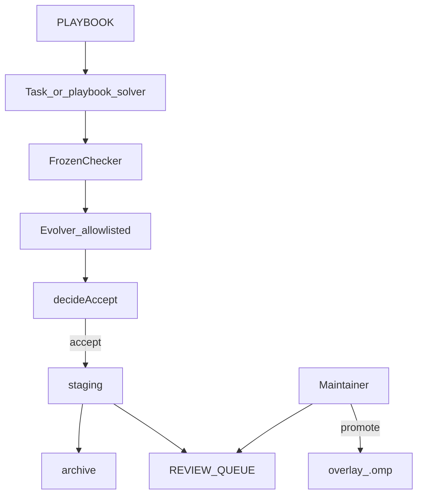
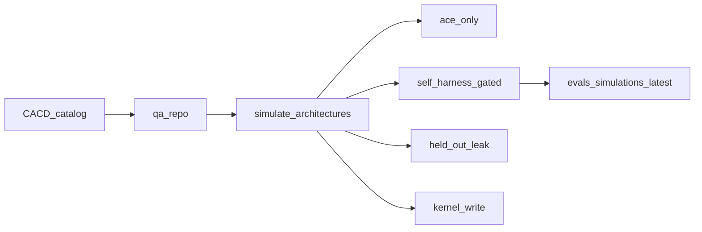

# Improveness — simulate and gate self-improving agentic harnesses

> **What it is:** A research corpus, a CACD operating model, and a keyless simulator for agentic-architecture wirings, plus a maintainer-gated overlay that evolves project Oh My Pi surfaces against a frozen checker.
> **What it is not:** A weight trainer, an auto-apply bot, a live fork of `can1357/oh-my-pi`, or a public Terminal-Bench 2 campaign.
> **Primary interface:** Bun CLIs under `harness/omp/drivers/` (`qa.sh`, `simulate-architectures.ts`, `run-benchmark.ts`).

Runtime: Bun 1.3.14. No server port. LLM keys optional.

---

**TL;DR**

- **Selling point:** seven named agentic architectures are simulated without a live model — ACE-only stagnates, gated Self-Harness improves, leaks / kernel writes / unbounded loops / auto-promote are refused.
- **CACD** is Contract · Architecture · Control · Delivery. QA opens every catalog path.
- The *model* stays frozen. What improves is the **harness** (AHE / Self-Harness / ACE).
- Accept means staging + archive + review queue. A human promotes (D7, D12).
- Fitness is a 20-fixture frozen checker (12 held-in, 8 held-out), not public TB2.
- Recorded search: held-in **0/12 → 7/12**, held-out **0/8 → 3/8**. AHE-all-families sim: **12/12** and **6/8**.
- Repo QA checks CACD needles, relative links in 65 markdown files, and the fixture split.
- Root CI runs `harness/omp/scripts/qa.sh`. Live smoke is skip-gated.
- System prompt files are not an improvement surface (AHE prompt-only −2.3 pp).
- Source: [Lilian Weng, “Harness Engineering for Self-Improvement” (Jul 2026)](https://lilianweng.github.io/posts/2026-07-04-harness/).

---

## Table of contents

1. [Vision](#1-vision)
2. [Definitions](#2-definitions)
3. [Architecture](#3-architecture)
4. [CACD](#4-cacd)
5. [Simulations](#5-simulations)
6. [Quickstart](#6-quickstart)
7. [Configuration](#7-configuration)
8. [Project structure](#8-project-structure)
9. [Drivers and interfaces](#9-drivers-and-interfaces)
10. [Eval suite](#10-eval-suite)
11. [Testing, QA, and CI](#11-testing-qa-and-ci)
12. [Safety kernel](#12-safety-kernel)
13. [Cookbook](#13-cookbook)
14. [Benchmarks](#14-benchmarks)
15. [Roadmap and changelog](#15-roadmap-and-changelog)
16. [FAQ and glossary](#16-faq-and-glossary)

## 1. Vision

### 1.1 What it is

Improveness lets a maintainer **define**, **simulate**, and **gate** how an agentic coding harness is allowed to improve itself.

1. A **reading corpus** (`docs/`) for Weng’s survey.
2. A **CACD** model so Contract, Architecture, Control, and Delivery stay checkable.
3. A **simulator** of agentic wirings (ACE-only, Self-Harness, leaked held-out, kernel-writing evolver, unbounded loop, auto-promote).
4. A **working overlay** on in-tree Oh My Pi (`harness/omp/`).

### 1.2 What it is not

- Not a live fork of [oh-my-pi](https://github.com/can1357/oh-my-pi) with remotes.
- Not DGM / AlphaEvolve / SIA weight updates.
- Not an ACE-only prompt rewriter.
- Not a closed loop that writes canonical `overlay/.omp`.
- Not a public Terminal-Bench 2 or SWE-bench leaderboard run.

### 1.3 Who it is for

Platform and harness authors who need to **compare agentic architectures** before buying tokens. Maintainers who treat candidates as evidence ([oh-my-pi#7907](https://github.com/can1357/oh-my-pi/issues/7907)).

### 1.4 Success criteria

`bash harness/omp/scripts/qa.sh` exits 0. All seven architecture simulations pass. A reviewer can answer “what may the evolver touch?” from [`harness/omp/KERNEL.md`](harness/omp/KERNEL.md) without the paper.

## 2. Definitions

| Term | Definition |
|------|------------|
| **CACD** | **C**ontract · **A**rchitecture · **C**ontrol · **D**elivery. The operating model. Machine catalog: [`harness/omp/cacd/catalog.ts`](harness/omp/cacd/catalog.ts) (12 items). Narrative: [`harness/omp/CACD.md`](harness/omp/CACD.md). |
| **Contract** | Editable vs frozen paths (KERNEL, SURFACES, plan, ADRs). |
| **Architecture** | How roles, memory, tools, and the evaluator are wired. |
| **Control** | What must throw or reject (allowlist, held-out, step cap, frozen checker). |
| **Delivery** | How a gain becomes evidence (staging, archive, queue, CI) — not authority. |
| **QA** | Repository-wide assurance: CACD needles, relative links, fixture inventory, then the simulation suite. Orchestrator: [`harness/omp/scripts/qa.sh`](harness/omp/scripts/qa.sh). |
| **Simulation** | Deterministic replay of a *named* agentic architecture against the frozen suite. No live LLM. |
| **Agentic architecture** | The wiring of agents, memory, tools, evaluators, and promote rights — not the weights. This engine’s selling point is simulating those wirings. |
| **ACE** | Playbook memory with a deterministic curator. |
| **AHE** | File-level evolution of tools / middleware / memory. Prompt-only missed the gain. |
| **Self-Harness** | Held-in / held-out accept rule around a frozen model. |

## 3. Architecture

### 3.1 Improvement loop



### 3.2 Simulation vs live



### 3.3 Key modules

| Path | Role |
|------|------|
| [`harness/omp/CACD.md`](harness/omp/CACD.md) | Operating model |
| [`harness/omp/cacd/catalog.ts`](harness/omp/cacd/catalog.ts) | 12 QA-checked items |
| [`harness/omp/drivers/simulate-architectures.ts`](harness/omp/drivers/simulate-architectures.ts) | 7 architecture replays |
| [`harness/omp/drivers/qa-repo.ts`](harness/omp/drivers/qa-repo.ts) | Repo QA |
| [`harness/omp/overlay/.omp/`](harness/omp/overlay/.omp/) | Project playbook and agents |
| [`oh-my-pi/`](oh-my-pi/) | Vendored seed harness |

## 4. CACD

See [`harness/omp/CACD.md`](harness/omp/CACD.md). D13 records the name.

| Layer | Count | Examples |
|-------|-------|----------|
| Contract | 4 | KERNEL, SURFACES, IMPLEMENTATION_PLAN, DECISIONS |
| Architecture | 2 | CACD.md, overlay AGENTS.md |
| Control | 3 | allowlist, search cap, held-in-only proposer |
| Delivery | 3 | REVIEW_QUEUE, overlay.yml, qa.sh |

QA fails the build if any catalog path is missing or loses its `mustContain` needles.

## 5. Simulations

This is the platform extension: **compare agentic architectures without buying a frontier run**.

Recorded report: [`harness/omp/evals/simulations/latest/summary.md`](harness/omp/evals/simulations/latest/summary.md)

| Id | Architecture | Expected | Outcome | Held-in | Held-out |
|----|--------------|----------|---------|---------|----------|
| `ace-only` | ACE slogans, no `recipe:*` | stagnate | pass | 0/12 | 0/8 |
| `self-harness-gated` | 5-step bounded search | improve | pass | 7/12 | 3/8 |
| `ahe-surfaces` | All held-in families unlocked | improve | pass | 12/12 | 6/8 |
| `held-out-leak` | Proposer sees `no-secrets` | throw | pass | — | — |
| `kernel-write` | Evolver writes the checker | throw | pass | — | — |
| `unbounded-search` | `stepCap = 9` | throw | pass | — | — |
| `auto-promote` | Search writes `overlay/.omp` | no-promote | pass | — | — |

What each wiring teaches:

- **ace-only** — AHE’s warning: slogans without tools/memory unlocks do not move the suite.
- **self-harness-gated** — the product loop: gain on both splits, still no promote.
- **ahe-surfaces** — unlocking held-in families reaches 12/12 and 6/8; secret held-out tasks stay locked.
- **held-out-leak / kernel-write / unbounded-search / auto-promote** — Control and Delivery refuse unsafe topologies.

```text
bun harness/omp/drivers/simulate-architectures.ts
```

## 6. Quickstart

### 6.1 Prerequisites

- Bun 1.3.14
- `rg` (ripgrep)
- Git. LLM keys optional

### 6.2 Full repository QA (preferred)

```text
bash harness/omp/scripts/qa.sh
```

### 6.3 Overlay-only gate

```text
bash harness/omp/scripts/validate.sh
```

### 6.4 Install playbook context into in-tree OMP

```text
bash harness/omp/scripts/install-overlay.sh
```

Merges into existing `oh-my-pi/.omp/`. Do not replace that directory.

### 6.5 Improvement cycle in a temp tree

```text
bun harness/omp/drivers/run-benchmark.ts 5 /tmp/improv-bench
```

## 7. Configuration

None required for `qa.sh`. Secrets stay in the environment.

| Variable | Required | Default | Description |
|----------|----------|---------|-------------|
| `OMP_GOOGLE_ANTIGRAVITY_CLIENT_ID` | no | unset | OMP OAuth placeholder |
| `OMP_GOOGLE_ANTIGRAVITY_CLIENT_SECRET` | no | unset | OMP OAuth placeholder |
| `OMP_GOOGLE_GEMINI_CLI_CLIENT_ID` | no | unset | OMP OAuth placeholder |
| `OMP_GOOGLE_GEMINI_CLI_CLIENT_SECRET` | no | unset | OMP OAuth placeholder |
| `OMP_ANTHROPIC_OAUTH_CLIENT_ID` | no | unset | OMP OAuth placeholder |
| `ANTHROPIC_API_KEY` | no | unset | Optional live smoke |
| `OPENAI_API_KEY` | no | unset | Optional live smoke |
| `OPENROUTER_API_KEY` | no | unset | Optional live smoke |
| `OMP_LIVE_SMOKE` | no | unset | Set `1` to attempt `createAgentSession` smoke |
| `OMP_LIVE_SEARCH` | no | unset | Reserved; deterministic search is the gate |

See [`.env.example`](.env.example).

## 8. Project structure

```text
.
├── README.md
├── IMPLEMENTATION_PLAN.md
├── DECISIONS.md                 # D1–D13
├── .github/workflows/overlay.yml
├── docs/
├── harness/omp/
│   ├── CACD.md
│   ├── cacd/catalog.ts
│   ├── KERNEL.md
│   ├── SURFACES.md
│   ├── drivers/                 # 19 Bun drivers
│   ├── evals/
│   │   ├── held-in/             # 12
│   │   ├── held-out/            # 8
│   │   ├── benchmarks/local-20/
│   │   └── simulations/latest/
│   ├── overlay/.omp/
│   ├── scripts/validate.sh
│   ├── scripts/qa.sh
│   └── tests/                   # 19 bun test files
├── oh-my-pi/
└── vendor/cursor-config-coding/
```

## 9. Drivers and interfaces

19 drivers. Evolver writes go through `assertEvolverWrite`.

### 9.1 Memory and traces (4)

| Name | Approval | What it does |
|------|----------|--------------|
| `curate-playbook.ts` | playbook/ only | Deterministic ACE delta merge |
| `export-session.ts` | traces/ append | jsonl → miner trace tree |
| `write-diagnosis.ts` | `diagnosis.md` only | Debugger write path |
| `playbook-solver.ts` | read-only | Scores fixtures from `recipe:*` families |

### 9.2 Gate and review (5)

| Name | Approval | What it does |
|------|----------|--------------|
| `run-eval.ts` | none | `scoreSplit` on repo/ or expected/ |
| `self-harness.ts` | staging/ only | `decideAccept` + `stageCandidate` |
| `manifest.ts` | n/a | Candidate JSON schema |
| `apply-candidate.ts` | staging | Parent snapshot + manifest |
| `rollback-candidate.ts` | staging snapshots | Restore parent bytes |

### 9.3 Search and runners (5)

| Name | Approval | What it does |
|------|----------|--------------|
| `archive.ts` | archive/ | Snapshot, `listArchive`, `sampleParent` |
| `propose.ts` | staging playbook | Next held-in-only recipe |
| `search.ts` | staging + archive + queue | Hard-capped loop; no overlay promote |
| `tb-export.ts` | adapter out dir | Harbor-shaped local task |
| `run-tb-local.ts` | none | Runs adapter `test.sh` |

### 9.4 Assurance (5)

| Name | Approval | What it does |
|------|----------|--------------|
| `allowlist.ts` | n/a | Tool + path policy |
| `live-session-smoke.ts` | skip without keys | Optional SDK pong |
| `run-benchmark.ts` | temp worktree | 5-step local-20 report |
| `qa-repo.ts` | none | CACD + links + fixtures |
| `simulate-architectures.ts` | temp worktree | Seven architecture replays |

4 + 5 + 5 + 5 = 19.

Project agents: [`debugger.md`](harness/omp/overlay/.omp/agents/debugger.md) (read-only) and [`evolver.md`](harness/omp/overlay/.omp/agents/evolver.md). Hidden roles `@debugger` / `@evolver` (D10).

## 10. Eval suite

| Split | Count | Role |
|-------|-------|------|
| Held-in | 12 | Proposer may see failures |
| Held-out | 8 | Regression brake |

Held-out-only `recipe:no-secrets` is never proposed. Those two tasks staying failed is the leakage brake.

Each fixture: `fixture.json` + `check.sh` + failing `repo/` + passing `expected/`.

## 11. Testing, QA, and CI

```text
bun test harness/omp/tests/
bash harness/omp/scripts/validate.sh
bash harness/omp/scripts/qa.sh
```

| Tier | What | Command |
|------|------|---------|
| Fast | 19 test files (allowlists, solver, search, CACD, QA, sims) | `bun test harness/omp/tests/` |
| Medium | Overlay greps + fixture count | `validate.sh` |
| Repo QA | Catalog + links + simulations | `qa.sh` |
| Slow | Live smoke | skip without keys |
| Out of gate | OMP `coding-agent-heavy` | do not run |

CI ([`.github/workflows/overlay.yml`](.github/workflows/overlay.yml)): job `validate` now runs `qa.sh`. Job `live-smoke` still skip-gates.

## 12. Safety kernel

[`harness/omp/KERNEL.md`](harness/omp/KERNEL.md) · [`docs/proposals/04-safety.md`](docs/proposals/04-safety.md)

| Rule | Enforcement |
|------|-------------|
| No checker / system-prompt / OMP package writes | `assertEvolverWrite` |
| No held-out ids in the proposer | `propose.ts` |
| Hard step cap | `MAX_STEP_CAP = 8` |
| Frozen fitness | `check.sh`, not an LLM judge |
| Human promote | `REVIEW_QUEUE.md` |
| Unsafe wirings | architecture simulations must `throw` / `no-promote` |

## 13. Cookbook

**Simulate every named architecture**

```text
bun harness/omp/drivers/simulate-architectures.ts
```

**Repository QA only**

```text
bun harness/omp/drivers/qa-repo.ts
```

**Score a split**

```text
bun harness/omp/drivers/run-eval.ts harness/omp/evals held-in repo
```

**Local Harbor-shaped tasks**

```text
bun harness/omp/drivers/run-tb-local.ts harness/omp/evals repo
```

## 14. Benchmarks

Search cycle: [`harness/omp/evals/benchmarks/local-20/summary.md`](harness/omp/evals/benchmarks/local-20/summary.md)

| Split | Baseline | After 5 search steps | Δ |
|-------|----------|----------------------|---|
| Held-in | 0/12 | 7/12 | +7 |
| Held-out | 0/8 | 3/8 | +3 |

Architecture contrast (from simulations): ACE-only stays 0/20; unlocking all held-in AHE families reaches 12/12 and 6/8.

## 15. Roadmap and changelog

### 15.1 Build phases (completed)

| Phase | Theme | Status |
|-------|-------|--------|
| Research | Weng segments and proposals | done |
| P0 | Overlay loop | done |
| P1 | 20 fixtures, roles, TB adapter, archive | done |
| P2 | CI, search, local Harbor, local-20 | done |
| CACD + QA + sims | Operating model, repo QA, 7 architecture replays | done |

### 15.2 Possible future directions

- Public Terminal-Bench 2 campaign (never as evolver fitness)
- Live `@evolver` behind `OMP_LIVE_SEARCH=1`
- Spec Kit `.specify/`
- Human promote of a staging playbook

### 15.3 Changelog

| Date | Change |
|------|--------|
| 2026-08-15 | CACD (D13), repo QA, seven agentic-architecture simulations, extensive README rewrite |
| 2026-08-15 | P2: overlay CI, bounded search, local-20 (0/12→7/12, 0/8→3/8) |
| 2026-08-15 | P1: 20 fixtures, hidden roles, TB adapter, archive |
| 2026-08-15 | P0 overlay; in-tree OMP |

## 16. FAQ and glossary

**Why simulate instead of running a live agent on TB2?**
Public-set tuning is forbidden (P5). Simulations compare *wirings* (who may write, who may see \(D_{out}\), whether promote is automatic) at CI speed.

**What does CACD add over DECISIONS.md?**
ADRs are history. CACD is the live checklist QA opens every run.

**Why can the evolver be small?**
Lin et al. 2026: harness-updating is flat across mid and frontier models (D6).

**Where do I start?**
[`harness/omp/CACD.md`](harness/omp/CACD.md) · [`harness/omp/evals/simulations/latest/summary.md`](harness/omp/evals/simulations/latest/summary.md) · [`IMPLEMENTATION_PLAN.md`](IMPLEMENTATION_PLAN.md)

**Authority**

[`IMPLEMENTATION_PLAN.md`](IMPLEMENTATION_PLAN.md) · [`PROGRESS.md`](PROGRESS.md) · [`DECISIONS.md`](DECISIONS.md) · [`LEARNING.md`](LEARNING.md) · [`harness/omp/CACD.md`](harness/omp/CACD.md)
