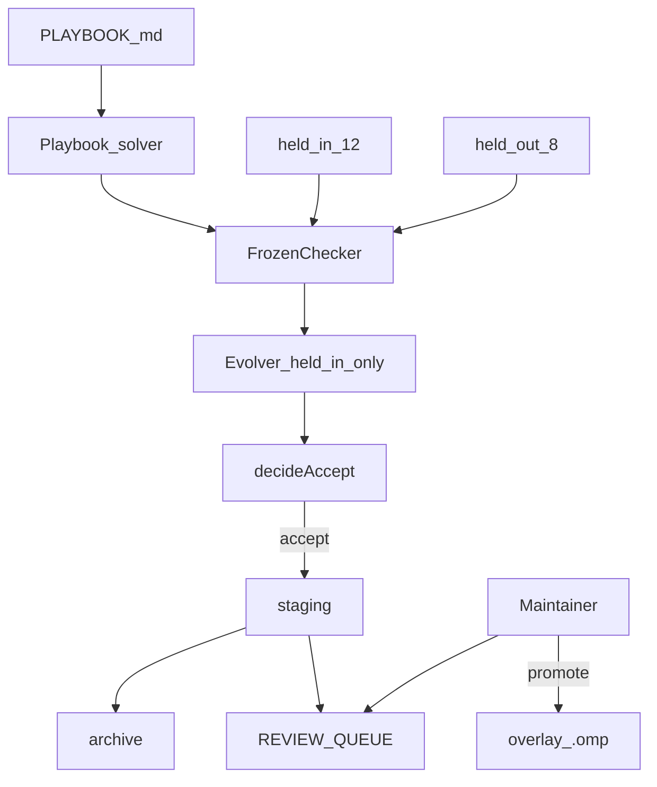
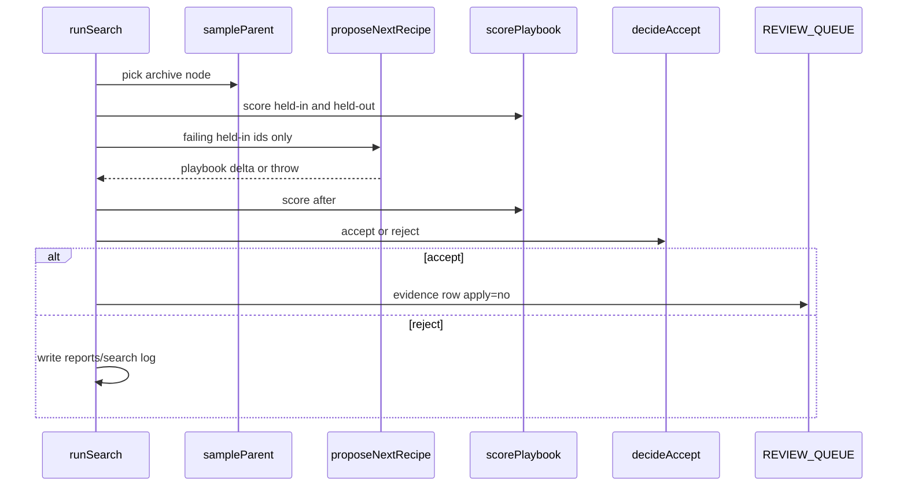
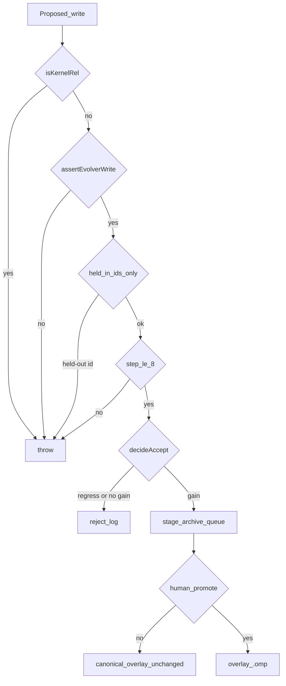

# Improveness — a gated engine for self-improving agentic harnesses

> **What it is:** A research corpus, a CACD operating model, and a keyless simulator of agentic-architecture wirings, plus a maintainer-gated overlay that evolves *project* Oh My Pi surfaces against a frozen checker.
> **What it is not:** A weight trainer, an auto-apply bot, a live fork of `can1357/oh-my-pi`, or a public Terminal-Bench 2 campaign.
> **Primary interface:** Bun CLIs under `harness/omp/drivers/` and `bash harness/omp/scripts/qa.sh`.

Runtime: Bun 1.3.14 on the repo filesystem. No HTTP server. No Docker. LLM API keys are optional and never required for QA.

---

**TL;DR**

- The *model* stays frozen. What improves is the **harness** around it — playbook, skills, tools, hooks — not `system-prompt.md`.
- **Selling point:** seven named agentic architectures are simulated without a live model. ACE-only stagnates (0/20). Gated Self-Harness improves (7/12 · 3/8). Leaks, kernel writes, unbounded loops, and auto-promote are refused.
- **CACD** is Contract · Architecture · Control · Delivery. QA opens all 12 catalog paths every run (D13).
- Accept means `staging/` + `archive/<id>/` + a `REVIEW_QUEUE.md` row. A human promotes. There is no auto-apply (D7, D12).
- Fitness is a **20-fixture** frozen checker (12 held-in, 8 held-out). The proposer never sees held-out ids.
- Recorded search cycle: held-in **0/12 → 7/12**, held-out **0/8 → 3/8**. Unlocking all held-in AHE families reaches **12/12 · 6/8**; secret held-out tasks stay locked.
- `qa.sh` is the repo gate: 19 test files, CACD needles, relative links, then the seven simulations. CI runs that script.
- In-tree [`oh-my-pi/`](oh-my-pi/) is the upgrade base (nested git removed). This repo does not push upstream.
- AHE measured prompt-only evolution at **−2.3 pp**. That file is kernel, not a playbook.
- Source survey: [Lilian Weng, “Harness Engineering for Self-Improvement” (Jul 2026)](https://lilianweng.github.io/posts/2026-07-04-harness/).

---

## Table of contents

1. [Vision](#1-vision)
2. [Concept to implementation](#2-concept-to-implementation)
3. [Architecture](#3-architecture)
4. [CACD](#4-cacd)
5. [Simulations](#5-simulations)
6. [Quickstart](#6-quickstart)
7. [Configuration](#7-configuration)
8. [Project structure](#8-project-structure)
9. [Drivers and interfaces](#9-drivers-and-interfaces)
10. [Data model](#10-data-model)
11. [Eval suite](#11-eval-suite)
12. [Testing, QA, and CI](#12-testing-qa-and-ci)
13. [Safety kernel](#13-safety-kernel)
14. [Deployment](#14-deployment)
15. [Cookbook](#15-cookbook)
16. [Benchmarks](#16-benchmarks)
17. [Extending](#17-extending)
18. [Roadmap and changelog](#18-roadmap-and-changelog)
19. [FAQ and glossary](#19-faq-and-glossary)
20. [Appendix: CLI reference](#20-appendix-cli-reference)

## 1. Vision

### 1.1 What it is

Improveness is a **harness-engineering engine**. It answers: given a strong coding agent (here, Oh My Pi), what do you add so the *harness* can improve itself without rewriting weights, without touching the permission kernel, and without silently promoting candidates?

Four layers live in one git root:

1. **Corpus** — Weng segments and method pages in [`docs/`](docs/00-index.md).
2. **CACD** — a machine-checkable operating model in [`harness/omp/CACD.md`](harness/omp/CACD.md).
3. **Simulator** — seven named agentic wirings in [`harness/omp/drivers/simulate-architectures.ts`](harness/omp/drivers/simulate-architectures.ts).
4. **Overlay** — the live loop on in-tree OMP under [`harness/omp/`](harness/omp/SURFACES.md).

### 1.2 What it is not

- Not a live fork of [oh-my-pi](https://github.com/can1357/oh-my-pi) with remotes. Nested `.git` was stripped (D8).
- Not DGM, AlphaEvolve, or SIA weight updates. Those stay parked.
- Not an ACE-only prompt rewriter. The `ace-only` simulation exists to *prove* slogans do not move the suite.
- Not a closed loop that writes canonical `overlay/.omp` or `oh-my-pi/packages/`.
- Not a public Terminal-Bench 2 or SWE-bench leaderboard run (D11, proposal P5).

### 1.3 Who it is for

Platform authors who need to **compare agentic architectures before buying tokens**. Maintainers who treat improvement candidates as evidence ([oh-my-pi#7907](https://github.com/can1357/oh-my-pi/issues/7907)). Future agents that must load a nawab contract from [`IMPLEMENTATION_PLAN.md`](IMPLEMENTATION_PLAN.md).

### 1.4 Success criteria

`bash harness/omp/scripts/qa.sh` exits 0. All seven architecture simulations pass. A reviewer can answer “what may the evolver touch?” from [`harness/omp/KERNEL.md`](harness/omp/KERNEL.md) and [`harness/omp/SURFACES.md`](harness/omp/SURFACES.md) without reading the paper.

## 2. Concept to implementation

| Paper / idea | What it means | Where it lives here |
|--------------|---------------|---------------------|
| Weng survey | Harness engineering, not RSI-via-weights | [`docs/00-index.md`](docs/00-index.md) segments 01–09 |
| ACE | Collapse-resistant playbook memory | [`overlay/.omp/playbook/`](harness/omp/overlay/.omp/playbook/) + [`curate-playbook.ts`](harness/omp/drivers/curate-playbook.ts) |
| AHE | Evolve tools / middleware / memory; not the system prompt | [`SURFACES.md`](harness/omp/SURFACES.md); prompt files are kernel |
| Self-Harness | Held-in / held-out accept rule | [`self-harness.ts`](harness/omp/drivers/self-harness.ts) |
| Agent Debugger | Read-only diagnosis role | [`agents/debugger.md`](harness/omp/overlay/.omp/agents/debugger.md) |
| Allowlisted evolver | Writes only overlay / staging | [`allowlist.ts`](harness/omp/drivers/allowlist.ts) + [`evolver.md`](harness/omp/overlay/.omp/agents/evolver.md) |
| DGM-lite archive | Parent + fitness snapshots | [`archive.ts`](harness/omp/drivers/archive.ts) |
| CACD | Contract · Architecture · Control · Delivery | [`CACD.md`](harness/omp/CACD.md) + [`cacd/catalog.ts`](harness/omp/cacd/catalog.ts) |
| Architecture sim | Keyless replay of unsafe vs gated wirings | [`simulate-architectures.ts`](harness/omp/drivers/simulate-architectures.ts) |

Lin et al. 2026: spend capability on the **task** agent; the evolver may be mid/small (D6). AHE: prompt-only evolution **−2.3 pp** on Terminal-Bench 2 — that is why `system-prompt.md` is frozen.

## 3. Architecture

### 3.1 High-level loop



### 3.2 One search turn



### 3.3 Safety stack



### 3.4 Key modules

| Path | Role |
|------|------|
| [`harness/omp/CACD.md`](harness/omp/CACD.md) | Operating model |
| [`harness/omp/cacd/catalog.ts`](harness/omp/cacd/catalog.ts) | 12 QA-checked items |
| [`harness/omp/KERNEL.md`](harness/omp/KERNEL.md) | Evolver-forbidden paths |
| [`harness/omp/SURFACES.md`](harness/omp/SURFACES.md) | AHE component → file map |
| [`harness/omp/drivers/`](harness/omp/drivers/) | 19 Bun drivers |
| [`harness/omp/evals/`](harness/omp/evals/) | Checker, 20 fixtures, local-20, simulations |
| [`oh-my-pi/`](oh-my-pi/) | Vendored seed; read-only unless a documented core patch |

## 4. CACD

**C**ontract · **A**rchitecture · **C**ontrol · **D**elivery. D13. Narrative: [`harness/omp/CACD.md`](harness/omp/CACD.md).

This is not a second plan file. It is the checklist `qa-repo.ts` opens every run. If you add a kernel path or a simulation id, add a catalog row in the same commit.

| Id | Layer | Title | Path |
|----|-------|-------|------|
| `c-kernel` | contract | Frozen kernel | `harness/omp/KERNEL.md` |
| `c-surfaces` | contract | Editable surfaces | `harness/omp/SURFACES.md` |
| `c-plan` | contract | Execution contract | `IMPLEMENTATION_PLAN.md` |
| `c-decisions` | contract | ADRs | `DECISIONS.md` |
| `a-cacd` | architecture | CACD definition | `harness/omp/CACD.md` |
| `a-agents` | architecture | Playbook is context | `harness/omp/overlay/.omp/AGENTS.md` |
| `k-allowlist` | control | Evolver path policy | `harness/omp/drivers/allowlist.ts` |
| `k-search-cap` | control | Hard search step cap | `harness/omp/drivers/search.ts` |
| `k-propose` | control | Held-in-only proposer | `harness/omp/drivers/propose.ts` |
| `d-queue` | delivery | Human review queue | `harness/omp/REVIEW_QUEUE.md` |
| `d-ci` | delivery | Overlay CI | `.github/workflows/overlay.yml` |
| `d-qa` | delivery | QA orchestrator | `harness/omp/scripts/qa.sh` |

4 + 2 + 3 + 3 = **12**.

## 5. Simulations

The platform extension: **compare agentic architectures without a frontier run**.

Driver: [`harness/omp/drivers/simulate-architectures.ts`](harness/omp/drivers/simulate-architectures.ts). Recorded report: [`harness/omp/evals/simulations/latest/summary.md`](harness/omp/evals/simulations/latest/summary.md).

| Id | Architecture | Expected | Outcome | Held-in | Held-out |
|----|--------------|----------|---------|---------|----------|
| `ace-only` | ACE slogans, no `recipe:*` | stagnate | pass | 0/12 | 0/8 |
| `self-harness-gated` | 5-step bounded search | improve | pass | 7/12 | 3/8 |
| `ahe-surfaces` | All held-in families unlocked | improve | pass | 12/12 | 6/8 |
| `held-out-leak` | Proposer sees `no-secrets` | throw | pass | — | — |
| `kernel-write` | Evolver writes the checker | throw | pass | — | — |
| `unbounded-search` | `stepCap = 9` | throw | pass | — | — |
| `auto-promote` | Search writes `overlay/.omp` | no-promote | pass | — | — |

| Wiring | Lesson |
|--------|--------|
| `ace-only` | AHE’s warning encoded as a passing test of *stagnation* |
| `self-harness-gated` | The product loop: both splits move; canonical overlay does not |
| `ahe-surfaces` | Tools/memory-style unlocks beat slogans; held-out secrets stay locked |
| `held-out-leak` | An evolver that can see D_out is Control-illegal |
| `kernel-write` | A topology that can silence the verifier never reaches Delivery |
| `unbounded-search` | `MAX_STEP_CAP = 8` (default 3) is hard |
| `auto-promote` | D12: search stages evidence; it does not promote |

```text
bun harness/omp/drivers/simulate-architectures.ts
```

## 6. Quickstart

### 6.1 Prerequisites

- [Bun 1.3.14](https://bun.sh) (OMP pin; overlay tests use the same)
- `rg` (ripgrep) for `validate.sh` and several fixture `check.sh` scripts
- Git
- LLM keys: **optional**. QA and simulations are keyless.

### 6.2 Clone and verify

```text
git clone https://github.com/Vinayak-RZ/Improveness.git
cd Improveness
bash harness/omp/scripts/qa.sh
```

Expected: `qa.sh ok`. `bun test` reports 55 pass across 19 files. Seven architecture simulations pass.

### 6.3 Overlay-only gate (faster, no second sim pass)

```text
bash harness/omp/scripts/validate.sh
```

### 6.4 Install playbook context into in-tree OMP

```text
bash harness/omp/scripts/install-overlay.sh
```

Merges Improveness files into the existing `oh-my-pi/.omp/` tree. Do **not** replace that directory; OMP already ships commands and skills.

### 6.5 Improvement cycle in a temp tree

```text
bun harness/omp/drivers/run-benchmark.ts 5 /tmp/improv-bench
```

Uses a copy of the evals. Does not dirty canonical `overlay/.omp/playbook/PLAYBOOK.md`.

## 7. Configuration

Nothing is required for `qa.sh`. Values stay in the environment. The curator rejects secret-shaped playbook lines.

| Variable | Required | Default | Description |
|----------|----------|---------|-------------|
| `OMP_GOOGLE_ANTIGRAVITY_CLIENT_ID` | no | unset | OMP OAuth placeholder |
| `OMP_GOOGLE_ANTIGRAVITY_CLIENT_SECRET` | no | unset | OMP OAuth placeholder |
| `OMP_GOOGLE_GEMINI_CLI_CLIENT_ID` | no | unset | OMP OAuth placeholder |
| `OMP_GOOGLE_GEMINI_CLI_CLIENT_SECRET` | no | unset | OMP OAuth placeholder |
| `OMP_ANTHROPIC_OAUTH_CLIENT_ID` | no | unset | OMP OAuth placeholder |
| `ANTHROPIC_API_KEY` | no | unset | Unlocks live smoke when `OMP_LIVE_SMOKE=1` |
| `OPENAI_API_KEY` | no | unset | Same |
| `OPENROUTER_API_KEY` | no | unset | Same |
| `OMP_LIVE_SMOKE` | no | unset | Set `1` to attempt `createAgentSession` smoke |
| `OMP_LIVE_SEARCH` | no | unset | Reserved; deterministic search is the CI gate |

See [`.env.example`](.env.example). Do not restore hardcoded OAuth client secrets (GitHub push protection).

**Cost model:** default QA and simulations spend zero API tokens. Live smoke is an optional CI job that exits 0 when keys are absent. A public TB2 campaign is P3 and must never become evolver fitness.

## 8. Project structure

```text
.
├── README.md
├── IMPLEMENTATION_PLAN.md       # live nawab P2 contract
├── DECISIONS.md                 # D1–D13
├── PROGRESS.md
├── LEARNING.md
├── PROJECT_OVERVIEW.md
├── .env.example
├── .github/workflows/overlay.yml
├── docs/                        # Weng segments, methods, proposals, plans
├── harness/omp/                 # Improveness source of truth
│   ├── CACD.md
│   ├── cacd/catalog.ts
│   ├── KERNEL.md
│   ├── SURFACES.md
│   ├── REVIEW_QUEUE.md
│   ├── drivers/                 # 19 TypeScript/Bun drivers
│   ├── evals/
│   │   ├── checker/check.ts
│   │   ├── held-in/             # 12 fixtures
│   │   ├── held-out/            # 8 fixtures
│   │   ├── tb-adapter/          # Harbor-shaped local tasks
│   │   ├── benchmarks/local-20/
│   │   └── simulations/latest/
│   ├── overlay/.omp/            # playbook, agents, manifests
│   ├── archive/                 # snapshot bodies gitignored
│   ├── staging/                 # accepted candidates gitignored
│   ├── scripts/validate.sh
│   ├── scripts/qa.sh
│   └── tests/                   # 19 bun test files
├── oh-my-pi/                    # vendored OMP, no nested .git
└── vendor/cursor-config-coding/ # nawab + extensive-readme skills
```

## 9. Drivers and interfaces

19 drivers. Evolver writes go through `assertEvolverWrite` in [`allowlist.ts`](harness/omp/drivers/allowlist.ts).

### 9.1 Memory and traces (4)

| Name | Approval | What it does |
|------|----------|--------------|
| `curate-playbook.ts` | `playbook/` only | Deterministic ACE delta; rejects secrets and SYSTEM.md lessons |
| `export-session.ts` | traces append | OMP jsonl → `meta.json`, turns, tool I/O, `outcome.json` |
| `write-diagnosis.ts` | `diagnosis.md` only | Debugger write under `traces/` or `reports/` |
| `playbook-solver.ts` | read-only | Scores fixtures as if a task agent followed `recipe:*` families |

### 9.2 Gate and review (5)

| Name | Approval | What it does |
|------|----------|--------------|
| `run-eval.ts` | none | `scoreSplit` on `repo/` or `expected/` |
| `self-harness.ts` | staging only | `decideAccept` + `stageCandidate` |
| `manifest.ts` | n/a | Candidate JSON schema |
| `apply-candidate.ts` | staging | Parent snapshot + manifest (library; no CLI apply-to-overlay) |
| `rollback-candidate.ts` | staging snapshots | Restore parent bytes by id |

### 9.3 Search and runners (5)

| Name | Approval | What it does |
|------|----------|--------------|
| `archive.ts` | archive only | `snapshotOverlay`, `listArchive`, `sampleParent`; kernel deny |
| `propose.ts` | staging playbook | Next held-in-only `recipe:*`; throws on held-out ids |
| `search.ts` | staging + archive + queue | Hard-capped loop; never promotes `overlay/.omp` |
| `tb-export.ts` | adapter out dir | Harbor-shaped `instruction.md` + `tests/test.sh` |
| `run-tb-local.ts` | none | Executes those tasks against fixture `repo/` or `expected/` |

### 9.4 Assurance (5)

| Name | Approval | What it does |
|------|----------|--------------|
| `allowlist.ts` | n/a | Debugger/evolver tool + path policy |
| `live-session-smoke.ts` | skip without keys | Optional `createAgentSession` pong |
| `run-benchmark.ts` | temp worktree | 5-step local-20 report |
| `qa-repo.ts` | none | CACD needles, relative links, fixture inventory |
| `simulate-architectures.ts` | temp worktree | Seven architecture replays |

4 + 5 + 5 + 5 = **19**.

Project agents: [`debugger.md`](harness/omp/overlay/.omp/agents/debugger.md) (read / grep / glob / find only) and [`evolver.md`](harness/omp/overlay/.omp/agents/evolver.md) (no bash; no kernel paths). Hidden OMP roles `@debugger` / `@evolver` (D10).

## 10. Data model

No database. Persistence is files.

### 10.1 Fixture

`harness/omp/evals/{held-in,held-out}/<id>/`

| File | Role |
|------|------|
| `fixture.json` | `{ id, split, prompt, check }` |
| `check.sh` | Frozen verifier; exit 0 = pass |
| `repo/` | Starter tree; must fail the check |
| `expected/` | Gold tree; must pass the check |

### 10.2 Candidate manifest

[`manifest.ts`](harness/omp/drivers/manifest.ts): `id`, `surface` (`tool` \| `hook` \| `memory` \| `skill` \| `playbook`), `files[]`, `parentHash` (sha256), `scores.heldIn` / `heldOut`, `rollback` command, optional `evidenceId` / `rootCause`.

### 10.3 Archive node

[`archive.ts`](harness/omp/drivers/archive.ts): `id`, `parentId`, `fitness` (held-out pass rate), `fileHashes`, `createdAt`. Bodies under `harness/omp/archive/<id>/` (gitignored). `sampleParent` weights `fitness / (1 + childCount)`.

### 10.4 CACD item

[`cacd/catalog.ts`](harness/omp/cacd/catalog.ts): `id`, `layer`, `title`, `path`, `mustContain[]`.

### 10.5 Simulation result

`id`, `title`, `sellingPoint`, `expected` (`stagnate` \| `improve` \| `throw` \| `no-promote`), `outcome` (`pass` \| `fail`), `detail`, optional scores.

## 11. Eval suite

### 11.1 Split

| Split | Count | Role |
|-------|-------|------|
| Held-in | 12 | Proposer may see failures and unlock families |
| Held-out | 8 | Regression brake; proposer must not receive these ids |

Each fixture is `fixture.json` + `check.sh` + failing `repo/` + passing `expected/`.

### 11.2 Held-in ids

`default-export`, `gitignore-rule`, `greet-export`, `index-reexport`, `license-header`, `named-type-export`, `package-script`, `readme-section`, `readme-title`, `sum-fn`, `tsconfig-strict`, `unused-var-marker`.

### 11.3 Held-out ids

`barrel-no-secrets`, `gitignore-dist`, `greet-types`, `no-implicit-any`, `no-secrets`, `package-test-script`, `readme-usage`, `typed-default-export`.

### 11.4 Recipe families

A playbook line containing `recipe:gitignore` unlocks every fixture in that family. That is how held-out **generalization** is measured without showing D_out to the proposer.

| Family | Held-in | Held-out |
|--------|---------|----------|
| `recipe:default-export` | default-export | typed-default-export |
| `recipe:gitignore` | gitignore-rule | gitignore-dist |
| `recipe:named-export` | greet-export, sum-fn, named-type-export | greet-types |
| `recipe:index-reexport` | index-reexport | — |
| `recipe:license-header` | license-header | — |
| `recipe:package-script` | package-script | package-test-script |
| `recipe:readme-h2` | readme-section | readme-usage |
| `recipe:readme-h1` | readme-title | — |
| `recipe:tsconfig` | tsconfig-strict | no-implicit-any |
| `recipe:unused-prefix` | unused-var-marker | — |
| `recipe:no-secrets` | — | no-secrets, barrel-no-secrets |

`recipe:no-secrets` has **no held-in member**. The deterministic proposer never unlocks it. Those two held-out tasks staying failed is intentional.

## 12. Testing, QA, and CI

```text
bun test harness/omp/tests/
bash harness/omp/scripts/validate.sh
bash harness/omp/scripts/qa.sh
```

| Tier | What | Command |
|------|------|---------|
| Fast | 19 test files, 55 cases | `bun test harness/omp/tests/` |
| Overlay | Kernel greps, ≥20 fixtures, no TB2 download URLs | `validate.sh` |
| Repo QA | 12 CACD items, relative links, then 7 simulations | `qa.sh` |
| Slow | Live `createAgentSession` | skip unless `OMP_LIVE_SMOKE=1` and a key |
| Out of gate | OMP `coding-agent-heavy` | do not run as the overlay gate |

`qa.sh` = `validate.sh` + `qa-repo.ts` + `simulate-architectures.ts`. CI ([`.github/workflows/overlay.yml`](.github/workflows/overlay.yml)) installs ripgrep, then runs `qa.sh` on the `validate` job (Bun 1.3.14, `contents: read`). Every fixture `check.sh` calls `rg`; without it expected trees fail. The `live-smoke` job is skip-gated and must not redden a keyless PR.

## 13. Safety kernel

[`harness/omp/KERNEL.md`](harness/omp/KERNEL.md) · [`docs/proposals/04-safety.md`](docs/proposals/04-safety.md)

| Rule | Enforcement |
|------|-------------|
| No writes to checker, KERNEL, SURFACES, CACD, `qa.sh`, system-prompt, or `oh-my-pi/packages/` | `isKernelRel` / `assertEvolverWrite` |
| Proposer cannot see held-out ids | `propose.ts` throws |
| Hard step cap | `MAX_STEP_CAP = 8` |
| Fitness is not an LLM judge | frozen `check.sh` |
| Human promote | `REVIEW_QUEUE.md`; search sets `apply to project .omp? = no` |
| Rejects are kept | `harness/omp/reports/search/` |
| Unsafe wirings | simulations must `throw` or `no-promote` |
| No public-set tuning | local fixtures only (proposal P5) |

Debugger tools allowed: `read`, `grep`, `find`, `glob`. Denied: `edit`, `write`, `bash`. Evolver may `edit` / `write` only under overlay playbook / skills / tools or `staging/`.

## 14. Deployment

There is no production service and no container image.

| Target | What happens |
|--------|----------------|
| Local | `qa.sh` / `validate.sh` / Bun CLIs |
| GitHub Actions | [`.github/workflows/overlay.yml`](.github/workflows/overlay.yml) on push/PR path filters + `workflow_dispatch` |
| Overlay install | `install-overlay.sh` merges into `oh-my-pi/.omp/` |
| Candidate rollback | `rollback-candidate.ts --id <id>` |
| npm / Harbor cloud / TB2 leaderboard | not shipped |

Enabling CI for others is merging this branch to `main`. Disabling search is “do not run `search.ts`.”

## 15. Cookbook

**Full repo QA (do this first)**

```text
bash harness/omp/scripts/qa.sh
```

**Simulate every named architecture**

```text
bun harness/omp/drivers/simulate-architectures.ts
```

**Score starter repos vs gold trees**

```text
bun harness/omp/drivers/run-eval.ts harness/omp/evals held-in repo
bun harness/omp/drivers/run-eval.ts harness/omp/evals held-out expected
```

**Bounded search in this checkout** (writes staging / archive / queue — prefer `run-benchmark.ts`)

```text
bun harness/omp/drivers/search.ts 3
```

**Harbor-shaped local tasks**

```text
bun harness/omp/drivers/tb-export.ts harness/omp/evals/held-out/no-secrets /tmp/tb
bun harness/omp/drivers/run-tb-local.ts harness/omp/evals repo
```

**Curate a playbook lesson**

```text
bun harness/omp/drivers/curate-playbook.ts --playbook harness/omp/overlay/.omp/playbook/PLAYBOOK.md --lesson "Prefer named exports" --passed
```

**Export an OMP session jsonl**

```text
bun harness/omp/drivers/export-session.ts --jsonl path/to/session.jsonl --out harness/omp/traces
```

**Skip-gated live smoke**

```text
bun harness/omp/drivers/live-session-smoke.ts
# {"skipped":true,"reason":"OMP_LIVE_SMOKE is not 1"}
```

## 16. Benchmarks

### 16.1 Local-20 search cycle

[`harness/omp/evals/benchmarks/local-20/summary.md`](harness/omp/evals/benchmarks/local-20/summary.md)

| Split | Baseline | After 5 search steps | Δ |
|-------|----------|----------------------|---|
| Held-in | 0/12 | 7/12 | +7 |
| Held-out | 0/8 | 3/8 | +3 |

| Step | Family unlocked | Decision | Held-in | Held-out |
|------|-----------------|----------|---------|----------|
| 1 | `recipe:default-export` | accept | 1/12 | 1/8 |
| 2 | `recipe:gitignore` | accept | 2/12 | 2/8 |
| 3 | `recipe:named-export` | accept | 5/12 | 3/8 |
| 4 | `recipe:index-reexport` | accept | 6/12 | 3/8 |
| 5 | `recipe:license-header` | accept | 7/12 | 3/8 |

Held-out +3 is generalization (`typed-default-export`, `gitignore-dist`, `greet-types`). `no-secrets` / `barrel-no-secrets` remain 0 because the proposer never saw them.

This is a **harness-memory** benchmark, not a live-LLM coding-agent run. It is the honest keyless demonstration that the gate, archive, and held-out brake work.

### 16.2 Architecture contrast

From §5: ACE-only stays 0/20. Unlocking all held-in AHE families reaches 12/12 and 6/8. The gap between those two numbers *is* the product.

## 17. Extending

| You want to | Do this |
|-------------|---------|
| Add a fixture | New dir under `held-in/` or `held-out/` with `fixture.json`, `check.sh`, `repo/`, `expected/`. Map a `recipe:*` family in `playbook-solver.ts` if it should unlock. Keep held-out ids out of `HELD_IN_ID_TO_FAMILY`. |
| Add a simulation | New id in `ARCHITECTURE_SIMULATIONS` + a runner in `simulate-architectures.ts` + a row in the recorded summary. |
| Add a CACD item | Append to `CACD_ITEMS` with `path` + `mustContain`. QA will fail until the file matches. |
| Add a kernel path | `KERNEL.md` + `KERNEL_PATH_MARKERS` in `allowlist.ts` in the same commit. |
| Promote a candidate | Human edit via `REVIEW_QUEUE.md`. Do not add an auto-apply driver. |

## 18. Roadmap and changelog

### 18.1 Build phases (completed)

| Phase | Theme | Status |
|-------|-------|--------|
| Research | Weng segments, methods, proposals 00–05 | done |
| P0 | Overlay loop: surfaces, ACE, traces, Self-Harness, manifests | done |
| P1 | 20 fixtures, live-smoke skip-gate, hidden roles, TB adapter, archive | done |
| P2 | Root CI, bounded search, local Harbor, local-20 | done |
| CACD + QA + sims | Operating model, repo QA, 7 architecture replays | done |

### 18.2 Possible future directions

- Public Terminal-Bench 2 / Harbor campaign (never as evolver fitness)
- Required live-smoke (needs secrets on every PR)
- Live `@evolver` behind `OMP_LIVE_SEARCH=1`
- Spec Kit `.specify/` and Agent Patterns Catalog ids
- Human promote of a staging playbook onto canonical `overlay/.omp`

### 18.3 Changelog

| Date | Change |
|------|--------|
| 2026-08-16 | README rewritten as the extensive-readme reference manual (20 sections) |
| 2026-08-15 | CACD (D13), repo QA, seven agentic-architecture simulations |
| 2026-08-15 | P2: overlay CI, bounded search, local-20 (0/12→7/12, 0/8→3/8) |
| 2026-08-15 | P1: 20 fixtures, hidden `@debugger`/`@evolver`, TB adapter, archive |
| 2026-08-15 | P0 overlay; in-tree OMP; proposals corpus |

## 19. FAQ and glossary

**Why simulate instead of running a live agent on public TB2?**
Proposal P5 and AHE: the proposer must not train on the public set it will be scored on. Simulations compare *wirings* (who may write, who may see held-out, whether promote is automatic) at CI speed.

**What does CACD add over DECISIONS.md?**
ADRs are history. CACD is the live checklist QA opens every run. D13 names it.

**Why can the evolver be small?**
Lin et al. 2026: harness-updating is flat across mid and frontier models (D6). Spend the frontier budget on the task agent.

**Why is ACE-only a passing simulation if it scores 0/20?**
Because the *expected* outcome is stagnation. That is the AHE lesson, encoded so a later agent cannot “fix” it by treating slogans as the product.

**Where do I start reading?**
This file. Then [`harness/omp/CACD.md`](harness/omp/CACD.md), [`harness/omp/evals/simulations/latest/summary.md`](harness/omp/evals/simulations/latest/summary.md), [`docs/00-index.md`](docs/00-index.md), [`IMPLEMENTATION_PLAN.md`](IMPLEMENTATION_PLAN.md).

| Term | Meaning |
|------|---------|
| **Harness** | Tools, context, eval, permissions around a frozen model |
| **CACD** | Contract · Architecture · Control · Delivery |
| **Contract** | Editable vs frozen paths |
| **Architecture** | How roles, memory, tools, and the evaluator are wired |
| **Control** | What must throw or reject |
| **Delivery** | How a gain becomes evidence, not authority |
| **QA** | Repo-wide assurance beyond unit tests |
| **Simulation** | Keyless replay of a named agentic wiring |
| **ACE** | Playbook memory with a deterministic curator |
| **AHE** | File-level evolution of tools / middleware / memory |
| **Self-Harness** | Held-in / held-out accept rule around a frozen model |
| **Kernel** | Paths the loop must not write |
| **Promote** | Human copy from staging onto canonical overlay |

**Authority**

[`IMPLEMENTATION_PLAN.md`](IMPLEMENTATION_PLAN.md) · [`PROGRESS.md`](PROGRESS.md) · [`DECISIONS.md`](DECISIONS.md) · [`LEARNING.md`](LEARNING.md) · [`harness/omp/CACD.md`](harness/omp/CACD.md)

## 20. Appendix: CLI reference

Invoke with `bun harness/omp/drivers/<file>.ts`. Library-only drivers have no useful CLI.

| Command | Arguments | Exit |
|---------|-----------|------|
| `qa-repo.ts` | none | 1 if any finding fails |
| `simulate-architectures.ts` | `[outDir]` (default `harness/omp/evals/simulations/latest`) | 1 if any sim fails |
| `run-benchmark.ts` | `[stepCap=3] [outDir]` | 0; prints summary |
| `search.ts` | `[stepCap=3]` | throws on bad cap / kernel write |
| `run-eval.ts` | `[evalsRoot] [held-in\|held-out] [repo\|expected]` | JSON scores |
| `run-tb-local.ts` | `[evalsRoot] [repo\|expected]` | JSON per-task results |
| `tb-export.ts` | `<fixtureDir> [adapterRoot]` | JSON export paths |
| `curate-playbook.ts` | `--playbook PATH [--session PATH] [--lesson TEXT] [--passed\|--failed]` | JSON delta |
| `export-session.ts` | `--jsonl PATH [--out tracesRoot]` | JSON session id |
| `rollback-candidate.ts` | `--id <id>` | JSON restore |
| `live-session-smoke.ts` | none (reads env) | 0 on skip; 1 if smoke requested without a factory |
| `apply-candidate.ts` | none | always throws (library entry) |

Scripts: `bash harness/omp/scripts/qa.sh`, `validate.sh`, `install-overlay.sh`.
