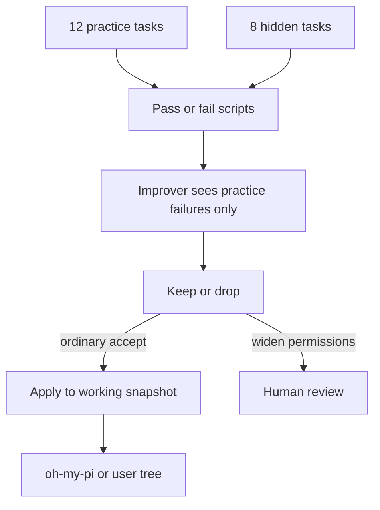

# Improveness — extra files that teach a coding agent, for people who want to understand how

> Full internals (every package, file map, how the repo runs): [Extensive README](docs/EXTENSIVE.md)

> **Improveness is a reference project for harness engineering.** A **harness** is everything around a language model: instructions, tools, memory, permissions, tests. This is not a new model and not a public leaderboard run. You use a coding agent (here, Oh My Pi). You run this repo. After a practice/hidden test, **that agent’s code can change**. Primary interface: `bash harness/omp/scripts/qa.sh`.

Runtime: [Bun](https://bun.sh) 1.3.14 on the filesystem. No HTTP server. No Docker.

---

## TL;DR

- Improves the **wrapper** around the model, not the model. The system prompt stays locked.
- Twenty tiny tasks: 12 practice (the improver may look) and 8 hidden (it must not see their names).
- Recorded run: **0/12 and 0/8 → 7/12 and 3/8**. Two “no hardcoded secrets” hidden tasks stay failed on purpose.
- After the gate, the target is the **working snapshot** you actually run (`oh-my-pi/` here). Not upstream GitHub. Today’s search still parks copies until the apply driver ships.
- Seven designs replay with **no API key**. Slogans-only stays at 0/20. Cheating setups are refused.

---

## Table of contents

1. [Vision](#1-vision)
2. [Ideas worth understanding](#2-ideas-worth-understanding)
3. [How it works](#3-how-it-works)
4. [Quickstart](#4-quickstart)
5. [Configuration](#5-configuration)
6. [Further reading](#6-further-reading)
7. [Future advancements](#7-future-advancements)

## 1. Vision

### What it is

You are using Oh My Pi (or another agent snapshot). You run Improveness. After tests pass, **that harness’s actual code changes** — tools, skills, orchestration, even the core loop — without retraining weights, without rewriting the system prompt, and without opening a PR against someone else’s GitHub.

The copy in this repo at [`oh-my-pi/`](oh-my-pi/) is the default working snapshot. Paper notes live in [`docs/`](docs/00-index.md). The loop lives under [`harness/omp/`](harness/omp/SURFACES.md).

It is for people who want to compare harness designs before spending tokens, and for anyone who has not read the papers.

### What it is not

- Not a fork that pushes to [Oh My Pi](https://github.com/can1357/oh-my-pi). Improving *this* copy is the point.
- Not a weight trainer.
- Not “write nicer slogans.” A slogans-only replay is a **passing** test of a **zero** score.
- Not a loop that silences the grader or widens permissions by itself.
- Not a run of public [Terminal-Bench](https://www.tbench.ai/) as the improver’s score.

Success: `qa.sh` exits 0, and you can answer “what may the improver edit?” from [`KERNEL.md`](harness/omp/KERNEL.md) and [`SURFACES.md`](harness/omp/SURFACES.md).

## 2. Ideas worth understanding

Four bets. Internals and extra ideas: [Extensive README](docs/EXTENSIVE.md).

### 2.1 Change the wrapper, not the brain

**The problem.** Retraining a frontier model for every new habit is too expensive. Letting the agent rewrite its own grader lets it cheat.

**How it works.** The model stays frozen. What changes is the harness: tools, skills, orchestration, the core loop, and a playbook of lessons. [`SURFACES.md`](harness/omp/SURFACES.md) lists what the improver may touch after the gate. [`KERNEL.md`](harness/omp/KERNEL.md) lists what it must not (grader, system prompt, permission kernel). Oh My Pi’s authors showed the same idea: swap the *edit format* and Grok Code Fast 1 went from 6.7% to 68.3% pass@1 with **zero** training compute.

**Like.** You do not rewire a person’s brain to teach a house style. You give them a better checklist and better tools.

**Limits.** The recorded scores check whether the playbook contains the right lessons, not whether a live model can code.

**Read next.** [Weng, “Harness Engineering for Self-Improvement”](https://lilianweng.github.io/posts/2026-07-04-harness/). [“I Improved 15 LLMs at Coding in One Afternoon. Only the Harness Changed.”](https://blog.can.ac/2026/02/12/the-harness-problem/). Background: [recursive self-improvement](https://en.wikipedia.org/wiki/Recursive_self-improvement).

### 2.2 Homework vs exam

**The problem.** If the improver can see every task you later grade it on, the score is fake.

**How it works.** Twenty local tasks under [`harness/omp/evals/`](harness/omp/evals/). Twelve are **practice** (held-in): the improver may see failures. Eight are **hidden** (held-out): their names must never reach [`propose.ts`](harness/omp/drivers/propose.ts). A change is kept only if practice improved and hidden did not drop.

Walk one task. [`gitignore-rule`](harness/omp/evals/held-in/gitignore-rule/) asks to ignore `node_modules`. Adding `recipe:gitignore` also unlocks hidden `gitignore-dist` without showing that name to the picker. That is transfer. `recipe:no-secrets` has **no** practice member, so those two hidden tasks stay failed — a leak brake, not a bug.

**Like.** Studying past homework is allowed. Seeing tomorrow’s exam paper is not.

**Limits.** Twenty synthetic tasks prove the gate. They do not prove a live agent on Terminal-Bench.

**Read next.** [Self-Harness (Zhang et al.)](https://arxiv.org/abs/2606.09498). Background: [training / validation / test splits](https://en.wikipedia.org/wiki/Training,_validation,_and_test_data_sets).

### 2.3 Change the copy you are using

**The problem.** If search can silence the grader, it will “improve” by deleting tests. If it can only ever write a review table, you are not using Improveness on Oh My Pi — you are filing tickets about it.

**How it works.** Decision D14: after practice rose and hidden did not fall, Improveness should apply ordinary edits to the **working snapshot** (`oh-my-pi/` here, or another agent tree). Tools, skills, orchestration, core loop are in scope. The checker, `system-prompt.md`, and `approval.ts` are not. Permission-widening still waits for a person. [oh-my-pi#7907](https://github.com/can1357/oh-my-pi/issues/7907) is the stance for *upstream* maintainers; this repo does not push there.

Today’s [`search.ts`](harness/omp/drivers/search.ts) still writes a waiting room (P2). The apply driver is next.

**Like.** Git-write on the checkout you actually run — not a bot that merges to `can1357/oh-my-pi`, and not a bot that never writes.

**Limits.** Live Oh My Pi sessions still restart today when source changes. That is the next idea.

**Read next.** [Snapshot apply](docs/proposals/06-snapshot-apply.md). [D14](DECISIONS.md).

### 2.4 Do not kill the runtime to improve it

**The problem.** If every self-mod requires stopping Oh My Pi, you dump session memory, open connections, and in-flight tasks. At the frequency a self-improving harness wants, that unavailability *is* the failure.

**How it works.** [Spatiotemporal composability](docs/methods/spatiotemporal-composability.md) (Cordis / DeepSeek Harness): **temporal** = unload reverses every effect; **spatial** = plugins declare dependencies and reload when those change. DeepSeek Harness treats the model adapter, tools, session log, sandbox, **agent loop**, and UI as plugins. Oh My Pi can *load* extensions. It cannot *unload* one and guarantee cleanup.

**Like.** Unplugging a lamp vs unscrewing the bulb. Process restart is pulling the house fuse.

**Limits.** This repo has not vendored Cordis. Prefer revertible plugins when apply lands; restart stays the fallback.

**Read next.** [cordiverse/paper](https://github.com/cordiverse/paper). [DeepSeek Harness plugins and lifecycle](https://deepseek-harness.github.io/deepseek-harness/en/develop/framework/).

## 3. How it works



A playbook of lessons is scored as if followed. The frozen checker grades both splits. The improver may only see practice failures. Keep a change only if practice went up and hidden did not drop. Ordinary accepts should write the working snapshot (D14). Permission-widening still stops for a person. Search today still stages; that lag is listed under future advancements.

Full driver list, file maps, and the seven no-key design replays: [Extensive README](docs/EXTENSIVE.md).

## 4. Quickstart

```text
git clone https://github.com/Vinayak-RZ/Improveness.git
cd Improveness
bash harness/omp/scripts/qa.sh
```

Need [Bun 1.3.14](https://bun.sh), [`rg`](https://github.com/BurntSushi/ripgrep), and Git. Expect `qa.sh ok`, 55 tests across 19 files, seven experiments pass.

Useful extras: `bun harness/omp/drivers/run-benchmark.ts 5 /tmp/improv-bench` and `bun harness/omp/drivers/simulate-architectures.ts`.

## 5. Configuration

Nothing is required for `qa.sh`. Do not commit OAuth secrets. See [`.env.example`](.env.example).

| Variable | Required | What it does |
|----------|----------|--------------|
| `ANTHROPIC_API_KEY` / `OPENAI_API_KEY` / `OPENROUTER_API_KEY` | no | Optional live ping |
| `OMP_LIVE_SMOKE` | no | Set `1` to request a real session ping |
| `OMP_LIVE_SEARCH` | no | Reserved live improver |
| `OMP_SNAPSHOT_ROOT` | no | Agent tree to mutate after the gate (default `oh-my-pi/`) |

Default checks spend zero tokens. Live ping stays green when keys are missing.

## 6. Further reading

| Idea | Canonical source | What you will learn |
|------|------------------|---------------------|
| Harness vs weights | [Weng, Jul 2026](https://lilianweng.github.io/posts/2026-07-04-harness/) | Why near-term self-improvement is wrapper work |
| Harness-only coding gains | [can.ac, Feb 2026](https://blog.can.ac/2026/02/12/the-harness-problem/) | Same models, better edit format, large pass@1 jumps |
| Practice / hidden gate | [Self-Harness, arXiv:2606.09498](https://arxiv.org/abs/2606.09498) | Accept only if both splits hold |
| Tools not prompts | [AHE, arXiv:2604.25850](https://arxiv.org/abs/2604.25850) | Gain lived in tools and memory; prompt-only hurt |
| Live plugins | [Spatiotemporal composability](https://github.com/cordiverse/paper) | Unload must reverse effects |
| Holdout sets | [Wikipedia](https://en.wikipedia.org/wiki/Training,_validation,_and_test_data_sets) | Why an exam the student already saw is worthless |

Paper map: [`docs/00-index.md`](docs/00-index.md). Citations: [`docs/references.md`](docs/references.md). File-by-file: [Extensive README](docs/EXTENSIVE.md).

## 7. Future advancements

### 7.1 Apply accepted edits to the working snapshot

**Why now.** D14 is the product. [`search.ts`](harness/omp/drivers/search.ts) still only stages.

**What would land.** A driver (not named `auto-apply.ts`) that writes `oh-my-pi/` or `OMP_SNAPSHOT_ROOT` after accept, and still refuses the checker, `system-prompt.md`, and `approval.ts`.

**Done when.** A test shows an accepted ordinary candidate as a diff on the snapshot, and a kernel path still throws.

### 7.2 A live improver on a real session

**Why now.** Search is deterministic `recipe:*` tags. [`OMP_LIVE_SEARCH`](.env.example) is unused.

**What would land.** Skip-gated `createAgentSession` with the evolver allowlist, then the same gate.

**Done when.** `OMP_LIVE_SEARCH=1` plus a key runs one bounded live step; `qa.sh` still passes with the flag unset.

### 7.3 Revertible plugins (do not kill OMP to improve it)

**Why now.** File apply still implies restart. [Spatiotemporal composability](docs/methods/spatiotemporal-composability.md) is the named bottleneck.

**What would land.** Disposers on OMP `ExtensionAPI`, or a thin Fiber-like loader.

**Done when.** One extension unload reverses its tools and listeners without restarting the host; KERNEL files still cannot unload.

### 7.4 Public Terminal-Bench as a report, never as fitness

**Why now.** [`run-tb-local.ts`](harness/omp/drivers/run-tb-local.ts) only runs in-repo tasks. Public Terminal-Bench must not become the improver’s score.

**What would land.** An optional, non-required report job. Fitness stays the frozen 20 tasks.

**Done when.** CI can comment a TB2 number that [`propose.ts`](harness/omp/drivers/propose.ts) cannot see.

Authority files: [`IMPLEMENTATION_PLAN.md`](IMPLEMENTATION_PLAN.md) · [`DECISIONS.md`](DECISIONS.md) · [`PROGRESS.md`](PROGRESS.md) · [`LEARNING.md`](LEARNING.md) · [`harness/omp/CACD.md`](harness/omp/CACD.md)
