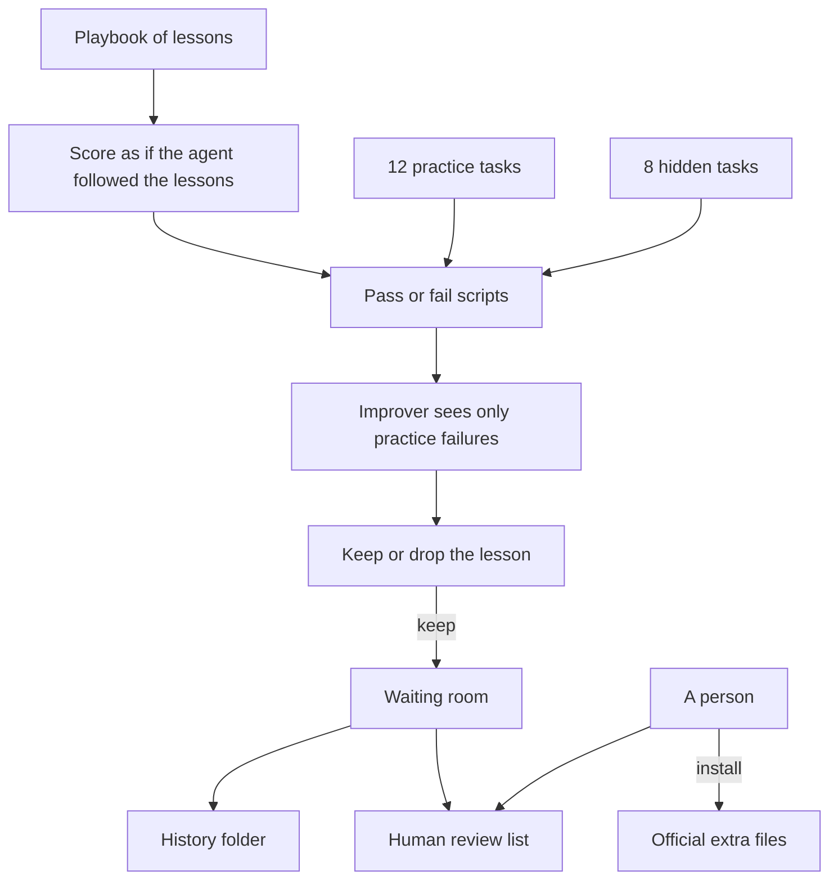
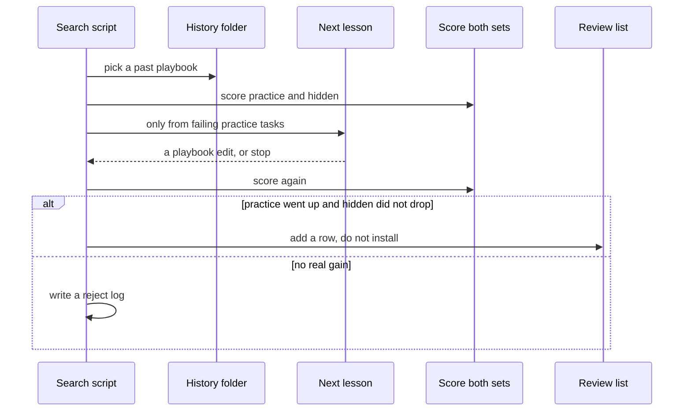
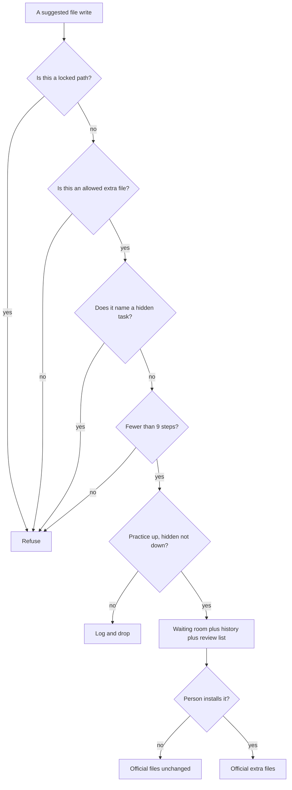

# Improveness — extra files that teach a coding agent new habits

> **What it is:** A study of “harness engineering,” plus working extra files on top of [Oh My Pi](https://github.com/can1357/oh-my-pi). The *model* stays the same. The instructions, tools, and tests around it get better — and a person still has to install anything official.
> **What it is not:** A new language model. A bot that silently edits the real project. A fork we push back to Oh My Pi. A public coding-agent leaderboard run.
> **How you use it:** Scripts on disk, run with [Bun](https://bun.sh). One command checks the whole repo: `bash harness/omp/scripts/qa.sh`.

No website. No Docker. No API key required to clone and verify. GitHub Actions runs the same check.

---

**After you read this file you should be able to**

- Explain what a **harness** is, and why this repo does not retrain a model.
- Walk through one real task (`gitignore-rule`) from broken starter → gold answer → lesson → hidden-set transfer.
- Name what lives in this git root: paper notes, extra files on Oh My Pi, 20 local tasks, a no-key search loop, and seven design experiments.
- Say why slogans in a playbook scored **0/20**, five real lessons scored **7/12 and 3/8**, and “don’t hardcode secrets” stayed failed on purpose.
- Run `qa.sh` and know what a green result means.

**The short version of the work**

- Source essay: [Lilian Weng, “Harness Engineering for Self-Improvement” (July 2026)](https://lilianweng.github.io/posts/2026-07-04-harness/). We wrote that essay into [`docs/`](docs/00-index.md), then built the cheapest version that is still honest.
- [`oh-my-pi/`](oh-my-pi/) is a snapshot of Oh My Pi (~123MB, nested git removed). We do not push upstream.
- Extra files and scripts live under [`harness/omp/`](harness/omp/SURFACES.md). The improver may edit a playbook and project tools. It may not edit the grader, the system prompt, or Oh My Pi’s own packages.
- Twenty tiny coding tasks: **12 practice** (the improver may look) and **8 hidden** (it must not see their names). That is homework vs exam.
- A recorded five-step run: **0/12 → 7/12** on practice, **0/8 → 3/8** on hidden. A person still has to copy anything into the official extra files.

---

## Table of contents

1. [What this project is](#1-what-this-project-is)
2. [One task, one lesson, one score](#2-one-task-one-lesson-one-score)
3. [What the papers taught us](#3-what-the-papers-taught-us)
4. [What we actually built](#4-what-we-actually-built)
5. [How the loop works](#5-how-the-loop-works)
6. [The four-layer checklist](#6-the-four-layer-checklist)
7. [Seven experiments that teach the design](#7-seven-experiments-that-teach-the-design)
8. [Quickstart](#8-quickstart)
9. [Configuration](#9-configuration)
10. [Map of the repo](#10-map-of-the-repo)
11. [Scripts you can run](#11-scripts-you-can-run)
12. [What we store on disk](#12-what-we-store-on-disk)
13. [The 20 coding tasks](#13-the-20-coding-tasks)
14. [How we test](#14-how-we-test)
15. [What the improver must not touch](#15-what-the-improver-must-not-touch)
16. [Where this runs](#16-where-this-runs)
17. [Common commands](#17-common-commands)
18. [Recorded scores](#18-recorded-scores)
19. [Extending, roadmap, changelog](#19-extending-roadmap-changelog)
20. [Word list and full commands](#20-word-list-and-full-commands)

## 1. What this project is

A **coding agent** is a program that uses a language model to edit a codebase. Think of two layers:

| Layer | Everyday name | In this repo |
|-------|---------------|--------------|
| The model | The brain | Frozen. We do not train it. |
| The harness | Everything around the brain: instructions, tools, memory, permissions, tests | This is what Improveness changes. |

Oh My Pi is already a strong harness. After a week of real work, people still want it to *remember* habits: “prefer named exports,” “ignore `dist/`,” “never paste API keys into source.”

Three tempting fixes are the wrong product:

1. **Retrain the model.** Expensive. Not this repo.
2. **Rewrite the system prompt every week.** A published ablation (see §3) found that prompt-only edits made a public coding benchmark *worse* by 2.3 points.
3. **Let the agent edit its own official files and tests.** Then it can “improve” by deleting the grader.

Improveness is the boring alternative we actually shipped: a **playbook of lessons**, **graders that never change**, a **waiting room** for suggestions, and a **human** who installs anything that looks good.

It is for people who build coding-agent platforms, maintainers who treat a suggestion as evidence ([oh-my-pi#7907](https://github.com/can1357/oh-my-pi/issues/7907)), and readers who have never opened the papers.

Success is concrete: `bash harness/omp/scripts/qa.sh` exits 0, all seven design experiments pass, and you can answer “what may the improver edit?” from [`KERNEL.md`](harness/omp/KERNEL.md) and [`SURFACES.md`](harness/omp/SURFACES.md).

## 2. One task, one lesson, one score

This is the smallest complete picture of the repo. If you only remember one example, remember this one.

### 2.1 A practice task

Folder: [`harness/omp/evals/held-in/gitignore-rule/`](harness/omp/evals/held-in/gitignore-rule/).

The prompt in `fixture.json` is one sentence: *Ignore `node_modules` in `.gitignore`.*

The grader is three lines:

```text
#!/usr/bin/env bash
set -euo pipefail
rg -q '^node_modules$' .gitignore
```

`repo/` is the broken starter (the line is missing — the grader fails). `expected/` is the gold tree (the line is there — the grader passes). Every one of the 20 tasks has that shape.

### 2.2 A lesson that unlocks a family

The search script does not look at hidden-task names. It looks at which **practice** tasks still fail, and it adds one tagged lesson to the playbook, for example:

```text
recipe:gitignore — When asked to ignore a path, append that path as its own .gitignore line.
```

[`playbook-solver.ts`](harness/omp/drivers/playbook-solver.ts) then treats every task in that family as solved. The same tag also covers the **hidden** task `gitignore-dist` (“ignore `dist/`”). That is how we measure transfer: the improver never saw `gitignore-dist`, but a general `.gitignore` lesson should still help.

### 2.3 What a five-step run actually did

Starting from a playbook with **zero** of those tags, five kept lessons moved the score like this:

| After step | Lesson added | Practice | Hidden |
|------------|--------------|----------|--------|
| 0 | (empty playbook) | 0/12 | 0/8 |
| 1 | default export | 1/12 | 1/8 |
| 2 | gitignore | 2/12 | 2/8 |
| 3 | named export | 5/12 | 3/8 |
| 4 | re-export from index | 6/12 | 3/8 |
| 5 | license header | 7/12 | 3/8 |

The hidden +3 is transfer (typed default export, ignore `dist/`, typed `greet`). Two hidden tasks about hardcoded secrets stay at 0: there is **no** practice task in that family, so the picker never unlocks `recipe:no-secrets`. That is a leak brake, not a bug.

Those five lessons were written to a waiting room, a history folder, and a human review list. The official playbook in git did not change. That is the product: **evidence, not auto-install.**

Full table: [`harness/omp/evals/benchmarks/local-20/summary.md`](harness/omp/evals/benchmarks/local-20/summary.md).

## 3. What the papers taught us

You do not need to read the papers to run the repo. You *do* need these four ideas to understand why the files look the way they do. Longer notes: [`docs/00-index.md`](docs/00-index.md).

### 3.1 Near-term “self-improvement” is harness work

[Weng’s essay](https://lilianweng.github.io/posts/2026-07-04-harness/) starts from an old idea: a machine that designs a better machine. In 2026, that almost never means “the model rewrites its own weights.” It means the model (or a smaller helper) improves the **pipeline around it** — tools, context, workflow, eval — and the next run is better on real tasks.

The object being optimized has been moving outward:

`prompts → structured context → workflow → harness code → optimizer code`

Improveness stops at harness code plus a gated search. Weight updates (Darwin-Gödel Machine, AlphaEvolve-style joint training) are written up in [`docs/08-joint-optimization.md`](docs/08-joint-optimization.md) and left on the shelf.

### 3.2 Spend money on the task agent, not the improver

Lin et al. (2026), in Weng’s write-up: writing a useful extra file is a **flat** skill from a 9B model up to a frontier model. *Using* that extra file is not flat — mid-size models gain the most; weak models ignore skills; strong models are already near a ceiling.

So: the agent that edits the user’s repo can be expensive. The agent that proposes a playbook line can be cheap. We recorded that as decision D6 in [`DECISIONS.md`](DECISIONS.md).

### 3.3 Keep a change only if homework improved and the exam did not get worse

Self-Harness (Zhang et al. 2026): mine failures, propose a narrow edit, then accept only if the practice set does not regress **and** a hidden set does not regress. Rejects are logged, not forgotten.

If the improver can see the hidden set, the exam is worthless. If it can edit the grader, it can “pass” by cheating. Both of those setups are experiments we run on every `qa.sh` (see §7).

### 3.4 The gain is in tools, memory, and middleware — not the system prompt

Agentic Harness Engineering (also Lin et al. 2026) split a coding agent into seven files: system prompt, tool description, tool implementation, middleware, skill, sub-agent config, long-term memory. On Terminal-Bench 2 they went 69.7 → 77.0 in ten iterations. Prompt-only evolution: **−2.3 points**.

That is why [`system-prompt.md`](oh-my-pi/packages/coding-agent/src/prompts/system/system-prompt.md) is locked, and why the `ace-only` experiment (slogans, no concrete lessons) is a *passing* test of a **zero** score. We do not want a later change to “fix” 0/20 by treating empty advice as a win.

Adoption order we followed (cheapest first): declare locked vs editable files → playbook → traces and a read-only debugger → practice/hidden gate → candidate records → history folder → bounded search. Spec: [`docs/proposals/05-adoption-order.md`](docs/proposals/05-adoption-order.md).

## 4. What we actually built

Four layers in one git root, built in that order.

### 4.1 Paper notes and proposals

[`docs/`](docs/00-index.md) is nine segments matching Weng’s headings, plus method pages and “what would we add” proposals (generic harness, Oh My Pi gaps, safety, adoption order). This is how a later reader recovers *why* without rereading the essay.

### 4.2 A snapshot of Oh My Pi

[`oh-my-pi/`](oh-my-pi/) is the seed agent. Nested `.git` was deleted so Improveness owns history (decision D8). We do not treat it as a live fork. Almost all of our code stays out of `oh-my-pi/packages/`. The one core edit we did make: hidden `@debugger` and `@evolver` role names so extra agents can pin a model slot without changing the TUI (decision D10).

### 4.3 Extra files on top of that snapshot

[`harness/omp/`](harness/omp/SURFACES.md) is the product:

| Wave | What landed |
|------|-------------|
| First overlay | Locked vs editable file lists, playbook + curator, session-log export, debugger agent, practice/hidden gate, candidate records, review list, `validate.sh` |
| Twenty tasks | 12 practice + 8 hidden, optional live ping, Harbor-shaped local export, history snapshots |
| Search + CI | GitHub Actions, bounded search, local runner, recorded 20-task run |
| Checklist + experiments | Four-layer checklist opened by QA, seven no-key design replays |

### 4.4 Decisions that still bind the code

Full list: [`DECISIONS.md`](DECISIONS.md). The ones you will feel while reading files:

| Id | In one sentence |
|----|-----------------|
| D3 | Oh My Pi is the example harness (OpenCode is comparison only). |
| D5 | Aim at tools/memory/middleware; start with a playbook, not “prompts forever.” |
| D6 | Improver may be a smaller model. |
| D7 | No auto-install onto official files. |
| D9 | Put our code in `harness/omp/` first; touch Oh My Pi core only if a gate cannot be met otherwise. |
| D11 | Required CI is the no-key check. A public Terminal-Bench run is not fitness. |
| D12 | Search may write the waiting room, history, and review list — never the official extra files. |
| D13 | The four-layer checklist is what QA opens, not another diary. |

## 5. How the loop works

### 5.1 Big picture



### 5.2 One search step



### 5.3 Safety checks, in order



### 5.4 Folders to open first

| Path | What you learn |
|------|----------------|
| [`harness/omp/KERNEL.md`](harness/omp/KERNEL.md) | Files the improver must not write |
| [`harness/omp/SURFACES.md`](harness/omp/SURFACES.md) | Files it may write, mapped to the seven paper components |
| [`harness/omp/CACD.md`](harness/omp/CACD.md) | The four-layer checklist in prose |
| [`harness/omp/drivers/`](harness/omp/drivers/) | 19 Bun scripts |
| [`harness/omp/evals/`](harness/omp/evals/) | Grader, 20 tasks, recorded runs |
| [`oh-my-pi/`](oh-my-pi/) | Seed agent; treat as read-only unless a note says otherwise |

## 6. The four-layer checklist

In the code this is **CACD**: Contract, Architecture, Control, Delivery. In English:

| Layer | Question |
|-------|----------|
| **Contract** | Which files are locked, and which may change? |
| **Architecture** | How are the playbook, roles, and grader wired? |
| **Control** | What must the scripts refuse? |
| **Delivery** | How does a good idea become evidence, not an automatic install? |

This is not a second plan document. QA opens every path in [`harness/omp/cacd/catalog.ts`](harness/omp/cacd/catalog.ts) on every run. If you add a locked path or a new experiment, add a catalog row in the same commit.

| Id | Layer | Title | Path |
|----|-------|-------|------|
| `c-kernel` | contract | Locked files | `harness/omp/KERNEL.md` |
| `c-surfaces` | contract | Editable files | `harness/omp/SURFACES.md` |
| `c-plan` | contract | What we are building now | `IMPLEMENTATION_PLAN.md` |
| `c-decisions` | contract | Written decisions | `DECISIONS.md` |
| `a-cacd` | architecture | The checklist itself | `harness/omp/CACD.md` |
| `a-agents` | architecture | Playbook is context, not a prompt rewrite | `harness/omp/overlay/.omp/AGENTS.md` |
| `k-allowlist` | control | Path policy for the improver | `harness/omp/drivers/allowlist.ts` |
| `k-search-cap` | control | Hard cap on search steps | `harness/omp/drivers/search.ts` |
| `k-propose` | control | Next lesson comes from practice tasks only | `harness/omp/drivers/propose.ts` |
| `d-queue` | delivery | Human review list | `harness/omp/REVIEW_QUEUE.md` |
| `d-ci` | delivery | GitHub Actions | `.github/workflows/overlay.yml` |
| `d-qa` | delivery | The repo check script | `harness/omp/scripts/qa.sh` |

4 + 2 + 3 + 3 = **12**.

## 7. Seven experiments that teach the design

The useful trick in this repo: **compare how the pieces are wired without paying for a frontier model.** Each row is a named setup. The test passes when the *expected* thing happens — including “the score stays at zero.”

Script: [`harness/omp/drivers/simulate-architectures.ts`](harness/omp/drivers/simulate-architectures.ts). Saved report: [`harness/omp/evals/simulations/latest/summary.md`](harness/omp/evals/simulations/latest/summary.md).

| Id | What we wired | What must happen | Result | Practice | Hidden |
|----|---------------|------------------|--------|----------|--------|
| `ace-only` | Playbook slogans, no concrete lessons | Score stays at zero | pass | 0/12 | 0/8 |
| `self-harness-gated` | Five bounded steps, hidden set as a brake | Score goes up | pass | 7/12 | 3/8 |
| `ahe-surfaces` | Every practice lesson unlocked | Score goes up; secret tasks stay locked | pass | 12/12 | 6/8 |
| `held-out-leak` | Improver is shown a hidden-task name | Script must refuse | pass | — | — |
| `kernel-write` | Improver tries to edit the grader | Script must refuse | pass | — | — |
| `unbounded-search` | Ask for 9 steps (cap is 8) | Script must refuse | pass | — | — |
| `auto-promote` | Search tries to write the official extra files | Must not install | pass | — | — |

What you should take away:

- Empty advice is not an improvement. That is a test, not a product failure.
- The gated loop is the product: both sets move; official files do not.
- Unlocking every *practice* lesson still cannot unlock “don’t hardcode secrets,” because that family has no practice member.
- Seeing the exam, silencing the grader, looping forever, and auto-install are all Control failures. They never get to Delivery.

```text
bun harness/omp/drivers/simulate-architectures.ts
```

## 8. Quickstart

### 8.1 What you need

- [Bun 1.3.14](https://bun.sh) (same version Oh My Pi pins)
- [`rg`](https://github.com/BurntSushi/ripgrep) (ripgrep) — every task’s `check.sh` calls it
- Git
- Language-model API keys: **optional**

### 8.2 Clone and prove the repo works

```text
git clone https://github.com/Vinayak-RZ/Improveness.git
cd Improveness
bash harness/omp/scripts/qa.sh
```

You should see `qa.sh ok`. Unit tests print 55 pass across 19 files. All seven experiments pass.

### 8.3 Faster check (skips the second experiment pass)

```text
bash harness/omp/scripts/validate.sh
```

### 8.4 Copy the playbook into the Oh My Pi snapshot

```text
bash harness/omp/scripts/install-overlay.sh
```

This **merges** into the existing `oh-my-pi/.omp/` folder. Do not delete that folder first — Oh My Pi already ships its own commands and skills.

### 8.5 Run an improvement cycle in a throwaway copy

```text
bun harness/omp/drivers/run-benchmark.ts 5 /tmp/improv-bench
```

Uses a copy of the tasks. Does not edit the official playbook in this checkout.

## 9. Configuration

`qa.sh` needs no environment variables. Secrets stay in the environment, never in the playbook (the curator rejects lines that look like keys).

| Variable | Required | Default | What it is for |
|----------|----------|---------|----------------|
| `OMP_GOOGLE_ANTIGRAVITY_CLIENT_ID` | no | unset | Oh My Pi OAuth placeholder |
| `OMP_GOOGLE_ANTIGRAVITY_CLIENT_SECRET` | no | unset | Oh My Pi OAuth placeholder |
| `OMP_GOOGLE_GEMINI_CLI_CLIENT_ID` | no | unset | Oh My Pi OAuth placeholder |
| `OMP_GOOGLE_GEMINI_CLI_CLIENT_SECRET` | no | unset | Oh My Pi OAuth placeholder |
| `OMP_ANTHROPIC_OAUTH_CLIENT_ID` | no | unset | Oh My Pi OAuth placeholder |
| `ANTHROPIC_API_KEY` | no | unset | Needed only for an optional live ping |
| `OPENAI_API_KEY` | no | unset | Same |
| `OPENROUTER_API_KEY` | no | unset | Same |
| `OMP_LIVE_SMOKE` | no | unset | Set to `1` to try a real agent session ping |
| `OMP_LIVE_SEARCH` | no | unset | Reserved. CI uses the no-key search. |

See [`.env.example`](.env.example). Do not paste real OAuth client secrets into git — GitHub will block the push.

Default checks spend zero tokens. The optional live ping is a second GitHub Actions job that stays green when keys are missing.

## 10. Map of the repo

```text
.
├── README.md                    # this guided tour
├── IMPLEMENTATION_PLAN.md       # what we are building right now
├── DECISIONS.md                 # written decisions D1–D13
├── PROGRESS.md
├── LEARNING.md                  # short notes from each build wave
├── PROJECT_OVERVIEW.md
├── .env.example
├── .github/workflows/overlay.yml
├── docs/                        # paper notes, method pages, proposals
├── harness/omp/                 # Improveness itself
│   ├── CACD.md
│   ├── cacd/catalog.ts
│   ├── KERNEL.md
│   ├── SURFACES.md
│   ├── REVIEW_QUEUE.md
│   ├── drivers/                 # 19 TypeScript scripts
│   ├── evals/
│   │   ├── checker/check.ts
│   │   ├── held-in/             # 12 practice tasks
│   │   ├── held-out/            # 8 hidden tasks
│   │   ├── tb-adapter/          # local tasks in a Harbor-like layout
│   │   ├── benchmarks/local-20/
│   │   └── simulations/latest/
│   ├── overlay/.omp/            # playbook, agents, manifests
│   ├── archive/                 # snapshot bodies are gitignored
│   ├── staging/                 # waiting-room bodies are gitignored
│   ├── scripts/validate.sh
│   ├── scripts/qa.sh
│   └── tests/                   # 19 test files
├── oh-my-pi/                    # Oh My Pi snapshot, no nested .git
└── vendor/cursor-config-coding/ # editor skills used to write this repo
```

If you want the *story* of each wave, not just the tree: [`LEARNING.md`](LEARNING.md).

## 11. Scripts you can run

There are **19** scripts under [`harness/omp/drivers/`](harness/omp/drivers/). Writes from the improver go through `assertEvolverWrite` in [`allowlist.ts`](harness/omp/drivers/allowlist.ts).

### 11.1 Memory and traces (4)

| Script | Who may write | What it does |
|--------|---------------|--------------|
| `curate-playbook.ts` | `playbook/` only | Adds a lesson. Rejects secrets and “edit SYSTEM.md” advice. |
| `export-session.ts` | traces folder | Turns an Oh My Pi session log into a folder of turns and tool I/O |
| `write-diagnosis.ts` | `diagnosis.md` only | Debugger write under `traces/` or `reports/` |
| `playbook-solver.ts` | read-only | Scores tasks as if the coding agent followed the playbook lessons |

### 11.2 Gate and review (5)

| Script | Who may write | What it does |
|--------|---------------|--------------|
| `run-eval.ts` | nothing | Scores a set of tasks on the starter tree or the gold tree |
| `self-harness.ts` | waiting room only | Keep the change only if practice improved and hidden did not drop |
| `manifest.ts` | n/a | Shape of a candidate record (JSON) |
| `apply-candidate.ts` | waiting room | Snapshot + record. Not an “install into official files” command. |
| `rollback-candidate.ts` | waiting-room snapshots | Restore files by candidate id |

### 11.3 Search and runners (5)

| Script | Who may write | What it does |
|--------|---------------|--------------|
| `archive.ts` | history folder | Save / list / pick a past playbook. Refuses locked paths. |
| `propose.ts` | waiting-room playbook | Picks the next practice lesson. Errors if you pass a hidden-task name. |
| `search.ts` | waiting room, history, review list | Bounded loop. Never writes official extra files. |
| `tb-export.ts` | an output folder | Writes a Harbor-like `instruction.md` + `tests/test.sh` |
| `run-tb-local.ts` | nothing | Runs those local tasks against a starter or gold tree |

### 11.4 Checks (5)

| Script | Who may write | What it does |
|--------|---------------|--------------|
| `allowlist.ts` | n/a | Which tools and paths each role may use |
| `live-session-smoke.ts` | skip without keys | Optional “say pong” ping to a real agent session |
| `run-benchmark.ts` | a temp folder | Five-step recorded-style run |
| `qa-repo.ts` | nothing | Opens the 12 checklist rows and checks relative links |
| `simulate-architectures.ts` | a temp folder | The seven design experiments |

4 + 5 + 5 + 5 = **19**.

Two project agents ship as markdown: [`debugger.md`](harness/omp/overlay/.omp/agents/debugger.md) (read, grep, glob, find only) and [`evolver.md`](harness/omp/overlay/.omp/agents/evolver.md) (no shell; no locked paths).

## 12. What we store on disk

There is no database. Everything is files.

### 12.1 A coding task

`harness/omp/evals/{held-in,held-out}/<id>/`

| File | Meaning |
|------|---------|
| `fixture.json` | Name, which set it belongs to, the prompt, which script grades it |
| `check.sh` | The grader. Exit 0 means pass. This file is locked. |
| `repo/` | The broken starter. Must fail the grader. |
| `expected/` | The gold answer. Must pass the grader. |

### 12.2 A candidate record

[`manifest.ts`](harness/omp/drivers/manifest.ts) stores: id, which kind of extra file it is (tool, hook, memory, skill, or playbook), the file list, a parent hash, practice and hidden scores, a rollback command, and optional evidence fields.

### 12.3 A history snapshot

[`archive.ts`](harness/omp/drivers/archive.ts) stores: id, parent id, score (hidden-set pass rate), file hashes, created time. File bodies live under `harness/omp/archive/<id>/` and are gitignored. When picking a parent we prefer a high score and few children.

### 12.4 A checklist row

[`cacd/catalog.ts`](harness/omp/cacd/catalog.ts): id, layer, title, path, and strings that file must contain.

### 12.5 An experiment result

id, title, what we are proving, what must happen (`stagnate`, `improve`, `throw`, or `no-promote`), pass or fail, a detail string, optional scores.

## 13. The 20 coding tasks

### 13.1 Two sets on purpose

| Set | Count | Role |
|-----|-------|------|
| Practice (`held-in`) | 12 | The improver may see failures and add matching lessons |
| Hidden (`held-out`) | 8 | A brake. The improver must not be given these names. |

### 13.2 Practice task names

`default-export`, `gitignore-rule`, `greet-export`, `index-reexport`, `license-header`, `named-type-export`, `package-script`, `readme-section`, `readme-title`, `sum-fn`, `tsconfig-strict`, `unused-var-marker`.

### 13.3 Hidden task names

`barrel-no-secrets`, `gitignore-dist`, `greet-types`, `no-implicit-any`, `no-secrets`, `package-test-script`, `readme-usage`, `typed-default-export`.

### 13.4 Lesson families

A playbook line that contains `recipe:gitignore` counts as knowing *every* task in that family.

| Lesson tag | Practice tasks it unlocks | Hidden tasks it also unlocks |
|------------|---------------------------|------------------------------|
| `recipe:default-export` | default-export | typed-default-export |
| `recipe:gitignore` | gitignore-rule | gitignore-dist |
| `recipe:named-export` | greet-export, sum-fn, named-type-export | greet-types |
| `recipe:index-reexport` | index-reexport | — |
| `recipe:license-header` | license-header | — |
| `recipe:package-script` | package-script | package-test-script |
| `recipe:readme-h2` | readme-section | readme-usage |
| `recipe:readme-h1` | readme-title | — |
| `recipe:tsconfig` | tsconfig-strict | no-implicit-any |
| `recipe:unused-prefix` | unused-var-marker | — |
| `recipe:no-secrets` | — | no-secrets, barrel-no-secrets |

`recipe:no-secrets` has **no practice member**. The automatic lesson picker never unlocks it.

## 14. How we test

```text
bun test harness/omp/tests/
bash harness/omp/scripts/validate.sh
bash harness/omp/scripts/qa.sh
```

| How heavy | What it covers | Command |
|-----------|----------------|---------|
| Fast | 19 test files, 55 cases | `bun test harness/omp/tests/` |
| Overlay | Locked-path greps, at least 20 tasks, no public-benchmark download URLs | `validate.sh` |
| Whole repo | 12 checklist rows, relative links, then the seven experiments | `qa.sh` |
| Slow | A real agent session | only if `OMP_LIVE_SMOKE=1` and a key are set |
| Not our gate | Oh My Pi’s own heavy test suite | do not run that as the Improveness check |

`qa.sh` is `validate.sh`, then `qa-repo.ts`, then the experiments. GitHub Actions ([`.github/workflows/overlay.yml`](.github/workflows/overlay.yml)) installs ripgrep, then runs `qa.sh` (Bun 1.3.14). Without `rg`, every gold tree fails. The live-ping job is optional and must stay green on a pull request that has no secrets.

## 15. What the improver must not touch

[`harness/omp/KERNEL.md`](harness/omp/KERNEL.md) · longer write-up: [`docs/proposals/04-safety.md`](docs/proposals/04-safety.md)

| Rule | How it is enforced |
|------|--------------------|
| No writes to the grader, KERNEL, SURFACES, the checklist, `qa.sh`, the system prompt, or `oh-my-pi/packages/` | Path checks in the allowlist |
| The lesson picker cannot see hidden-task names | `propose.ts` throws |
| Search cannot run forever | Hard cap of 8 steps |
| A language model does not grade the tasks | The `check.sh` scripts do |
| A person installs | Review list; search writes “do not apply” |
| Rejects are kept | `harness/omp/reports/search/` |
| Unsafe wirings | Experiments must refuse or refuse to install |
| No tuning on a public leaderboard | Local tasks only |

The debugger may `read`, `grep`, `find`, and `glob`. It may not `edit`, `write`, or run a shell. The improver may `edit` / `write` only under the extra playbook / skills / tools folders, or the waiting room.

## 16. Where this runs

There is no production server and no container image.

| Place | What happens |
|-------|----------------|
| Your machine | `qa.sh`, `validate.sh`, and the Bun scripts |
| GitHub Actions | [`.github/workflows/overlay.yml`](.github/workflows/overlay.yml) on matching paths, or a manual run |
| Overlay install | `install-overlay.sh` merges into `oh-my-pi/.omp/` |
| Undo a candidate | `rollback-candidate.ts --id <id>` |
| npm, Harbor cloud, public Terminal-Bench | not shipped |

Turning CI on for everyone else is merging this branch to `main`. Turning search off is “don’t run `search.ts`.”

## 17. Common commands

**Check the whole repo (start here)**

```text
bash harness/omp/scripts/qa.sh
```

**Replay every named experiment**

```text
bun harness/omp/drivers/simulate-architectures.ts
```

**Score starter trees vs gold trees**

```text
bun harness/omp/drivers/run-eval.ts harness/omp/evals held-in repo
bun harness/omp/drivers/run-eval.ts harness/omp/evals held-out expected
```

**Bounded search in this checkout** (writes the waiting room, history, and review list — prefer `run-benchmark.ts` if you do not want to dirty this tree)

```text
bun harness/omp/drivers/search.ts 3
```

**Local tasks in a Harbor-like layout**

```text
bun harness/omp/drivers/tb-export.ts harness/omp/evals/held-out/no-secrets /tmp/tb
bun harness/omp/drivers/run-tb-local.ts harness/omp/evals repo
```

**Add a playbook lesson by hand**

```text
bun harness/omp/drivers/curate-playbook.ts --playbook harness/omp/overlay/.omp/playbook/PLAYBOOK.md --lesson "Prefer named exports" --passed
```

**Turn an Oh My Pi session log into a trace folder**

```text
bun harness/omp/drivers/export-session.ts --jsonl path/to/session.jsonl --out harness/omp/traces
```

**Optional live ping (skips without a flag)**

```text
bun harness/omp/drivers/live-session-smoke.ts
# {"skipped":true,"reason":"OMP_LIVE_SMOKE is not 1"}
```

## 18. Recorded scores

Full write-up: [`harness/omp/evals/benchmarks/local-20/summary.md`](harness/omp/evals/benchmarks/local-20/summary.md)

| Set | Before | After 5 steps | Change |
|-----|--------|---------------|--------|
| Practice | 0/12 | 7/12 | +7 |
| Hidden | 0/8 | 3/8 | +3 |

This scores **whether the playbook contains the right lessons**, not whether a live model can code. It is the honest no-key proof that the gate, the history folder, and the hidden-set brake work.

From §7: slogans-only stays 0/20. Unlocking every practice lesson reaches 12/12 and 6/8. That gap is the product.

## 19. Extending, roadmap, changelog

| You want to | Do this |
|-------------|---------|
| Add a coding task | New folder under `held-in/` or `held-out/` with `fixture.json`, `check.sh`, `repo/`, `expected/`. If a lesson should unlock it, map that in `playbook-solver.ts`. Never put a hidden-task name in the practice-only map. |
| Add an experiment | New id plus a runner in `simulate-architectures.ts`, plus a row in the saved report. |
| Add a checklist row | Append to `CACD_ITEMS` with a path and required strings. QA fails until the file matches. |
| Lock a new path | Update `KERNEL.md` and `KERNEL_PATH_MARKERS` in `allowlist.ts` in the same commit. |
| Install a candidate | A person edits via `REVIEW_QUEUE.md`. Do not add an auto-install script. |

### Already shipped

| Phase | What landed | Status |
|-------|-------------|--------|
| Research | Paper notes, method pages, proposals 00–05 | done |
| First overlay | Extra files, playbook, traces, accept/reject, candidate records | done |
| Twenty tasks | Practice/hidden split, optional live ping, debugger/improver roles, local Harbor layout, history folder | done |
| Search + CI | GitHub Actions, bounded search, local runner, recorded 20-task run | done |
| Checklist + experiments | Four-layer checklist, repo QA, seven design replays | done |

### Possible later work

- A public [Terminal-Bench 2](https://www.tbench.ai/) run (**never** as the improver’s score)
- Making the live ping required (needs secrets on every pull request)
- A live improver session behind `OMP_LIVE_SEARCH=1`
- Spec Kit and an agent-pattern catalog
- A person installing a waiting-room playbook onto the official extra files

### Changelog

| Date | Change |
|------|--------|
| 2026-08-17 | README rewritten as a guided tour: one task walkthrough, paper takeaways, and what each build wave shipped |
| 2026-08-16 | README in plain language; CI installs ripgrep |
| 2026-08-16 | README first written as a 20-section manual |
| 2026-08-15 | Four-layer checklist, repo QA, seven design replays |
| 2026-08-15 | CI, bounded search, recorded 0/12→7/12 and 0/8→3/8 |
| 2026-08-15 | 20 tasks, debugger/improver roles, local Harbor layout, history folder |
| 2026-08-15 | First overlay; Oh My Pi snapshot; paper notes |

## 20. Word list and full commands

**Why replay setups instead of running a live agent on a public benchmark?**
If the improver can practice on the public set you later score it on, the score is contaminated. Replays compare *who may write, who may see the hidden set, and whether install is automatic* — at the speed of CI, with no tokens.

**What does the four-layer checklist add over `DECISIONS.md`?**
`DECISIONS.md` is history (“we decided X”). The checklist is what QA opens *today*. If a required sentence disappears from a file, the check fails.

**Why can the improver be a smaller model?**
Updating extra files is a flatter skill than doing the user’s coding task. Spend the expensive model on the task agent.

**Why is “slogans only, score 0/20” a *passing* experiment?**
Because we *want* that setup to fail at scoring. The test passes when the score stays at zero.

**Where should I read next?**
This file. Then [`harness/omp/CACD.md`](harness/omp/CACD.md), [`LEARNING.md`](LEARNING.md), [`harness/omp/evals/simulations/latest/summary.md`](harness/omp/evals/simulations/latest/summary.md), [`docs/00-index.md`](docs/00-index.md).

| Word in the code | Plain meaning |
|------------------|---------------|
| **Harness** | Instructions, tools, tests, and permissions around a model you are not retraining |
| **Playbook** | A markdown file of lessons the agent should follow |
| **Practice set / held-in** | Tasks the improver may look at |
| **Hidden set / held-out** | Tasks used only as a brake |
| **Improver / evolver** | The role that suggests extra-file edits |
| **Locked files / kernel** | Paths that role must not write |
| **Waiting room / staging** | Where a kept suggestion sits |
| **Install / promote** | A person copies a suggestion into the official extra files |
| **Checklist / CACD** | Contract, Architecture, Control, Delivery |
| **Setup replay / simulation** | A no-key run of a named wiring |
| **ACE** | Playbook memory with a picky curator script |
| **AHE** | Improve tools and memory, not the system prompt |
| **Self-Harness** | Keep a change only if practice rose and hidden did not fall |
| **Oh My Pi / OMP** | The coding agent we layer extra files on |
| **Harbor / Terminal-Bench** | A public coding-agent benchmark we do **not** use as the improver’s score |

Longer notes: [`IMPLEMENTATION_PLAN.md`](IMPLEMENTATION_PLAN.md) · [`PROGRESS.md`](PROGRESS.md) · [`DECISIONS.md`](DECISIONS.md) · [`LEARNING.md`](LEARNING.md) · [`harness/omp/CACD.md`](harness/omp/CACD.md)

Run scripts with `bun harness/omp/drivers/<file>.ts`. Some files are libraries and have no useful command line.

| Command | Arguments | What exit means |
|---------|-----------|-----------------|
| `qa-repo.ts` | none | 1 if any checklist or link check fails |
| `simulate-architectures.ts` | optional output folder (default `harness/omp/evals/simulations/latest`) | 1 if any experiment fails |
| `run-benchmark.ts` | optional step count (default 3) and output folder | 0; prints a summary |
| `search.ts` | optional step count (default 3) | Errors on a bad cap or a locked-path write |
| `run-eval.ts` | evals folder, `held-in` or `held-out`, `repo` or `expected` | Prints JSON scores |
| `run-tb-local.ts` | evals folder, `repo` or `expected` | Prints per-task JSON |
| `tb-export.ts` | a task folder, optional output folder | Prints export paths |
| `curate-playbook.ts` | `--playbook PATH` and either `--session PATH` or `--lesson TEXT` plus `--passed` or `--failed` | Prints the playbook edit |
| `export-session.ts` | `--jsonl PATH` and optional `--out` folder | Prints the session id |
| `rollback-candidate.ts` | `--id <id>` | Prints the restore |
| `live-session-smoke.ts` | none (reads the environment) | 0 if skipped; 1 if you asked for a live ping with no session factory |
| `apply-candidate.ts` | none | Always errors on the command line (library only) |

Shell scripts: `bash harness/omp/scripts/qa.sh`, `validate.sh`, `install-overlay.sh`.
