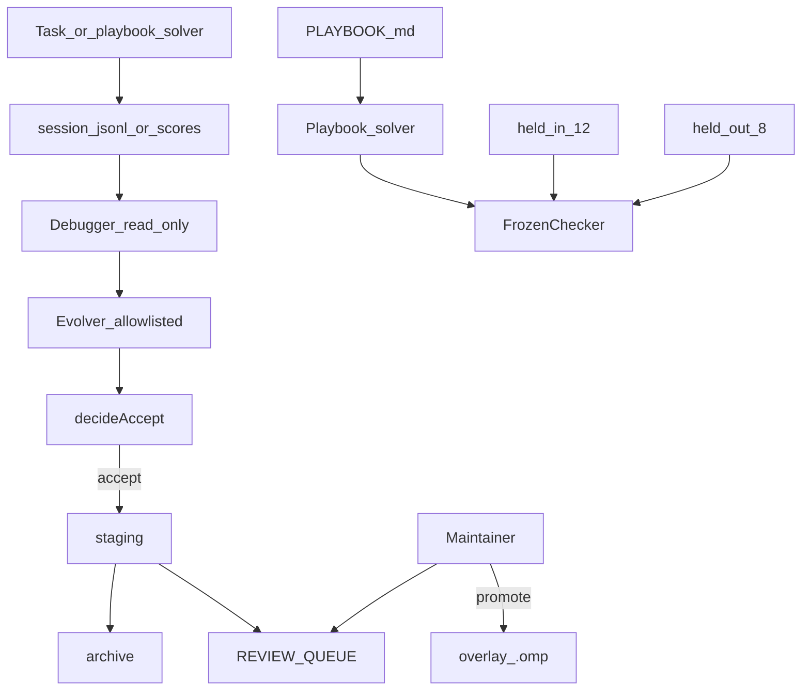
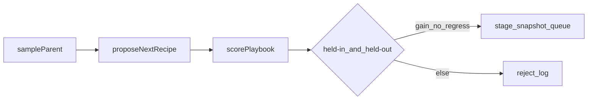

# Improveness — self-improvement overlay for a frozen coding harness

> **What it is:** A research corpus plus a maintainer-gated loop that evolves *project* Oh My Pi surfaces (playbook, skills, tools) against a frozen held-in / held-out checker.
> **What it is not:** A weight trainer, an auto-apply bot, a fork that pushes to `can1357/oh-my-pi`, or a public Terminal-Bench 2 campaign.
> **Primary interface:** Bun CLIs under `harness/omp/drivers/` plus Markdown authority files.

---

**TL;DR**

- The *model* stays frozen. What improves is the **harness** around it (AHE / Self-Harness / ACE).
- Editable surfaces live in [`harness/omp/overlay/.omp/`](harness/omp/overlay/.omp/). The evaluator and permission kernel do not.
- Accept means **staging + archive + review queue**. A human promotes. There is no auto-apply (D7, D12).
- Fitness is a **20-fixture** frozen checker (12 held-in, 8 held-out), not public TB2.
- A recorded 5-step cycle moved held-in **0/12 → 7/12** and held-out **0/8 → 3/8**. Held-out-only secret tasks stayed failed.
- The evolver never sees held-out prompts. Shared `recipe:*` families are what generalize.
- Root CI runs [`harness/omp/scripts/validate.sh`](harness/omp/scripts/validate.sh) with Bun 1.3.14. Live smoke is skip-gated.
- In-tree [`oh-my-pi/`](oh-my-pi/) is the upgrade base (nested git removed). We do not push upstream.
- System prompt files are **not** an improvement surface (AHE prompt-only −2.3 pp).
- Source survey: [Lilian Weng, “Harness Engineering for Self-Improvement” (Jul 2026)](https://lilianweng.github.io/posts/2026-07-04-harness/).

---

## Table of contents

1. [Vision](#1-vision)
2. [Architecture](#2-architecture)
3. [Quickstart](#3-quickstart)
4. [Configuration](#4-configuration)
5. [Project structure](#5-project-structure)
6. [Drivers and interfaces](#6-drivers-and-interfaces)
7. [Eval suite](#7-eval-suite)
8. [Testing and CI](#8-testing-and-ci)
9. [Safety kernel](#9-safety-kernel)
10. [Cookbook](#10-cookbook)
11. [Benchmarks](#11-benchmarks)
12. [Roadmap and changelog](#12-roadmap-and-changelog)
13. [FAQ and glossary](#13-faq-and-glossary)

## 1. Vision

### 1.1 What it is

Improveness is two layers in one git root:

1. A **reading corpus** that breaks Weng’s survey into segments and method pages (`docs/`).
2. A **working overlay** that instantiates the generic self-improvement spec on in-tree Oh My Pi (`harness/omp/`).

The product question is: *given a strong coding harness, what do you add so it can improve itself without rewriting the model or the permission kernel?*

### 1.2 What it is not

- Not a live fork of [oh-my-pi](https://github.com/can1357/oh-my-pi) with remotes.
- Not DGM / AlphaEvolve / SIA weight updates.
- Not an ACE-only prompt rewriter. AHE’s prompt-only ablation *regressed* (−2.3 pp).
- Not a closed loop that writes canonical `overlay/.omp` or `oh-my-pi/packages/`.
- Not a public Terminal-Bench 2 or SWE-bench leaderboard run.

### 1.3 Who it is for

Maintainers who want candidates as **evidence** ([oh-my-pi#7907](https://github.com/can1357/oh-my-pi/issues/7907)). Researchers who want a concrete AHE-shaped loop on a real harness. Future agents who need a nawab contract in [`IMPLEMENTATION_PLAN.md`](IMPLEMENTATION_PLAN.md).

### 1.4 Success criteria

A reviewer can answer “what may the evolver touch?” from [`harness/omp/KERNEL.md`](harness/omp/KERNEL.md) and [`harness/omp/SURFACES.md`](harness/omp/SURFACES.md) without reading the paper. `validate.sh` is green. A search cycle can improve held-in *and* held-out without leaking \(D_{out}\) into the proposer.

## 2. Architecture

### 2.1 High-level loop



### 2.2 Search step



### 2.3 Key modules

| Path | Role |
|------|------|
| [`harness/omp/overlay/.omp/`](harness/omp/overlay/.omp/) | Project playbook, agents, manifests |
| [`harness/omp/drivers/`](harness/omp/drivers/) | 17 Bun drivers (curator through benchmark) |
| [`harness/omp/evals/`](harness/omp/evals/) | Frozen checker, 20 fixtures, TB adapter, local benchmark |
| [`harness/omp/KERNEL.md`](harness/omp/KERNEL.md) | Evolver-forbidden paths |
| [`oh-my-pi/`](oh-my-pi/) | Vendored seed harness; read-only unless a documented core patch |
| [`docs/`](docs/00-index.md) | Weng segments, methods, proposals |

## 3. Quickstart

### 3.1 Prerequisites

- [Bun 1.3.14](https://bun.sh) (OMP pin; also used by overlay tests)
- `rg` (ripgrep) for `validate.sh` and several fixture `check.sh` scripts
- Git. LLM API keys are **optional**

### 3.2 Install overlay into in-tree OMP

```text
bash harness/omp/scripts/install-overlay.sh
```

That **merges** into existing `oh-my-pi/.omp/`. Do not replace that directory; OMP already ships commands and skills.

### 3.3 Run the overlay gate

```text
bash harness/omp/scripts/validate.sh
```

### 3.4 Run a recorded-style improvement cycle

```text
bun harness/omp/drivers/run-benchmark.ts 5 /tmp/improv-bench
```

To refresh the committed report:

```text
bun harness/omp/drivers/run-benchmark.ts 5 harness/omp/evals/benchmarks/local-20
```

### 3.5 Verify smoke (no keys)

```text
bun harness/omp/drivers/live-session-smoke.ts
# {"skipped":true,"reason":"OMP_LIVE_SMOKE is not 1"}
```

## 4. Configuration

None of these are required for `validate.sh`. Values stay in the environment; never in the playbook.

| Variable | Required | Default | Description |
|----------|----------|---------|-------------|
| `OMP_GOOGLE_ANTIGRAVITY_CLIENT_ID` | no | unset | OMP OAuth placeholder |
| `OMP_GOOGLE_ANTIGRAVITY_CLIENT_SECRET` | no | unset | OMP OAuth placeholder |
| `OMP_GOOGLE_GEMINI_CLI_CLIENT_ID` | no | unset | OMP OAuth placeholder |
| `OMP_GOOGLE_GEMINI_CLI_CLIENT_SECRET` | no | unset | OMP OAuth placeholder |
| `OMP_ANTHROPIC_OAUTH_CLIENT_ID` | no | unset | OMP OAuth placeholder |
| `ANTHROPIC_API_KEY` | no | unset | Unlocks optional live smoke when `OMP_LIVE_SMOKE=1` |
| `OPENAI_API_KEY` | no | unset | Same |
| `OPENROUTER_API_KEY` | no | unset | Same |
| `OMP_LIVE_SMOKE` | no | unset | Set `1` to attempt `createAgentSession` smoke |
| `OMP_LIVE_SEARCH` | no | unset | Reserved for an optional live evolver; deterministic search is the gate |

See [`.env.example`](.env.example). Do not restore hardcoded OAuth client secrets.

## 5. Project structure

```text
.
├── README.md                    # this file
├── IMPLEMENTATION_PLAN.md       # live nawab P2 contract
├── DECISIONS.md                 # D1–D12
├── PROGRESS.md
├── LEARNING.md
├── PROJECT_OVERVIEW.md
├── .env.example
├── .github/workflows/overlay.yml
├── docs/                        # research + proposals + plans
├── harness/omp/                 # Improveness overlay (source of truth)
│   ├── KERNEL.md
│   ├── SURFACES.md
│   ├── REVIEW_QUEUE.md
│   ├── drivers/                 # 17 TypeScript/Bun drivers
│   ├── evals/                   # checker, fixtures, tb-adapter, benchmarks
│   ├── overlay/.omp/            # playbook, agents, manifests
│   ├── archive/                 # DGM-lite snapshots (bodies gitignored)
│   ├── staging/                 # accepted candidates (gitignored)
│   ├── scripts/validate.sh
│   └── tests/                   # 16 bun test files
├── oh-my-pi/                    # vendored OMP (no nested .git)
└── vendor/cursor-config-coding/ # nawab / extensive-readme skills
```

## 6. Drivers and interfaces

17 drivers. Grouped by job. Approval: evolver writes go through `assertEvolverWrite`.

### 6.1 Memory and traces (4)

| Name | Approval | What it does |
|------|----------|--------------|
| `curate-playbook.ts` | playbook/ only | Deterministic ACE delta merge; rejects secrets / SYSTEM.md |
| `export-session.ts` | traces/ append | jsonl → `meta.json`, turns, tool I/O, `outcome.json` |
| `write-diagnosis.ts` | `diagnosis.md` only | Debugger write path under traces/ or reports/ |
| `playbook-solver.ts` | read-only | Scores fixtures as if a task agent followed `recipe:*` families |

### 6.2 Gate and review (5)

| Name | Approval | What it does |
|------|----------|--------------|
| `run-eval.ts` | none | `scoreSplit` on held-in / held-out `repo/` or `expected/` |
| `self-harness.ts` | staging/ only | `decideAccept` + `stageCandidate` |
| `manifest.ts` | n/a | Candidate JSON schema |
| `apply-candidate.ts` | staging + parent snapshot | Writes a falsifiable manifest |
| `rollback-candidate.ts` | staging snapshots | Restores parent bytes |

### 6.3 Search and eval runners (5)

| Name | Approval | What it does |
|------|----------|--------------|
| `archive.ts` | archive/ only | `snapshotOverlay`, `listArchive`, `sampleParent`; kernel deny |
| `propose.ts` | staging playbook | Next held-in-only `recipe:*`; throws on held-out ids |
| `search.ts` | staging + archive + queue | Hard-capped loop; never promotes `overlay/.omp` |
| `tb-export.ts` | adapter out dir | Harbor-shaped `instruction.md` + `tests/test.sh` |
| `run-tb-local.ts` | none | Executes those tasks against fixture `repo/` or `expected/` |

### 6.4 Smoke and evidence (3)

| Name | Approval | What it does |
|------|----------|--------------|
| `allowlist.ts` | n/a | Debugger/evolver tool + path policy |
| `live-session-smoke.ts` | skip without keys | Optional `createAgentSession` pong check |
| `run-benchmark.ts` | temp worktree | Copies evals, runs search, writes `summary.md` / `scores.json` |

Project agents: [`overlay/.omp/agents/debugger.md`](harness/omp/overlay/.omp/agents/debugger.md) (read/grep/glob only) and [`evolver.md`](harness/omp/overlay/.omp/agents/evolver.md) (no bash; no kernel paths). Hidden OMP roles `@debugger` / `@evolver` (D10).

## 7. Eval suite

### 7.1 Split

| Split | Count | Role |
|-------|-------|------|
| Held-in | 12 | Proposer may see failures and unlock families |
| Held-out | 8 | Regression brake; proposer must not read these ids |

Held-in ids: `default-export`, `gitignore-rule`, `greet-export`, `index-reexport`, `license-header`, `named-type-export`, `package-script`, `readme-section`, `readme-title`, `sum-fn`, `tsconfig-strict`, `unused-var-marker`.

Held-out ids: `barrel-no-secrets`, `gitignore-dist`, `greet-types`, `no-implicit-any`, `no-secrets`, `package-test-script`, `readme-usage`, `typed-default-export`.

Each fixture is `fixture.json` + `check.sh` + `repo/` (fails) + `expected/` (passes).

### 7.2 Recipe families

A playbook line containing `recipe:gitignore` unlocks every fixture in that family. That is how held-out **generalization** is measured without showing \(D_{out}\) to the proposer.

| Family | Held-in | Held-out |
|--------|---------|----------|
| `recipe:default-export` | default-export | typed-default-export |
| `recipe:gitignore` | gitignore-rule | gitignore-dist |
| `recipe:named-export` | greet-export, sum-fn, named-type-export | greet-types |
| `recipe:index-reexport` | index-reexport | — |
| `recipe:license-header` | license-header | — |
| `recipe:package-script` | package-script | package-test-script |
| `recipe:readme-h2` | readme-section | readme-usage |
| `recipe:readme-h1` | readme-title | — |
| `recipe:tsconfig` | tsconfig-strict | no-implicit-any |
| `recipe:unused-prefix` | unused-var-marker | — |
| `recipe:no-secrets` | — | no-secrets, barrel-no-secrets |

`recipe:no-secrets` has **no held-in member**, so the deterministic proposer never unlocks it. Those two held-out tasks staying failed is intentional.

## 8. Testing and CI

```text
bun test harness/omp/tests/
bash harness/omp/scripts/validate.sh
```

- **Fast:** allowlists, curator, exporter, checker, solver, search cap/kernel, Harbor runner
- **Medium:** `runSearch` on a temp copy of the 20 fixtures (no LLM)
- **Slow:** live smoke / live search — skip without `OMP_LIVE_SMOKE=1` and a key
- **Not a gate:** `oh-my-pi` `coding-agent-heavy`

CI: [`.github/workflows/overlay.yml`](.github/workflows/overlay.yml)

| Job | Required for PR green? | Secrets |
|-----|------------------------|---------|
| `validate` | yes | none |
| `live-smoke` | no (exits 0 when skipped) | optional LLM key + `OMP_LIVE_SMOKE=1` |

Do not adopt `oh-my-pi/.github/workflows/ci.yml` as the overlay gate.

## 9. Safety kernel

See [`harness/omp/KERNEL.md`](harness/omp/KERNEL.md) and [`docs/proposals/04-safety.md`](docs/proposals/04-safety.md).

| Rule | Enforcement |
|------|-------------|
| Evolver cannot write the checker, KERNEL, system-prompt, or `oh-my-pi/packages/` | `assertEvolverWrite` / `isKernelRel` |
| Proposer cannot see held-out ids | `propose.ts` throws |
| Hard step cap | `MAX_STEP_CAP = 8` (default 3) |
| Fitness is not an LLM judge | frozen `check.sh` |
| Human promote | `REVIEW_QUEUE.md`; search sets `apply to project .omp? = no` |
| Rejects are kept | `harness/omp/reports/search/` |
| No public-set tuning | local fixtures only (proposal P5) |

## 10. Cookbook

**Score a split against starter repos**

```text
bun harness/omp/drivers/run-eval.ts harness/omp/evals held-in repo
bun harness/omp/drivers/run-eval.ts harness/omp/evals held-out expected
```

**Run bounded search in this checkout** (writes staging / archive / queue — prefer `run-benchmark.ts` which uses a temp worktree)

```text
bun harness/omp/drivers/search.ts 3
```

**Export and run one Harbor-shaped task**

```text
bun harness/omp/drivers/tb-export.ts harness/omp/evals/held-out/no-secrets /tmp/tb
bun harness/omp/drivers/run-tb-local.ts harness/omp/evals repo
```

**Install playbook context into OMP**

```text
bash harness/omp/scripts/install-overlay.sh
```

## 11. Benchmarks

Recorded run: [`harness/omp/evals/benchmarks/local-20/summary.md`](harness/omp/evals/benchmarks/local-20/summary.md)

| Split | Baseline | After 5 search steps | Δ |
|-------|----------|----------------------|---|
| Held-in | 0/12 | 7/12 | +7 |
| Held-out | 0/8 | 3/8 | +3 |

| Step | Family unlocked | Decision | Held-in | Held-out |
|------|-----------------|----------|---------|----------|
| 1 | `recipe:default-export` | accept | 1/12 | 1/8 |
| 2 | `recipe:gitignore` | accept | 2/12 | 2/8 |
| 3 | `recipe:named-export` | accept | 5/12 | 3/8 |
| 4 | `recipe:index-reexport` | accept | 6/12 | 3/8 |
| 5 | `recipe:license-header` | accept | 7/12 | 3/8 |

How improvement happens:

1. Baseline playbook has ACE slogans and **zero** `recipe:*` lines, so the solver uses every fixture’s failing `repo/`.
2. `sampleParent` picks the archive node with highest fitness / (1 + children).
3. `proposeNextRecipe` looks at **sorted failing held-in ids** and appends one new family.
4. `scorePlaybook` treats unlocked fixtures as their `expected/` trees (the harness now “knows” that repair).
5. `decideAccept` requires no regression on either split and a gain on at least one.
6. Accept writes staging + archive snapshot + a queue row. The canonical overlay playbook in the worktree used for the committed report is a **copy**; this repo’s `overlay/.omp/playbook/PLAYBOOK.md` stays the seed.

Held-out +3 comes from families that also cover `typed-default-export`, `gitignore-dist`, and `greet-types`. `no-secrets` / `barrel-no-secrets` remain 0 because the proposer never saw them.

This is a **harness-memory** benchmark, not a live-LLM coding-agent run. It is the honest keyless demonstration that the Self-Harness gate, archive, and held-out brake work. A public TB2 campaign stays P3 (D11).

## 12. Roadmap and changelog

### 12.1 Build phases (completed)

| Phase | Theme | Status |
|-------|-------|--------|
| Research | Weng segments, methods, proposals 00–05 | done |
| P0 | Surfaces, ACE, traces, debugger, Self-Harness, manifests, `validate.sh` | done |
| P1 | 20 fixtures, live-smoke skip-gate, hidden roles, TB adapter, archive primitive | done |
| P2.0 | Contract + D11/D12 | done |
| P2.A–N | Root CI, search loop, local Harbor runner, local benchmark, extensive README | done |

### 12.2 Possible future directions

- Public Terminal-Bench 2 / Harbor campaign (never as evolver fitness)
- Required live-smoke (needs repo secrets on every PR)
- Spec Kit `.specify/` and Agent Patterns Catalog ids
- Live `@evolver` proposer behind `OMP_LIVE_SEARCH=1`
- Human promote of a staging playbook onto canonical `overlay/.omp`

### 12.3 Changelog

| Date | Change |
|------|--------|
| 2026-08-15 | P2 closeout: overlay GitHub Actions, bounded search, local Harbor runner, 5-step local-20 report (0/12→7/12, 0/8→3/8), extensive README |
| 2026-08-15 | P1: 20 fixtures, hidden `@debugger`/`@evolver`, TB adapter, archive primitive |
| 2026-08-15 | P0: overlay loop outside OMP core |
| 2026-08-15 | In-tree OMP clone; proposals-only pass superseded by D8/D9 |

## 13. FAQ and glossary

**Why not tune on public TB2?**
Proposal P5 and AHE: the proposer must not train on the public set it will be scored on. Local held-out is the brake.

**Why can the evolver be small?**
Lin et al. 2026: harness-updating is flat across mid and frontier models. Spend budget on the task agent (D6).

**What is ACE vs AHE vs Self-Harness?**
ACE = playbook memory with a deterministic curator. AHE = file-level evolution of tools/middleware/memory (not the system prompt). Self-Harness = held-in/held-out accept rule around a frozen model.

**What is the kernel?**
Paths the loop must not write: checker, KERNEL/SURFACES, system-prompt files, OMP packages, overlay CI workflow. Listed in [`KERNEL.md`](harness/omp/KERNEL.md).

**Where do I start reading?**
[`docs/00-index.md`](docs/00-index.md) for the paper. [`harness/omp/SURFACES.md`](harness/omp/SURFACES.md) for paths. [`IMPLEMENTATION_PLAN.md`](IMPLEMENTATION_PLAN.md) for the execution contract. [`DECISIONS.md`](DECISIONS.md) for ADRs.

**Authority**

[`IMPLEMENTATION_PLAN.md`](IMPLEMENTATION_PLAN.md) · [`PROGRESS.md`](PROGRESS.md) · [`DECISIONS.md`](DECISIONS.md) · [`LEARNING.md`](LEARNING.md) · snapshot [`docs/plans/p2-omp-overlay.md`](docs/plans/p2-omp-overlay.md)
