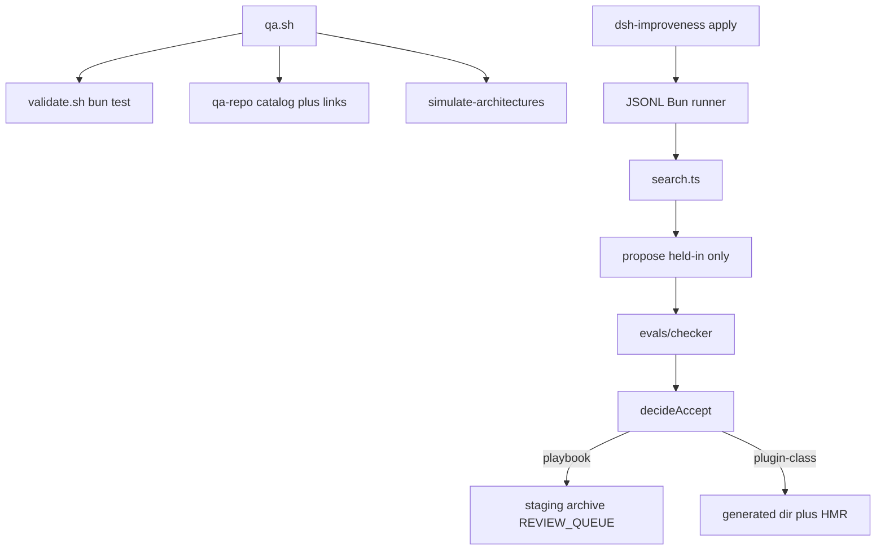

# Improveness — extensive internals

Companion to the main [README](../README.md). How the repo runs, every first-party module, and why the important files exist. Do not invent paths.

## Table of contents

- [1. How this repository runs](#1-how-this-repository-runs)
- [2. Package map](#2-package-map)
- [3. Packages](#3-packages)
- [4. Configuration](#4-configuration)
- [5. Tests and CI](#5-tests-and-ci)
- [6. Ideas worth understanding](#6-ideas-worth-understanding)
- [7. Further reading](#7-further-reading)
- [8. Future advancements](#8-future-advancements)

This file is the **engineering companion**: how a request becomes a file write, why each module exists, and the same 2026 harness vocabulary as the landing [README](../README.md), at the grain of paths.

## 1. How this repository runs

There is no HTTP server. A maintainer (or CI) runs a Bun script on the filesystem.

**Walkthrough.** `bash harness/omp/scripts/qa.sh` is the product check. It runs `validate.sh` (unit tests, KERNEL needles, no public-TB2 URLs), then `qa-repo.ts` (catalog rows, relative links, 12/8 fixtures), then `simulate-architectures.ts` (seven named wirings, no API key).

A search step: pick a past playbook from `archive/`, score practice and hidden, propose a lesson only from failing **practice** ids, score again, keep if practice rose and hidden did not drop. Playbook-class writes `staging/` + `archive/` + `REVIEW_QUEUE.md`. Plugin-class writes `harness/omp/generated/<id>/` after load/dispose/policy. Live DSH installs those siblings under `$DSH_HOME/profiles/improveness/improveness-generated/`.

Optional live paths (`OMP_LIVE_SMOKE`, `DSH_LIVE_SMOKE`) skip without keys so forks stay green.

## 2. Package map

| Package | Path | Role | Entry |
|---------|------|------|-------|
| DSH bundle | `plugins/dsh-improveness/` | Installable `dsh.bundle` (JIT + HostPort) | `src/apply.js` |
| Improveness overlay | `harness/omp/` | Loop, checker, overlay files, QA | `bash harness/omp/scripts/qa.sh` |
| Parked snapshot | `oh-my-pi/` | P1 OMP HostPort working snapshot (D14) | Oh My Pi CLI / `createAgentSession` |
| Research corpus | `docs/` | Weng segments, methods, proposals | [`docs/00-index.md`](00-index.md) |
| Coding-config vendor | `vendor/cursor-config-coding/` | Skills/rules source; copied into `.cursor/` | [vendor README](../vendor/cursor-config-coding/README.md) |
| Root authority | repo root | Plan, ADRs, progress, product README | [`IMPLEMENTATION_PLAN.md`](../IMPLEMENTATION_PLAN.md) |

Generated noise (`oh-my-pi/node_modules`, lockfile internals) is not listed below.

## 3. Packages

### 3.0 DSH bundle (`plugins/dsh-improveness/`)

**What it is for.** The installable product: a DeepSeek Harness `dsh.bundle` that JIT-mounts session plugins and promotes durable siblings after the frozen checker.

**How it is used.** `dsh plugin --profile improveness add ./plugins/dsh-improveness`. QA stays `bash harness/omp/scripts/qa.sh`.

**How it works.** `src/apply.js` registers Creator-like tools. Ephemeral mounts are session-owned and fail-closed while in-flight. Durable files go to a profile-owned generated directory, never this package and never `node_modules`. The Bun loop is reached over JSONL.

#### File map

| File | Why it is here | What it does |
|------|----------------|--------------|
| `package.json` | `dsh.bundle` marker | Cordis patch pointer |
| `src/apply.js` | Plugin entry | Register tools + disposer (section-gated) |
| `src/sections.js` | D16 flags | JIT / improve / eventInject parse |
| `src/catalog.js` | Discovery | Hierarchical namespace → group → tool |
| `src/events.js` | Inject | need_tool reminder + optional hint mount |
| `src/synthesize.js` | JIT assemble | Task harness from M/P/A/C templates |
| `src/modules/templates.js` | Slot modules | Invertible memory/planning/action/capability |
| `src/jit.js` | Fast path | define/run/stop + drain |
| `src/frozen-ids.js` | Kernel ids | Namespaces, not Fiber ids |
| `src/slots.js` | HarnessFactory | Collision-before-mount |
| `src/policy-fence.js` | AOT gate | Isolated load/dispose/policy before durable write |
| `src/host-port-dsh.js` | DSH HostPort | Session log, HMR, generated dir |
| `src/core-client.js` | Node→Bun | JSONL spawn |
| `runtime/runner.ts` | Packaged runner | `serveStdin` |

### 3.1 Improveness overlay (`harness/omp/`)

**What it is for.** The self-improvement loop: playbook, traces, debugger/evolver agents, frozen checker, bounded search, CACD catalog, keyless architecture sims.

**How it is used.** CI and humans run `qa.sh`. Drivers are `bun harness/omp/drivers/<file>.ts`. Overlay files merge into `oh-my-pi/.omp/` via `install-overlay.sh`.

**How it works.** Contract files (`KERNEL.md`, `SURFACES.md`, `CACD.md`) say what may change. Drivers propose and score. The checker is a set of `check.sh` scripts, not an LLM judge. CACD catalog needles fail QA if a required sentence disappears.

#### File map — contract

| File | Why it is here | What it does |
|------|----------------|--------------|
| [`KERNEL.md`](../harness/omp/KERNEL.md) | Evolver-forbidden paths | Lists checker, `system-prompt.md`, `approval.ts`, Improveness QA |
| [`SURFACES.md`](../harness/omp/SURFACES.md) | Evolver-allowed paths | Playbook, tools, skills, snapshot loop after D14 |
| [`CACD.md`](../harness/omp/CACD.md) | Operating model | Contract · Architecture · Control · Delivery |
| [`cacd/catalog.ts`](../harness/omp/cacd/catalog.ts) | Machine checklist | Catalog rows QA greps; includes `working snapshot`, `D15`, `dsh.bundle` |
| [`REVIEW_QUEUE.md`](../harness/omp/REVIEW_QUEUE.md) | Human checkpoint | Permission-widening; “no auto-apply” onto checker/upstream |
| [`archive/README.md`](../harness/omp/archive/README.md) | DGM-lite parent sampling | Snapshots + fitness; never archives the checker |

#### File map — overlay agents and playbook

| File | Why it is here | What it does |
|------|----------------|--------------|
| [`overlay/.omp/AGENTS.md`](../harness/omp/overlay/.omp/AGENTS.md) | Context, not kernel prompt | Points at PLAYBOOK.md; forbids `system-prompt` edits |
| [`overlay/.omp/playbook/PLAYBOOK.md`](../harness/omp/overlay/.omp/playbook/PLAYBOOK.md) | ACE memory | Lessons the solver scores |
| [`overlay/.omp/agents/debugger.md`](../harness/omp/overlay/.omp/agents/debugger.md) | Read-only diagnosis role | Pins `smol` + read/grep/glob |
| [`overlay/.omp/agents/evolver.md`](../harness/omp/overlay/.omp/agents/evolver.md) | Cheap writer role | Allowlisted edits; D14 apply after gate |

#### File map — drivers and HostPort

| File | Why it is here | What it does |
|------|----------------|--------------|
| `drivers/allowlist.ts` | Path policy | `assertEvolverWrite`; `KERNEL_PATH_MARKERS` |
| `drivers/curate-playbook.ts` | ACE curator | Append-only lessons; rejects secrets and SYSTEM.md advice |
| `drivers/playbook-solver.ts` | Measurable ACE | Unlocks `recipe:*` families on fixtures |
| `drivers/export-session.ts` | Weakness mining | Session jsonl → trace tree |
| `drivers/write-diagnosis.ts` | Debugger write | `diagnosis.md` under traces/reports only |
| `drivers/run-eval.ts` | Score a split | Starter vs gold trees |
| `drivers/self-harness.ts` | Accept rule | Practice up and hidden not down |
| `drivers/manifest.ts` | Candidate shape | Falsifiable record + rollback command |
| `drivers/apply-candidate.ts` | P2 apply | Writes **staging**, not `oh-my-pi/` |
| `drivers/rollback-candidate.ts` | Undo | Restore parent hash |
| `drivers/archive.ts` | Parent sampling | Snapshot + `sampleParent`; `isKernelRel` |
| `drivers/propose.ts` | Held-in-only | Throws if a hidden id is named |
| `drivers/search.ts` | Bounded loop | `MAX_STEP_CAP = 8`; playbook stages; plugin-class applies |
| `drivers/improve-short.ts` | D16 short-term | Post-trajectory playbook candidates |
| `drivers/improve-long.ts` | D16 long-term | Archive cadence → bounded search |
| `drivers/apply-snapshot.ts` | Durable plugins | Immutable candidate → validate disposer → atomic generated dir |
| `drivers/dsh-core-runner.ts` | JSONL RPC | Node plugin ↔ Bun loop (`improveShort` / `improveLong`) |
| `host-port/omp-port.ts` | P1 OMP adapter | Overlay + generated apply; `needsRestart` for snapshot source |
| `host-port/pareto.ts` | Archive survivors | Quality vs cost front |
| `host-port/skill-compile.ts` | Evo-Harness P1 | Playbook family → `SKILL.md` |
| `host-port/retrieve-prior.ts` | JIT retrieve | Sample archive parents into session |
| `drivers/tb-export.ts` | Harbor shape | `instruction.md` + `tests/test.sh` |
| `drivers/run-tb-local.ts` | Local Harbor | Not a public TB2 download |
| `drivers/run-benchmark.ts` | Recorded 20-task run | 0/12→7/12, 0/8→3/8 after 5 steps |
| `drivers/qa-repo.ts` | Repo QA | Catalog + links + fixture counts |
| `drivers/simulate-architectures.ts` | Architecture sims | Seven named wirings, keyless |
| `drivers/live-session-smoke.ts` | Optional ping | Skip without keys |

#### File map — evals and scripts

| File | Why it is here | What it does |
|------|----------------|--------------|
| `evals/held-in/` (12) | Practice set | Improver may see these ids |
| `evals/held-out/` (8) | Hidden set | Leakage brake; `no-secrets` has no held-in member |
| `evals/checker/` | Frozen verifier | `check.sh` + gold trees; evolver must not write |
| `evals/checker/posix-bash.ts` | Windows scoring | Prefer Git bash over the WSL launcher |
| `evals/tb-adapter/` | Local Harbor layout | Not public Terminal-Bench |
| `evals/benchmarks/local-20/` | Recorded report | Held-in/held-out after search |
| `evals/simulations/latest/` | Last sim report | Seven-row table |
| `scripts/validate.sh` | Fast gate | bun test + KERNEL greps + ripgrep |
| `scripts/qa.sh` | Full gate | validate + qa-repo + sims |
| `scripts/install-overlay.sh` | Merge overlay | Into existing `oh-my-pi/.omp/` |
| `tests/` (24 files) | Unit + contract | Includes plugin JIT, apply-snapshot, JSONL, P1 HostPort |

### 3.2 Working snapshot (`oh-my-pi/`)

**What it is for.** The coding agent Improveness is supposed to **change** after the gate (D14). Nested `.git` was stripped (D8). We do not push to `can1357/oh-my-pi`.

**How it is used.** Optional live smoke/search via `createAgentSession`. Overlay merges into `oh-my-pi/.omp/`. Frozen kernel files must stay clean in git.

**How it works.** Upstream Oh My Pi is a Bun monorepo. Improveness cares about `packages/coding-agent`: system prompt, tools (`approval.ts` is permission kernel), extension loader (activate without guaranteed unload), hidden `debugger`/`evolver` roles (D10). Other packages (`tui`, `hashline`, `ai`, …) are present because the snapshot is whole; they are not Improveness’s loop.

#### File map (kernel + extension gap only)

| File | Why it is here | What it does |
|------|----------------|--------------|
| `packages/coding-agent/src/prompts/system/system-prompt.md` | AHE: prompt-only missed the gain | Frozen; not an improvement surface |
| `packages/coding-agent/src/system-prompt.ts` | Assembles the prompt | Frozen |
| `packages/coding-agent/src/tools/approval.ts` | Permission kernel | Human checkpoint to widen |
| `packages/coding-agent/src/config/model-roles.ts` | Role map | Hidden debugger/evolver; evolver cannot redefine the map |
| `docs/extensions.md` | Extension API | Load/register; no Cordis-style unload |

Do not file-list the rest of `oh-my-pi/packages/`. It is a vendored snapshot, not Improveness source.

### 3.3 Research corpus (`docs/`)

**What it is for.** A maintainer-readable map of Weng’s survey plus method pages and change proposals.

**How it is used.** Start at [`00-index.md`](00-index.md). Proposals feed KERNEL/SURFACES. Method notes feed teaching READMEs.

**How it works.** Segments 01–09 follow Weng’s headings. `methods/` is one page per cited system. `proposals/` is the “what we add” track. `plans/` snapshots nawab contracts.

#### File map

| File | Why it is here | What it does |
|------|----------------|--------------|
| [`00-index.md`](00-index.md) | Reading order | Paper map + default recommendation |
| [`01-rsi-and-harness.md`](01-rsi-and-harness.md) … [`09-challenges-and-evals.md`](09-challenges-and-evals.md) | Survey segments | One Weng topic each |
| [`methods/README.md`](methods/README.md) | Method index | ACE, AHE, Self-Harness, Cordis, HostPort, JIT, HELIX, … |
| [`CLAIM_LEDGER.md`](CLAIM_LEDGER.md) | Allowed README claims | Proven vs forbidden |
| [`methods/host-port.md`](methods/host-port.md) | Thin adapter | HELIX-inspired surface |
| [`methods/two-speed.md`](methods/two-speed.md) | JIT vs AOT | Session vs durable |
| [`methods/node-bun-protocol.md`](methods/node-bun-protocol.md) | Dual runtime | JSONL RPC |
| [`methods/spatiotemporal-composability.md`](methods/spatiotemporal-composability.md) | Live self-mod | Temporal + spatial composability |
| [`proposals/06-snapshot-apply.md`](proposals/06-snapshot-apply.md) | D14 product spec | Mutate the agent you are using |
| [`proposals/04-safety.md`](proposals/04-safety.md) | Kernel rules | Evaluator outside the loop |
| [`plans/p2-omp-overlay.md`](plans/p2-omp-overlay.md) | Historical P2 | Stage-only search |
| [`plans/p3-snapshot-apply.md`](plans/p3-snapshot-apply.md) | P3 snapshot | Pointer to live plan |
| [`references.md`](references.md) | Citation list | Papers and product links |
| [`EXTENSIVE.md`](EXTENSIVE.md) | This file | Internals companion |

### 3.4 Coding-config vendor (`vendor/cursor-config-coding/`)

**What it is for.** Portable Cursor skills/rules (D4). Project copies live under [`.cursor/skills/`](../.cursor/skills/nawab-plans/SKILL.md) so agents load them without replacing the git root.

**How it is used.** Agents read `.cursor/skills`. README work routes through [`readme`](../.cursor/skills/readme/SKILL.md) → `product-readme` (landing) / `readable-readme` / `extensive-readme` (this file).

**How it works.** Upstream: [Vinayak-RZ/cursor-config-coding](https://github.com/Vinayak-RZ/cursor-config-coding). Landing page: `product-readme`. Internals: this file.

One line, not a file list: do not dump every GSAP/Spec Kit skill here.

### 3.5 Root authority (repo root)

**What it is for.** Nawab contract, ADRs, live status, product README.

**How it is used.** QA opens `IMPLEMENTATION_PLAN.md` and `DECISIONS.md` for catalog needles. Humans read [`README.md`](../README.md) first.

#### File map

| File | Why it is here | What it does |
|------|----------------|--------------|
| [`README.md`](../README.md) | Product landing | Teaching README; links here |
| [`LICENSE`](../LICENSE) | Improveness MIT | Does not re-license `oh-my-pi/` |
| [`IMPLEMENTATION_PLAN.md`](../IMPLEMENTATION_PLAN.md) | Live D15 contract | Must contain `No public Terminal-Bench` and `working snapshot` |
| [`DECISIONS.md`](../DECISIONS.md) | ADRs D1–D15 | Catalog requires D7, D11–D15, `dsh.bundle`, `HostPort` |
| [`PROGRESS.md`](../PROGRESS.md) | Phase status | D15 P0 + P1 HostPort |
| [`LEARNING.md`](../LEARNING.md) | Phase learnings | Including D15 JSONL vs shared package |
| [`PROJECT_OVERVIEW.md`](../PROJECT_OVERVIEW.md) | Scope one-pager | Plugin-first vision |
| [`.env.example`](../.env.example) | Env inventory | Comments only; no secrets |
| [`.github/workflows/overlay.yml`](../.github/workflows/overlay.yml) | Improveness CI | Bun 1.3.14, ripgrep, `validate.sh` |

## 4. Configuration

Nothing is required for `qa.sh`. Full list: [`.env.example`](../.env.example).

| Variable | Required | Default | What it does |
|----------|----------|---------|--------------|
| `OMP_*` OAuth placeholders | no | unset | Oh My Pi desktop clients; never commit real values |
| `ANTHROPIC_API_KEY` / `OPENAI_API_KEY` / `OPENROUTER_API_KEY` | no | unset | Optional live ping |
| `OMP_LIVE_SMOKE` | no | unset | Set `1` to request a real session ping |
| `OMP_LIVE_SEARCH` | no | unset | Reserved live improver |
| `DSH_LIVE_SMOKE` | no | unset | Set `1` for a live DSH profile smoke |
| `IMPROVENESS_CORE_RUNNER` | no | checkout runner | Override JSONL Bun entry |
| `DSH_HOME` / `IMPROVENESS_GENERATED` | no | `harness/omp/generated/` | Durable plugin root |

## 5. Tests and CI

| Tier | What | Command |
|------|------|---------|
| Fast | 24 test files | `bun test harness/omp/tests/` |
| Overlay | locked-path greps, ≥20 tasks, no public-bench download URLs | `harness/omp/scripts/validate.sh` |
| Whole repo | catalog rows (incl. `dsh.bundle`), links, seven replays | `harness/omp/scripts/qa.sh` |
| Slow | real DSH or OMP session | `DSH_LIVE_SMOKE=1` / `OMP_LIVE_SMOKE=1` plus keys |
| Not our gate | Oh My Pi’s heavy suite | do not run as the Improveness check |

CI ([`.github/workflows/overlay.yml`](../.github/workflows/overlay.yml)) installs ripgrep, then runs `qa.sh` (Bun 1.3.14). Without `rg`, gold trees fail.

Seven architecture sims (`simulate-architectures.ts`):

| Id | What we wired | Must happen | Practice | Hidden |
|----|---------------|-------------|----------|--------|
| `ace-only` | Slogans, no recipes | stay at zero | 0/12 | 0/8 |
| `self-harness-gated` | Five bounded steps | score goes up | 7/12 | 3/8 |
| `ahe-surfaces` | All practice lessons | score goes up; secrets stay locked | 12/12 | 6/8 |
| `held-out-leak` | Hidden name given to picker | refuse | — | — |
| `kernel-write` | Edit the grader | refuse | — | — |
| `unbounded-search` | 9 steps (cap is 8) | refuse | — | — |
| `auto-promote` | Write the grader or skip the gate | must refuse | — | — |

`auto-promote` means “no kernel / no skip-gate,” not a ban on gated generated-plugin apply (D15).

## 6. Ideas worth understanding

Main README teaches five named techniques. This section is the **engineering ideology**: why those bets show up as files.

### 6.1 Slogans are not lessons

**The problem.** A playbook rewritten into a shorter “system prompt” loses the details that help. A published ablation found prompt-only evolution **hurt** Terminal-Bench 2 by 2.3 points.

**How it works.** [`curate-playbook.ts`](../harness/omp/drivers/curate-playbook.ts) only appends or increments counters. [`playbook-solver.ts`](../harness/omp/drivers/playbook-solver.ts) scores tagged `recipe:*` families. The `ace-only` replay is a **passing** test of a **zero** score.

**Like.** “Cook well” vs “salt the pasta water.”

**Limits.** Unlocking every practice family reaches 12/12 and 6/8, still not 8/8 hidden, because secrets stay locked.

**Read next.** [ACE, arXiv:2510.04618](https://arxiv.org/abs/2510.04618). [AHE, arXiv:2604.25850](https://arxiv.org/abs/2604.25850).

### 6.2 Cheap writer, expensive doer

**The problem.** Frontier tokens are scarce. Using them to *write* extra files is a poor spend if a smaller model can write equally useful ones.

**How it works.** Lin et al.: **updating** (produce a useful extra file) is flat from 9B to frontier; **benefit** (follow that file) is not. Overlay [`evolver.md`](../harness/omp/overlay/.omp/agents/evolver.md) pins `@smol` (D6).

**Like.** A junior writes the checklist. A senior uses it on the real job.

**Limits.** Recorded scores here do not call a live improver.

**Read next.** [Harness Updating Is Not Harness Benefit](https://arxiv.org/abs/2605.30621).

### 6.3 Try the wiring before you buy tokens

**The problem.** Comparing “who may write, who may see the hidden set” on a live frontier run is slow and leaks the public set.

**How it works.** [`simulate-architectures.ts`](../harness/omp/drivers/simulate-architectures.ts) replays seven named designs against the frozen 20 tasks with no model.

**Like.** A crash-test dummy for the plumbing.

**Limits.** Does not replace a live agent run.

### 6.4 Unload must invert (spatiotemporal composability)

**The problem.** Restart-as-deploy dumps process-local state. At high self-mod frequency, unavailability *is* the product.

**How it works.** Cordis tracks effects and runs inverses on Fiber unload. Improveness JIT `apply()` **must return a disposer**; `validateGeneratedPlugin` fails if tools stay registered. In-flight `run()` increments a counter; `stop` drains then **fail-closes**.

**Like.** `try/finally`, except the `try` lasts a whole session and the `finally` is scheduled by the runtime.

**Read next.** [Cordis paper](https://github.com/cordiverse/paper). Code: [`plugins/dsh-improveness/src/jit.js`](../plugins/dsh-improveness/src/jit.js).

### 6.5 Frozen ids are laws, Fiber ids are handles

**The problem.** If the evolver can name a Fiber instance (`fiber-9f3`) as “kernel”, every reload invents a new kernel. If it can write the checker, the score is whatever it wants ([HSI](https://arxiv.org/html/2608.08466)).

**How it works.** [`frozen-ids.js`](../plugins/dsh-improveness/src/frozen-ids.js) lists namespaces (`dsh.approval`, `dsh-improveness`, …). [`allowlist.ts`](../harness/omp/drivers/allowlist.ts) lists paths. Tests assert `fiber-9f3a` is **not** frozen.

**Like.** A constitution (stable) vs a session id (ephemeral).

### 6.6 Two clocks: JIT and AOT

**The problem.** Waiting for a full Self-Harness gate before the agent can use a one-off tool makes the session stupid. Promoting every ephemeral tool makes the profile a junk drawer.

**How it works.** JIT: `mountEphemeral(sessionId, pkg, slot)`. AOT: `decideAccept` → [`apply-snapshot.ts`](../harness/omp/drivers/apply-snapshot.ts) → generated dir → HMR. [JIT-Agent](https://arxiv.org/abs/2608.25593) named the split; we did not train the 27B.

**Like.** A REPL vs installing a package.

### 6.7 Evidence lives on disk (Meta-Harness shape)

**The problem.** A one-prompt “memory” cannot be grepped, rolled back, or Pareto-ranked.

**How it works.** Candidates are directories. Archive snapshots hash overlay files. P1 [`pareto.ts`](../harness/omp/host-port/pareto.ts) keeps non-dominated (quality, cost) nodes. [`retrieve-prior.ts`](../harness/omp/host-port/retrieve-prior.ts) pulls parents into the next JIT context.

**Like.** An experiment folder in a lab notebook, not a vibes paragraph in chat.

**Read next.** [Meta-Harness](https://arxiv.org/abs/2603.28052). [AutoResearch](https://github.com/karpathy/autoResearch).

### 6.8 Thin HostPort, two runtimes

**The problem.** Node (DSH) cannot import this Bun loop. Wrapping DSH in a second supervisor would violate [HELIX](https://arxiv.org/abs/2608.13951).

**How it works.** HostPort methods only. JSONL [`dsh-core-runner.ts`](../harness/omp/drivers/dsh-core-runner.ts). P1 [`omp-port.ts`](../harness/omp/host-port/omp-port.ts) sets `needsRestart` because OMP extensions still do not invert.

**Like.** A USB-C port vs designing a new computer around each phone.

### 6.9 Public benches are reports, not the loss function

**The problem.** Using public Terminal-Bench as evolver fitness leaks the exam into the improver ([Evo-Bench](https://arxiv.org/html/2608.09096)).

**How it works.** `propose.ts` throws if a held-out id is named. `run-tb-local.ts` has no public TB download URL. Catalog needle: `No public Terminal-Bench`.

**Like.** Publishing a paper with a public test set, then training on it.

### 6.10 Slots prevent silent overwrite

**The problem.** Two “memory” plugins both loading is a Heisenbug.

**How it works.** [`slots.js`](../plugins/dsh-improveness/src/slots.js): one `memory` / `planning` / `action`; `capability` is an ordered set. Collision throws **before** `apply()`.

**Like.** One driver for the steering wheel; many optional accessories.

## 7. Further reading

| Idea | Canonical source | What you will learn |
|------|------------------|---------------------|
| Harness vs weights | [Weng, Jul 2026](https://lilianweng.github.io/posts/2026-07-04-harness/) | Why near-term self-improvement is wrapper work |
| Harness-only coding gains | [can.ac, Feb 2026](https://blog.can.ac/2026/02/12/the-harness-problem/) | Same models, better edit format |
| Playbook memory | [ACE, arXiv:2510.04618](https://arxiv.org/abs/2510.04618) | Incremental context that does not collapse |
| Practice / hidden gate | [Self-Harness, arXiv:2606.09498](https://arxiv.org/abs/2606.09498) | Accept only if both splits hold |
| Tools not prompts | [AHE, arXiv:2604.25850](https://arxiv.org/abs/2604.25850) | 69.7→77.0; prompt-only −2.3 pp |
| Cheap evolver | [Updating ≠ benefit, arXiv:2605.30621](https://arxiv.org/abs/2605.30621) | Updating is flat; spend budget on the task agent |
| Snapshot vs upstream | [oh-my-pi#7907](https://github.com/can1357/oh-my-pi/issues/7907) | Upstream review; *your* copy is D14/P1 |
| Live unload | [Cordis paper](https://github.com/cordiverse/paper) | Temporal + spatial composability |
| Filesystem search | [Meta-Harness](https://arxiv.org/abs/2603.28052) | Candidates as directories; Pareto |
| JIT vs AOT skills | [JIT-Agent](https://arxiv.org/abs/2608.25593) | Session tools vs durable skills |
| Thin host adapter | [HELIX](https://arxiv.org/abs/2608.13951) | Do not wrap the host in a second OS |
| Frozen outer loop | [HSI](https://arxiv.org/html/2608.08466) | Improver cannot silence the judge |
| Skill compilation | [Evo-Harness](https://arxiv.org/abs/2608.15071) | Procedure → SKILL.md |
| Held-out methodology | [Evo-Bench](https://arxiv.org/html/2608.09096) | Harness-sensitive hidden sets |
| Frozen prepare | [AutoResearch](https://github.com/karpathy/autoResearch) | Kernel vs sibling experiment files |
| Holdout sets | [Wikipedia](https://en.wikipedia.org/wiki/Training,_validation,_and_test_data_sets) | Why a seen exam is worthless |

Related systems this repo uses or cites: [Oh My Pi](https://github.com/can1357/oh-my-pi), [agentic-harness-engineering](https://github.com/china-qijizhifeng/agentic-harness-engineering), [Cordis paper](https://github.com/cordiverse/paper), [DeepSeek Harness plugins](https://deepseek-harness.github.io/deepseek-harness/en/develop/framework/), [Terminal-Bench](https://www.tbench.ai/) (refused as fitness).

## 8. Future advancements

Same four bets as the main README, with extra operational detail.

### 8.1 Apply accepted plugin-class edits (done for P0)

**Shipped.** [`apply-snapshot.ts`](../harness/omp/drivers/apply-snapshot.ts) writes `harness/omp/generated/<id>/` after load/dispose/policy. Playbook-class search still stages. Live DSH uses `$DSH_HOME/profiles/improveness/improveness-generated/`.

**Still open.** Packaged `prepare` copy of the Bun runner into a tarball; live-model gains (not claimed).

### 8.2 Live improver on a real session

**Why now.** `DSH_LIVE_SMOKE` / [`OMP_LIVE_SEARCH`](../.env.example) are skip-gated.

**What would land.** A real DSH profile session that define/run/stop a JIT plugin.

**Done when.** One bounded live step with a key; `qa.sh` still passes with the flag unset.

### 8.3 Revertible plugins (P0 shipped on DSH; OMP still needs restart)

**Why now.** DSH Fibers unload. OMP extensions still do not ([`oh-my-pi/docs/extensions.md`](../oh-my-pi/docs/extensions.md)). P1 OMP HostPort sets `needsRestart` for snapshot source.

**Done when.** One OMP extension unload reverses tools without host restart; KERNEL files cannot unload.

### 8.4 Public Terminal-Bench as a report; wire live ping

**Why now.** [`run-tb-local.ts`](../harness/omp/drivers/run-tb-local.ts) is in-repo only. [`live-session-smoke.ts`](../harness/omp/drivers/live-session-smoke.ts) exits 1 when forced on without a session factory.

**What would land.** Report-only TB2 job; smoke wrapper that injects `createAgentSession` (`read`/`grep`/`glob` only).

**Done when.** `propose.ts` cannot see public-set URLs; with a key and `OMP_LIVE_SMOKE=1`, smoke prints a pong.
