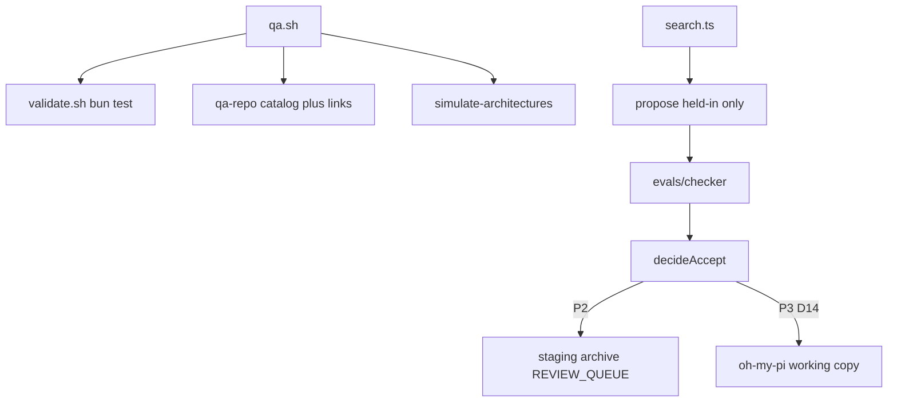

# Improveness — extensive internals

Companion to the main [README](../README.md). How the repo runs, every first-party module, and why the important files exist. Do not invent paths.

## Table of contents

- [1. How this repository runs](#1-how-this-repository-runs)
- [2. Package map](#2-package-map)
- [3. Packages](#3-packages)
- [4. Configuration](#4-configuration)
- [5. Tests and CI](#5-tests-and-ci)
- [6. Ideas worth understanding](#6-ideas-worth-understanding)
- [7. Further reading](#7-further-reading)
- [8. Future advancements](#8-future-advancements)

## 1. How this repository runs

There is no HTTP server. A maintainer (or CI) runs a Bun script on the filesystem.

**Walkthrough.** `bash harness/omp/scripts/qa.sh` is the product check. It runs `validate.sh` (unit tests, KERNEL needles, no public-TB2 URLs), then `qa-repo.ts` (13 catalog rows, relative links, 12/8 fixtures), then `simulate-architectures.ts` (seven named wirings, no API key).

A search step: pick a past playbook from `archive/`, score practice and hidden, propose a lesson only from failing **practice** ids, score again, keep if practice rose and hidden did not drop. P2 writes `staging/` + `archive/` + `REVIEW_QUEUE.md`. D14 says ordinary accepts should then mutate [`oh-my-pi/`](../oh-my-pi/). That apply driver is not shipped yet.

Optional live paths (`OMP_LIVE_SMOKE`, `OMP_LIVE_SEARCH`) skip without keys so forks stay green.

## 2. Package map

| Package | Path | Role | Entry |
|---------|------|------|-------|
| Improveness overlay | `harness/omp/` | Loop, checker, overlay files, QA | `bash harness/omp/scripts/qa.sh` |
| Working snapshot | `oh-my-pi/` | Agent being improved (D14) | Oh My Pi CLI / `createAgentSession` |
| Research corpus | `docs/` | Weng segments, methods, proposals | [`docs/00-index.md`](00-index.md) |
| Coding-config vendor | `vendor/cursor-config-coding/` | Skills/rules source; copied into `.cursor/` | [vendor README](../vendor/cursor-config-coding/README.md) |
| Root authority | repo root | Plan, ADRs, progress, human README | [`IMPLEMENTATION_PLAN.md`](../IMPLEMENTATION_PLAN.md) |

Generated noise (`oh-my-pi/node_modules`, lockfile internals) is not listed below.

## 3. Packages

### 3.1 Improveness overlay (`harness/omp/`)

**What it is for.** The self-improvement loop: playbook, traces, debugger/evolver agents, frozen checker, bounded search, CACD catalog, keyless architecture sims.

**How it is used.** CI and humans run `qa.sh`. Drivers are `bun harness/omp/drivers/<file>.ts`. Overlay files merge into `oh-my-pi/.omp/` via `install-overlay.sh`.

**How it works.** Contract files (`KERNEL.md`, `SURFACES.md`, `CACD.md`) say what may change. Drivers propose and score. The checker is a set of `check.sh` scripts, not an LLM judge. CACD catalog needles fail QA if a required sentence disappears.

#### File map — contract

| File | Why it is here | What it does |
|------|----------------|--------------|
| [`KERNEL.md`](../harness/omp/KERNEL.md) | Evolver-forbidden paths | Lists checker, `system-prompt.md`, `approval.ts`, Improveness QA |
| [`SURFACES.md`](../harness/omp/SURFACES.md) | Evolver-allowed paths | Playbook, tools, skills, snapshot loop after D14 |
| [`CACD.md`](../harness/omp/CACD.md) | Operating model | Contract · Architecture · Control · Delivery |
| [`cacd/catalog.ts`](../harness/omp/cacd/catalog.ts) | Machine checklist | 13 rows QA greps; includes `working snapshot` and `D14` |
| [`REVIEW_QUEUE.md`](../harness/omp/REVIEW_QUEUE.md) | Human checkpoint | Permission-widening; “no auto-apply” onto checker/upstream |
| [`archive/README.md`](../harness/omp/archive/README.md) | DGM-lite parent sampling | Snapshots + fitness; never archives the checker |

#### File map — overlay agents and playbook

| File | Why it is here | What it does |
|------|----------------|--------------|
| [`overlay/.omp/AGENTS.md`](../harness/omp/overlay/.omp/AGENTS.md) | Context, not kernel prompt | Points at PLAYBOOK.md; forbids `system-prompt` edits |
| [`overlay/.omp/playbook/PLAYBOOK.md`](../harness/omp/overlay/.omp/playbook/PLAYBOOK.md) | ACE memory | Lessons the solver scores |
| [`overlay/.omp/agents/debugger.md`](../harness/omp/overlay/.omp/agents/debugger.md) | Read-only diagnosis role | Pins `smol` + read/grep/glob |
| [`overlay/.omp/agents/evolver.md`](../harness/omp/overlay/.omp/agents/evolver.md) | Cheap writer role | Allowlisted edits; D14 apply after gate |

#### File map — drivers (19)

| File | Why it is here | What it does |
|------|----------------|--------------|
| `drivers/allowlist.ts` | Path policy | `assertEvolverWrite`; `KERNEL_PATH_MARKERS` |
| `drivers/curate-playbook.ts` | ACE curator | Append-only lessons; rejects secrets and SYSTEM.md advice |
| `drivers/playbook-solver.ts` | Measurable ACE | Unlocks `recipe:*` families on fixtures |
| `drivers/export-session.ts` | Weakness mining | Session jsonl → trace tree |
| `drivers/write-diagnosis.ts` | Debugger write | `diagnosis.md` under traces/reports only |
| `drivers/run-eval.ts` | Score a split | Starter vs gold trees |
| `drivers/self-harness.ts` | Accept rule | Practice up and hidden not down |
| `drivers/manifest.ts` | Candidate shape | Falsifiable record + rollback command |
| `drivers/apply-candidate.ts` | P2 apply | Writes **staging**, not `oh-my-pi/` |
| `drivers/rollback-candidate.ts` | Undo | Restore parent hash |
| `drivers/archive.ts` | Parent sampling | Snapshot + `sampleParent`; `isKernelRel` |
| `drivers/propose.ts` | Held-in-only | Throws if a hidden id is named |
| `drivers/search.ts` | Bounded loop | `MAX_STEP_CAP = 8`; stages (D12 as shipped) |
| `drivers/tb-export.ts` | Harbor shape | `instruction.md` + `tests/test.sh` |
| `drivers/run-tb-local.ts` | Local Harbor | Not a public TB2 download |
| `drivers/run-benchmark.ts` | Recorded 20-task run | 0/12→7/12, 0/8→3/8 after 5 steps |
| `drivers/qa-repo.ts` | Repo QA | Catalog + links + fixture counts |
| `drivers/simulate-architectures.ts` | Architecture sims | Seven named wirings, keyless |
| `drivers/live-session-smoke.ts` | Optional ping | Skip without keys |

#### File map — evals and scripts

| File | Why it is here | What it does |
|------|----------------|--------------|
| `evals/held-in/` (12) | Practice set | Improver may see these ids |
| `evals/held-out/` (8) | Hidden set | Leakage brake; `no-secrets` has no held-in member |
| `evals/checker/` | Frozen verifier | `check.sh` + gold trees; evolver must not write |
| `evals/tb-adapter/` | Local Harbor layout | Not public Terminal-Bench |
| `evals/benchmarks/local-20/` | Recorded report | Held-in/held-out after search |
| `evals/simulations/latest/` | Last sim report | Seven-row table |
| `scripts/validate.sh` | Fast gate | bun test + KERNEL greps + ripgrep |
| `scripts/qa.sh` | Full gate | validate + qa-repo + sims |
| `scripts/install-overlay.sh` | Merge overlay | Into existing `oh-my-pi/.omp/` |
| `tests/` (19 files, 55 cases) | Unit + contract | Includes CACD, search, allowlist, sims |

### 3.2 Working snapshot (`oh-my-pi/`)

**What it is for.** The coding agent Improveness is supposed to **change** after the gate (D14). Nested `.git` was stripped (D8). We do not push to `can1357/oh-my-pi`.

**How it is used.** Optional live smoke/search via `createAgentSession`. Overlay merges into `oh-my-pi/.omp/`. Frozen kernel files must stay clean in git.

**How it works.** Upstream Oh My Pi is a Bun monorepo. Improveness cares about `packages/coding-agent`: system prompt, tools (`approval.ts` is permission kernel), extension loader (activate without guaranteed unload), hidden `debugger`/`evolver` roles (D10). Other packages (`tui`, `hashline`, `ai`, …) are present because the snapshot is whole; they are not Improveness’s loop.

#### File map (kernel + extension gap only)

| File | Why it is here | What it does |
|------|----------------|--------------|
| `packages/coding-agent/src/prompts/system/system-prompt.md` | AHE: prompt-only missed the gain | Frozen; not an improvement surface |
| `packages/coding-agent/src/system-prompt.ts` | Assembles the prompt | Frozen |
| `packages/coding-agent/src/tools/approval.ts` | Permission kernel | Human checkpoint to widen |
| `packages/coding-agent/src/config/model-roles.ts` | Role map | Hidden debugger/evolver; evolver cannot redefine the map |
| `docs/extensions.md` | Extension API | Load/register; no Cordis-style unload |

Do not file-list the rest of `oh-my-pi/packages/`. It is a vendored snapshot, not Improveness source.

### 3.3 Research corpus (`docs/`)

**What it is for.** A maintainer-readable map of Weng’s survey plus method pages and change proposals.

**How it is used.** Start at [`00-index.md`](00-index.md). Proposals feed KERNEL/SURFACES. Method notes feed teaching READMEs.

**How it works.** Segments 01–09 follow Weng’s headings. `methods/` is one page per cited system. `proposals/` is the “what we add” track. `plans/` snapshots nawab contracts.

#### File map

| File | Why it is here | What it does |
|------|----------------|--------------|
| [`00-index.md`](00-index.md) | Reading order | Paper map + default recommendation |
| [`01-rsi-and-harness.md`](01-rsi-and-harness.md) … [`09-challenges-and-evals.md`](09-challenges-and-evals.md) | Survey segments | One Weng topic each |
| [`methods/README.md`](methods/README.md) | Method index | ACE, AHE, Self-Harness, Cordis, … |
| [`methods/spatiotemporal-composability.md`](methods/spatiotemporal-composability.md) | Live self-mod | Temporal + spatial composability |
| [`proposals/06-snapshot-apply.md`](proposals/06-snapshot-apply.md) | D14 product spec | Mutate the agent you are using |
| [`proposals/04-safety.md`](proposals/04-safety.md) | Kernel rules | Evaluator outside the loop |
| [`plans/p2-omp-overlay.md`](plans/p2-omp-overlay.md) | Historical P2 | Stage-only search |
| [`plans/p3-snapshot-apply.md`](plans/p3-snapshot-apply.md) | P3 snapshot | Pointer to live plan |
| [`references.md`](references.md) | Citation list | Papers and product links |
| [`EXTENSIVE.md`](EXTENSIVE.md) | This file | Internals companion |

### 3.4 Coding-config vendor (`vendor/cursor-config-coding/`)

**What it is for.** Portable Cursor skills/rules (D4). Project copies live under [`.cursor/skills/`](../.cursor/skills/nawab-plans/SKILL.md) so agents load them without replacing the git root.

**How it is used.** Agents read `.cursor/skills`. README work routes through [`readme`](../.cursor/skills/readme/SKILL.md) → `readable-readme` / `product-readme` / `extensive-readme`.

**How it works.** Upstream: [Vinayak-RZ/cursor-config-coding](https://github.com/Vinayak-RZ/cursor-config-coding). New README skills: `readme` (router), `readable-readme` (main human README), `extensive-readme` (this file), `product-readme` (landing page, unused here).

One line, not a file list: do not dump every GSAP/Spec Kit skill here.

### 3.5 Root authority (repo root)

**What it is for.** Nawab contract, ADRs, live status, human README.

**How it is used.** QA opens `IMPLEMENTATION_PLAN.md` and `DECISIONS.md` for catalog needles. Humans read [`README.md`](../README.md) first.

#### File map

| File | Why it is here | What it does |
|------|----------------|--------------|
| [`README.md`](../README.md) | Human overview | Readable-readme; links here |
| [`IMPLEMENTATION_PLAN.md`](../IMPLEMENTATION_PLAN.md) | Live P3 contract | Must contain `No public Terminal-Bench` and `working snapshot` |
| [`DECISIONS.md`](../DECISIONS.md) | ADRs D1–D14 | Catalog requires D7, D11–D14 |
| [`PROGRESS.md`](../PROGRESS.md) | Phase status | P3 Phase 0 done; apply driver pending |
| [`LEARNING.md`](../LEARNING.md) | Phase learnings | Including D14 + README split |
| [`PROJECT_OVERVIEW.md`](../PROJECT_OVERVIEW.md) | Scope one-pager | Snapshot apply vision |
| [`.env.example`](../.env.example) | Env inventory | Comments only; no secrets |
| [`.github/workflows/overlay.yml`](../.github/workflows/overlay.yml) | Improveness CI | Bun 1.3.14, ripgrep, `validate.sh` |

## 4. Configuration

Nothing is required for `qa.sh`. Full list: [`.env.example`](../.env.example).

| Variable | Required | Default | What it does |
|----------|----------|---------|--------------|
| `OMP_*` OAuth placeholders | no | unset | Oh My Pi desktop clients; never commit real values |
| `ANTHROPIC_API_KEY` / `OPENAI_API_KEY` / `OPENROUTER_API_KEY` | no | unset | Optional live ping |
| `OMP_LIVE_SMOKE` | no | unset | Set `1` to request a real session ping |
| `OMP_LIVE_SEARCH` | no | unset | Reserved live improver |
| `OMP_SNAPSHOT_ROOT` | no | `oh-my-pi/` | Working snapshot to mutate after the gate |

## 5. Tests and CI

| Tier | What | Command |
|------|------|---------|
| Fast | 19 files, 55 cases | `bun test harness/omp/tests/` |
| Overlay | locked-path greps, ≥20 tasks, no public-bench download URLs | `harness/omp/scripts/validate.sh` |
| Whole repo | 13 catalog rows, links, seven replays | `harness/omp/scripts/qa.sh` |
| Slow | real agent session | only if `OMP_LIVE_SMOKE=1` and a key |
| Not our gate | Oh My Pi’s heavy suite | do not run as the Improveness check |

CI ([`.github/workflows/overlay.yml`](../.github/workflows/overlay.yml)) installs ripgrep, then runs `qa.sh` (Bun 1.3.14). Without `rg`, gold trees fail.

Seven architecture sims (`simulate-architectures.ts`):

| Id | What we wired | Must happen | Practice | Hidden |
|----|---------------|-------------|----------|--------|
| `ace-only` | Slogans, no recipes | stay at zero | 0/12 | 0/8 |
| `self-harness-gated` | Five bounded steps | score goes up | 7/12 | 3/8 |
| `ahe-surfaces` | All practice lessons | score goes up; secrets stay locked | 12/12 | 6/8 |
| `held-out-leak` | Hidden name given to picker | refuse | — | — |
| `kernel-write` | Edit the grader | refuse | — | — |
| `unbounded-search` | 9 steps (cap is 8) | refuse | — | — |
| `auto-promote` | Write the grader or skip the gate | must refuse | — | — |

`auto-promote` means “no kernel / no skip-gate,” not a ban on gated snapshot apply (D14).

## 6. Ideas worth understanding

Main README teaches four ideas (wrapper, homework/exam, working snapshot, live unload). These extras live here.

### 6.1 Slogans are not lessons

**The problem.** A playbook rewritten into a shorter “system prompt” loses the details that help. A published ablation found prompt-only evolution **hurt** Terminal-Bench 2 by 2.3 points.

**How it works.** [`curate-playbook.ts`](../harness/omp/drivers/curate-playbook.ts) only appends or increments counters. [`playbook-solver.ts`](../harness/omp/drivers/playbook-solver.ts) scores tagged `recipe:*` families. The `ace-only` replay is a **passing** test of a **zero** score.

**Like.** “Cook well” vs “salt the pasta water.”

**Limits.** Unlocking every practice family reaches 12/12 and 6/8, still not 8/8 hidden, because secrets stay locked.

**Read next.** [ACE, arXiv:2510.04618](https://arxiv.org/abs/2510.04618). [AHE, arXiv:2604.25850](https://arxiv.org/abs/2604.25850).

### 6.2 Cheap writer, expensive doer

**The problem.** Frontier tokens are scarce. Using them to *write* extra files is a poor spend if a smaller model can write equally useful ones.

**How it works.** Lin et al.: **updating** (produce a useful extra file) is flat from 9B to frontier; **benefit** (follow that file) is not. Overlay [`evolver.md`](../harness/omp/overlay/.omp/agents/evolver.md) pins `@smol` (D6).

**Like.** A junior writes the checklist. A senior uses it on the real job.

**Limits.** Recorded scores here do not call a live improver.

**Read next.** [Harness Updating Is Not Harness Benefit](https://arxiv.org/abs/2605.30621).

### 6.3 Try the wiring before you buy tokens

**The problem.** Comparing “who may write, who may see the hidden set” on a live frontier run is slow and leaks the public set.

**How it works.** [`simulate-architectures.ts`](../harness/omp/drivers/simulate-architectures.ts) replays seven named designs against the frozen 20 tasks with no model.

**Like.** A crash-test dummy for the plumbing.

**Limits.** Does not replace a live agent run. This placement is local to `simulate-architectures.ts`. No external write-up yet.

## 7. Further reading

| Idea | Canonical source | What you will learn |
|------|------------------|---------------------|
| Harness vs weights | [Weng, Jul 2026](https://lilianweng.github.io/posts/2026-07-04-harness/) | Why near-term self-improvement is wrapper work |
| Harness-only coding gains | [can.ac, Feb 2026](https://blog.can.ac/2026/02/12/the-harness-problem/) | Same models, better edit format |
| Playbook memory | [ACE, arXiv:2510.04618](https://arxiv.org/abs/2510.04618) | Incremental context that does not collapse |
| Practice / hidden gate | [Self-Harness, arXiv:2606.09498](https://arxiv.org/abs/2606.09498) | Accept only if both splits hold |
| Tools not prompts | [AHE, arXiv:2604.25850](https://arxiv.org/abs/2604.25850) | 69.7→77.0; prompt-only −2.3 pp |
| Cheap evolver | [Updating ≠ benefit, arXiv:2605.30621](https://arxiv.org/abs/2605.30621) | Updating is flat; spend budget on the task agent |
| Snapshot vs upstream | [oh-my-pi#7907](https://github.com/can1357/oh-my-pi/issues/7907) | Upstream review; *your* copy is D14 |
| Live plugins | [Spatiotemporal composability](https://github.com/cordiverse/paper) | Unload must reverse effects |
| Holdout sets | [Wikipedia](https://en.wikipedia.org/wiki/Training,_validation,_and_test_data_sets) | Why a seen exam is worthless |

Related systems this repo uses or cites: [Oh My Pi](https://github.com/can1357/oh-my-pi), [agentic-harness-engineering](https://github.com/china-qijizhifeng/agentic-harness-engineering), [Cordis paper](https://github.com/cordiverse/paper), [DeepSeek Harness plugins](https://deepseek-harness.github.io/deepseek-harness/en/develop/framework/), [Terminal-Bench](https://www.tbench.ai/) (refused as fitness).

## 8. Future advancements

Same four bets as the main README, with extra operational detail.

### 8.1 Apply accepted edits to the working snapshot

**Why now.** [`search.ts`](../harness/omp/drivers/search.ts) still stages. [`apply-candidate.ts`](../harness/omp/drivers/apply-candidate.ts) writes staging only. D14 is the product.

**What would land.** `apply-snapshot.ts` (never `auto-apply.ts`) plus allowlist prefixes for snapshot tools/loop except frozen kernel rows.

**Done when.** Accept appears as a diff under `oh-my-pi/` (or `OMP_SNAPSHOT_ROOT`); kernel paths still throw; `qa.sh` green.

### 8.2 Live improver on a real session

**Why now.** [`OMP_LIVE_SEARCH`](../.env.example) is reserved. Need an honest D6 test.

**What would land.** Skip-gated `createAgentSession` with evolver allowlist.

**Done when.** One bounded live step with a key; `qa.sh` still passes with the flag unset.

### 8.3 Revertible plugins

**Why now.** OMP extensions load; they do not unload with invertibility ([`oh-my-pi/docs/extensions.md`](../oh-my-pi/docs/extensions.md)).

**What would land.** `ctx.effect`-style disposers or a thin Fiber loader. HMR: unload → load → apply.

**Done when.** One extension unload reverses tools and listeners without host restart; KERNEL files cannot unload.

### 8.4 Public Terminal-Bench as a report; wire live ping

**Why now.** [`run-tb-local.ts`](../harness/omp/drivers/run-tb-local.ts) is in-repo only. [`live-session-smoke.ts`](../harness/omp/drivers/live-session-smoke.ts) exits 1 when forced on without a session factory.

**What would land.** Report-only TB2 job; smoke wrapper that injects `createAgentSession` (`read`/`grep`/`glob` only).

**Done when.** `propose.ts` cannot see public-set URLs; with a key and `OMP_LIVE_SMOKE=1`, smoke prints a pong.
