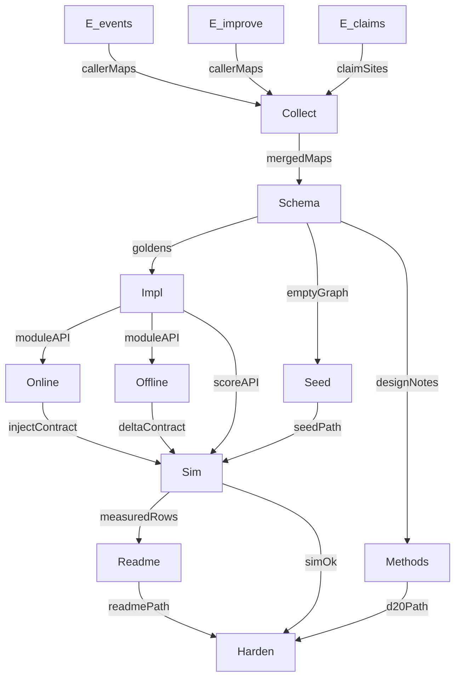

# Execution graph

> Materialized from nawab §19 on plan approval. Source: ingrained procedural order (nawab + graph-engineering). **Run immediately.**

---

## Metadata

| Field | Value |
|-------|-------|
| **Source plan** | Artifact `pg_graph_execution_8f13ec33.plan.md`; product contract [p4-procedural-graph.md](p4-procedural-graph.md) |
| **Objective** | Ingrain Procedural Graph order/conditions into the existing playbook, planning, `plan_step`, and improve loop — not a fourth section |
| **Topology mix** | diamond (explore) → chain (module) → fan-out (ingrain) → barrier (sim) → conditional (readme) → verify |
| **Graph-engineering** | named — this file is the runbook |

**Models:** high-value `cursor-grok-4.6-high`; extract `composer-2.5-fast`; transcription `composer-2.5`.

---

## Mermaid

---

## Nodes

| ID | Job | Input | Output | Type | Model | Write paths |
|----|-----|-------|--------|------|-------|-------------|
| E_events | Callers of emit / planningModule | `{ repoRoot }` | `{ hits[] }` | explore | composer-2.5-fast | none |
| E_improve | Callers of improveShort / propose / scorePlaybook | `{ repoRoot }` | `{ hits[] }` | explore | composer-2.5-fast | none |
| E_claims | Seven-sim / claim-honesty sites | `{ repoRoot }` | `{ hits[] }` | explore | composer-2.5-fast | none |
| Collect | Flatten dedupe | `hits[]` | `{ mergedMaps }` | lead | — | none |
| Schema+Impl | Goldens then procedure-graph.js | `{ mergedMaps, planSchema }` | `{ moduleAPI, testsPass }` | generalPurpose | cursor-grok-4.6-high | `plugins/dsh-improveness/src/procedure-graph.js`, `harness/omp/tests/procedure-graph.test.ts` |
| Seed | Empty Start graph | `{ schema }` | `{ seedPath }` | generalPurpose | composer-2.5 | `harness/omp/overlay/.omp/playbook/PROCEDURE_GRAPH.json` |
| Online | plan_step inject | `{ moduleAPI }` | `{ injectsOnPlanStep, suppressedWhenEventInjectOff }` | generalPurpose | cursor-grok-4.6-high | `events.js`, `templates.js`, `dsh-plugin.test.ts` |
| Offline | propose graph deltas | `{ moduleAPI }` | `{ proposeEmitsGraph, decideAcceptUnchanged }` | generalPurpose | cursor-grok-4.6-high | `improve-short.ts`, `propose.ts`, `search.ts`, tests |
| Methods | methods page | `{ planSchema }` | `{ methodsPath }` | generalPurpose | composer-2.5 | `docs/methods/**`, `docs/references.md`, `docs/00-index.md` |
| Sim | procedure eval + 8th sim | module+seed+contracts | `{ eightSimsPass, playbookSearchUnchanged }` | generalPurpose | cursor-grok-4.6-high | `evals/procedure/`, `simulate-architectures.ts` |
| Readme | README + ledger + D20 | `{ measuredRows }` | `{ readmePath, ledgerPath }` | generalPurpose | cursor-grok-4.6-high | README, CLAIM_LEDGER, DECISIONS, SURFACES |
| Verify | refute overclaim | `{ readmePath }` | `{ overclaims[] }` | explore | composer-2.5-fast | none |
| Harden | qa.sh | survivors | qa green | lead | cursor-grok-4.6-high | catalog/adjacent tests |

---

## Edges

| From | To | Data | Kind |
|------|----|------|------|
| E_* | Collect | `hits[]` | plumbing |
| Collect | Schema+Impl | `mergedMaps` | plumbing |
| Schema+Impl | Online, Offline, Sim | `moduleAPI` | agent |
| Schema+Impl | Seed | `emptyGraph` schema | plumbing |
| Online, Offline, Seed, Impl | Sim | contracts + seed + score | agent |
| Schema+Impl | Methods | `designNotes` | plumbing |
| Sim | Readme | `measuredRows` | agent |
| Sim, Methods, Readme | Harden | paths + simOk | verify |

---

## Waves

| Wave | Nodes | Fan-out? | Barrier? | Lead plumbing |
|------|-------|----------|----------|---------------|
| 0 | E_events, E_improve, E_claims | yes | no | — |
| 1 | Collect | no | yes — whole set | flatMap + dedupe `path+symbol` |
| 2 | Schema+Impl | no | yes | goldens then impl |
| 3 | Seed, Online, Offline, Methods | yes | no | — |
| 4 | Sim | no | yes | — |
| 5 | Readme | no | conditional on sim | skip if 12/8 drifted |
| 6 | Verify then Harden | verify fan-out | yes | qa.sh |

---

## Failure

- Thrown/empty Task → null, drop, continue the wave.
- Fan-in tolerates missing explore hits.
- Cycle unused. `seen` N/A.

---

## Commit mapping

| Node(s) | §9 row |
|---------|--------|
| Schema+Impl tests | 1 `test(procedure): golden localize and edit contracts` |
| Schema+Impl impl | 2 `feat(procedure): parse localize render and applyEdits` |
| Seed | 3 `feat(playbook): seed PROCEDURE_GRAPH.json` |
| Online | 4 `feat(planning): inject 2-hop procedure guidance` |
| Offline | 5 `feat(improve): propose procedure-graph deltas` |
| Sim | 6 `test(cacd): procedural-order architecture sim` |
| Methods | 7 `docs(methods): procedural-graph note` |
| Readme | 8 `docs(readme): name procedural order beside ACE` |
| Readme/D20 | 9 `docs(contract): SURFACES D20 IMPLEMENTATION_PLAN pointer` |
| Harden | 10 `chore(procedure): harden adjacent tests and qa catalog` |

Lead commits. Subagents do not.

---

## Approval implication

This file was written on nawab-plan approval. Graph execution starts at wave 0.
