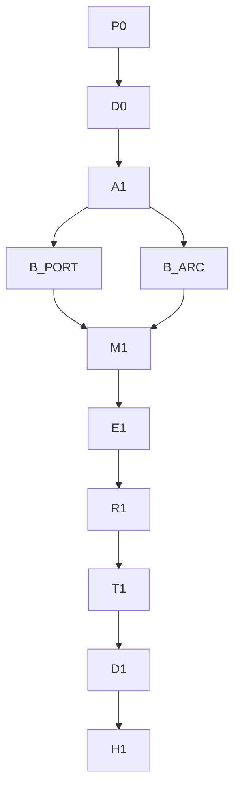

# Loop graph — TargetPort

> **This is the plan you read.** Loop plans are linked below.
>
> XOR: do not treat [EXECUTION_GRAPH.md](EXECUTION_GRAPH.md) as live for this wave.
>
> Scope: [p5-target-port.md](p5-target-port.md)  
> Gate 0: [../planning/GATE_0.md](../planning/GATE_0.md)

---

## Metadata

| Field | Value |
|-------|-------|
| **Scope plan** | [p5-target-port.md](p5-target-port.md) |
| **Objective** | Gate-improve domain kernels (ARC fixture) and any agentic system via TargetPort |
| **Topology mix** | chain (lock) → fan-out build → barrier integrate → tail E1→D1 |
| **Depth** | 2 |
| **Graph-of-loops** | named — live |
| **Graph-engineering** | not loaded (XOR) |
| **Branch** | `cursor/target-port-domain-kernels-eb86` |
| **Commit budget** | 8 |

---

## Loop plans

| ID | Name | Plan | Stop | Max rounds | Status |
|----|------|------|------|------------|--------|
| P0 | product lock | [loops/P0.md](loops/P0.md) | `rg -q '## User' docs/planning/PRODUCT.md && rg -q '## P0' docs/planning/PRODUCT.md` | 3 | pending |
| D0 | docs-in | [loops/D0.md](loops/D0.md) | `test -f docs/planning/GATE_0.md && test -f docs/methods/host-port.md` | 3 | pending |
| A1 | D21 ADR | [loops/A1.md](loops/A1.md) | `rg -q 'D21' DECISIONS.md` | 3 | pending |
| B_PORT | TargetPort | [loops/B_PORT.md](loops/B_PORT.md) | `test -f harness/omp/target-port/types.ts && test -f harness/omp/drivers/improve-target.ts` | 3 | pending |
| B_ARC | fixtures | [loops/B_ARC.md](loops/B_ARC.md) | `test -f harness/omp/targets/arc/manifest.json && test -f harness/omp/targets/generic-agentic/manifest.json` | 3 | pending |
| M1 | integrate | [loops/M1.md](loops/M1.md) | `rg -q 'TargetPort' harness/omp/SURFACES.md` | 3 | pending |
| E1 | evaluate | [loops/E1.md](loops/E1.md) | `bun test harness/omp/tests/target-port.test.ts` | 3 | pending |
| R1 | boot | [loops/R1.md](loops/R1.md) | `test -f docs/planning/R1_BOOT.md && rg -q 'improve-target' docs/planning/R1_BOOT.md` | 3 | pending |
| T1 | trials | [loops/T1.md](loops/T1.md) | `test -f docs/planning/T1_TRIALS.md && rg -c '| pass |' docs/planning/T1_TRIALS.md` | 3 | pending |
| D1 | docs-out | [loops/D1.md](loops/D1.md) | `rg -q 'TargetPort' README.md` | 3 | pending |
| H1 | harden | [loops/H1.md](loops/H1.md) | `bash harness/omp/scripts/qa.sh` | 3 | pending |

---

## Lifecycle

| Stage | Node id(s) | Plan / N/A |
|-------|------------|------------|
| Research + questions | R0 | lead (done → GATE_0.md) |
| Product lock | P0 | [loops/P0.md](loops/P0.md) |
| Docs-in | D0 | [loops/D0.md](loops/D0.md) |
| Architecture | A1 | [loops/A1.md](loops/A1.md) |
| Design / UI UX | U1 | N/A — no user-facing surface (CLI only) |
| Build | B_PORT, B_ARC | links |
| Integrate | M1 | [loops/M1.md](loops/M1.md) |
| Evaluate | E1 | [loops/E1.md](loops/E1.md) |
| Run | R1 | [loops/R1.md](loops/R1.md) |
| Trials | T1 | [loops/T1.md](loops/T1.md) |
| Docs-out | D1 | [loops/D1.md](loops/D1.md) |
| Harden | H1 | [loops/H1.md](loops/H1.md) |

---

## Mermaid

Edges cut: no U1 (no UI). B_PORT and B_ARC share no write paths after types exist — B_ARC consumes the manifest schema from B_PORT; if executed by one lead they are sequential. Fake edge "then README" cut until T1 evidence.

---

## Nodes

| ID | Job | Plan | Stop | Maker | Checker | Max rounds | Write paths |
|----|-----|------|------|-------|---------|------------|-------------|
| P0 | Product lock | [P0](loops/P0.md) | rg headings | inherit | inherit | 3 | `docs/planning/PRODUCT.md` |
| D0 | Docs-in gaps | [D0](loops/D0.md) | files exist | inherit | inherit | 3 | `docs/planning/GATE_0.md` |
| A1 | D21 | [A1](loops/A1.md) | rg D21 | inherit | inherit | 3 | `DECISIONS.md` |
| B_PORT | TargetPort | [B_PORT](loops/B_PORT.md) | files exist | inherit | inherit | 3 | `harness/omp/target-port/**`, `harness/omp/drivers/improve-target.ts`, `harness/omp/drivers/self-harness.ts`, `harness/omp/drivers/allowlist.ts` |
| B_ARC | Fixtures | [B_ARC](loops/B_ARC.md) | manifests | inherit | inherit | 3 | `harness/omp/targets/**` |
| M1 | Surfaces | [M1](loops/M1.md) | rg TargetPort | inherit | inherit | 3 | `harness/omp/SURFACES.md`, `harness/omp/KERNEL.md`, `harness/omp/CACD.md`, `harness/omp/cacd/catalog.ts`, `docs/methods/**` |
| E1 | Tests | [E1](loops/E1.md) | bun test | inherit | inherit | 3 | `harness/omp/tests/target-port.test.ts` |
| R1 | Boot CLI | [R1](loops/R1.md) | R1_BOOT | inherit | inherit | 3 | `docs/planning/R1_BOOT.md` |
| T1 | Trials | [T1](loops/T1.md) | T1_TRIALS | inherit | inherit | 3 | `docs/planning/T1_TRIALS.md` |
| D1 | README | [D1](loops/D1.md) | rg README | inherit | inherit | 3 | `README.md`, `docs/EXTENSIVE.md`, `docs/CLAIM_LEDGER.md` |
| H1 | qa.sh | [H1](loops/H1.md) | qa.sh | inherit | inherit | 3 | `PROGRESS.md`, `IMPLEMENTATION_PLAN.md` |

---

## Edges

| From | To | Data name | Kind |
|------|----|-----------|------|
| P0 | D0 | product lock | plumbing |
| D0 | A1 | gap list | plumbing |
| A1 | B_PORT | D21 contract | agent |
| A1 | B_ARC | kind enum | plumbing |
| B_PORT | M1 | TargetPort API | agent |
| B_ARC | M1 | fixture paths | plumbing |
| M1 | E1 | wired types | verify |
| E1 | R1 | tests green | verify |
| R1 | T1 | boot log | plumbing |
| T1 | D1 | trial log | agent |
| D1 | H1 | claim sites | verify |

---

## Waves

| Wave | Nodes | Fan-out? | Barrier? | Status | Lead plumbing |
|------|-------|----------|----------|--------|---------------|
| 0 | P0, D0 | no | no | pending | — |
| 1 | A1 | no | no | pending | — |
| 2 | B_PORT then B_ARC | no | no | pending | sequential (schema then fixtures) |
| 3 | M1 | no | yes | pending | — |
| 4 | E1 | no | no | pending | — |
| 5 | R1, T1 | no | no | pending | — |
| 6 | D1 | no | no | pending | — |
| 7 | H1 | no | yes | pending | qa.sh |

---

## Failure

- Checker fail + rounds left → remake from findings.
- `max_rounds` exhausted → escalated.
- Lead executes Stop commands (no nested Tasks in this worker).

---

## Commit mapping

| Node | Plan | §9 rows | Gate |
|------|------|---------|------|
| P0 D0 | plans | #2 | files |
| A1 B_PORT B_ARC E1 | code | #3 | bun test |
| M1 | docs contract | #4 | catalog |
| R1 T1 | logs | #6 | logs filled |
| D1 | readme | #5 | grep |
| H1 | qa | #7 | qa.sh |

---

## Approval implication

User default-approved. Execution starts immediately.
