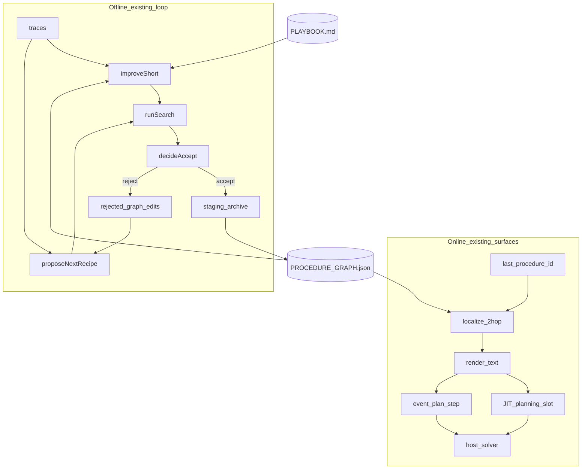
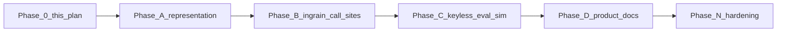

# Procedural order in the existing harness loop — Master Execution Plan

> Nawab master plan — entire feature execution in one document.
> **Mode:** feature
> After approval, pointer lands in [`IMPLEMENTATION_PLAN.md`](../../IMPLEMENTATION_PLAN.md); live status in [`PROGRESS.md`](../../PROGRESS.md); ADR as **D20** in [`DECISIONS.md`](../../DECISIONS.md).
> Do **not** overwrite the D15 product contract. This plan is a child wave.

Paper: Lu, Chen, Wu, Arık. [*Procedural Graphs: Self-Evolving Execution Structures for LLM Agents*](https://arxiv.org/abs/2609.09153) (Google / Georgia Tech / Peking, 8 Sep 2026). HF: https://huggingface.co/papers/2609.09153

---

## §0 Plan metadata

| Field | Value |
|-------|-------|
| **Mode** | feature |
| **Stack** | Bun overlay loop (`harness/omp/`) + Node DeepSeek plugin (`plugins/dsh-improveness`) + product README. No new runtime, no new package, no new env section flag. |
| **Base branch** | `main` |
| **Feature branch(es)** | `cursor/procedural-graph-plan-5809` (this plan). Execution continues on the same branch after approval, or a follow-up `cursor/procedural-order-5809` if this PR is plan-only. |
| **Authority docs** | [`DECISIONS.md`](../../DECISIONS.md) D15–D19 · [`harness/omp/KERNEL.md`](../../harness/omp/KERNEL.md) · [`harness/omp/SURFACES.md`](../../harness/omp/SURFACES.md) · [`docs/CLAIM_LEDGER.md`](../CLAIM_LEDGER.md) · this file |
| **Estimated commits** | **10** (major backend feature, one loop + product docs — not a new package) |
| **Lead agent** | Orchestrate, commit, integrate, PR. No parallel writers on the same files. |

---

## §1 North star & scope boundary

### Objective

Ingrain the Procedural Graph *principles* — typed order, conditions, and pitfalls, localized to “where the agent is,” evolved from success/failure traces, committed only through the existing Self-Harness gate — into the harness loop we already run, so the product is less “free-form agentic” and more procedurally coherent, without adding a fourth disableable section.

### What “ingrained” means (product law)

| They have | We already have | Ingrain as |
|-----------|-----------------|------------|
| `(procedure, relation, procedure)` + edge attributes | ACE bullets in `PLAYBOOK.md` | A **sibling graph file in the same playbook directory**. Same surface family. Different merge semantics (topology ≠ helpful/harmful counters). |
| Localize active node + 2-hop guidance | JIT `planning` `{ steps, budget }` + event `plan_step` | Planning slot carries `active` + rendered neighborhood. `plan_step` injects procedure guidance, not only a tool reminder. |
| Offline refiner Add/Delete/Update | `improveShort` / `proposeNextRecipe` / `runSearch` | Those functions also emit graph edits. **Same** `decideAccept`. |
| Validation gate + rejection memory | Held-in/held-out + archive/staging | Gate unchanged (stricter than the paper). Persist rejected *graph* edits next to existing search reports so the next propose sees them. |
| Soft bias, not a state machine | Playbook as context, not `SYSTEM.md` | Guidance is injected prose. The solver may ignore it. We do **not** hard-block tool calls from the graph. |

**Not a section.** No `IMPROVENESS_PG`. No Get-started flag. No `improveness.pg.*` tool group. Absence of the graph file (or empty `{ nodes: [], edges: [] }`) = today’s behavior. That is the unstrap.

### Deliverables

- Pure graph module (parse, localize 2-hop, deterministic render, apply Add/Delete/Update, structural validate, score a procedure trajectory).
- Seed `PROCEDURE_GRAPH.json` next to `PLAYBOOK.md`.
- Online: planning-slot params + `plan_step` inject of rendered neighborhood.
- Offline: `improveShort` and `proposeNextRecipe` may propose graph-file deltas; `runSearch` stages them like playbook files.
- Keyless `evals/procedure/` trajectories + an eighth architecture sim `procedural-order` (flat playbook cannot unlock order-sensitive paths; graph edges can).
- Product mention in `README.md` Core techniques, next to JIT / ACE / AHE — **not** a new Get-started section.
- `docs/methods/procedural-graph.md`, references row, `00-index` pointer, D20, claim-ledger row.

### Non-goals

- A fourth D16/D17 section or env flag.
- A second evolution engine, second checker, or MCTS (AFlow stays deferred).
- Guidance LLM on the hot path in P0 (paper’s extra call). P0 render is deterministic text.
- Matching last Cordis tool name (`bash`, `edit`, `grep`) as a graph node. Nodes are **procedure ids**.
- Changing the frozen **12 / 8** fixture inventory or the `0/12 → 7/12`, `0/8 → 3/8` playbook-search numbers.
- Claiming the paper’s BFCL / EnterpriseArena / ALFWorld numbers.
- Public Terminal-Bench as fitness.
- Training a guidance/refiner model; new npm/Bun dependency; new `packages/improveness-*`.
- Hard-enforcing the graph (rejecting tool calls that are off-edge). Soft bias only.
- Rewriting ACE into a graph. Bullets stay bullets.

### Priority

| Priority | Items |
|----------|-------|
| **P0** | Schema + localize/render/edit; seed file; planning + `plan_step`; improve/propose/search ingest the graph file; keyless procedure eval + `procedural-order` sim; README + methods + D20 + claim ledger; `qa.sh` green; 12/8 numbers unchanged |
| **P1** | Optional guidance LLM (same model route as solver, not a section); live-trace refiner (LLM ΔG from exported sessions); OMP HostPort catalog copy of procedure inject; mid-session graph hot-reload |

---

## §2 Prerequisites & blockers

| Item | Status | Blocks | Resolution |
|------|--------|--------|------------|
| User direction: ingrained, not a section; README mention with JIT/ACE/AHE | **done** | — | This plan |
| Paper read + overlay loop mapped | **done** | — | §4 / §11 |
| Plan approval (planning.mdc) | **pending** | Phase A code | Human approve this document |
| Frozen 12/8 + seven-sim README claims | done (constraint) | Any fixture add | Do **not** touch `held-in` / `held-out` inventory. New eval lives under `evals/procedure/` |
| Strong-release live DSH / live Taste row | open (unrelated) | Not this wave | Do not block PG on API keys |
| No new runtime deps | done | — | Stdlib JSON + existing Bun test |

**Hard rule:** no Phase A file edits until this plan is approved.

---

## §3 Authority & artifact map

| Document | Path | Role |
|----------|------|------|
| This plan | `docs/plans/p4-procedural-graph.md` | Execution contract for the wave |
| D15 product contract | `IMPLEMENTATION_PLAN.md` | Read-only until approval; then add a child-wave pointer only |
| ADRs | `DECISIONS.md` | Writable: append **D20** after approval, not before first feat commit |
| Progress | `PROGRESS.md` | Writable after Phase A starts |
| Kernel | `harness/omp/KERNEL.md` | Read-only to the evolver forever. Maintainer may add one sentence: graph files are playbook-class, not kernel. |
| Surfaces | `harness/omp/SURFACES.md` | Writable: playbook directory now includes the graph file. **Do not** add a D16 section row. |
| Claim ledger | `docs/CLAIM_LEDGER.md` | Writable: new keyless row + forbid paper bench numbers |
| Paper map | `docs/00-index.md`, `docs/methods/README.md`, `docs/references.md` | Writable |
| Product landing | `README.md` | Writable: one Core-techniques bullet + acknowledgements cite. No new flag block. |
| Spec Kit | `.specify/` | **N/A** — not a greenfield spec; nawab feature mode only |

**Read-only to subagents and to the evolver:** checker, `qa.sh`, `validate.sh`, plugin bundle internals except the new `procedure-graph.js` + event/planning call sites, `oh-my-pi/packages/**`, 12/8 fixture trees.

**Writable (execution):** listed deliverable paths in §4.

---

## §4 Architecture & system map

### Why this is not a port

The paper freezes ReAct and evolves \(G\). We freeze the checker and evolve the **harness**. Putting their graph *beside* ACE, scored by *our* gate, injected by *our* `plan_step`, proposed by *our* short/long improve, is the product move. A standalone “PG section” would repeat ModelTaste’s strap pattern where it is not needed: there is nothing to unstrap except deleting a JSON file.

### How a step looks after this wave

```text
trajectory last procedure id
        │
        ▼
 localize(id, G) ──► 2-hop neighborhood (or Start / empty)
        │
        ▼
 render(neighborhood)     deterministic markdown
        │                 (condition / guidance / pitfalls)
        ├─► planning slot params (JIT, session)
        └─► <improveness-procedure-guidance> on plan_step
                    │
                    ▼
              solver (unchanged)   soft bias

offline, same loop as today:

 traces ──► improveShort / propose
              │
              ├─ ACE delta     → PLAYBOOK.md
              └─ graph ΔG      → PROCEDURE_GRAPH.json
                    │
                    ▼
              decideAccept(held-in, held-out)
                    │
          accept ──► stage / archive   (playbook-class)
          reject ──► rejected-edit memory for next propose
```



### Target layout (files that will exist)

```text
plugins/dsh-improveness/src/procedure-graph.js   # pure: parse, localize, render, applyEdits, score
plugins/dsh-improveness/src/modules/templates.js # planning params gain active + guidance
plugins/dsh-improveness/src/events.js            # plan_step also injects procedure guidance
harness/omp/overlay/.omp/playbook/PROCEDURE_GRAPH.json
harness/omp/drivers/procedure-score.ts           # thin Bun wrapper over the JS module
harness/omp/evals/procedure/                     # keyless trajectories — NOT 12/8
harness/omp/drivers/improve-short.ts             # also curate graph
harness/omp/drivers/propose.ts                   # may emit graph file
harness/omp/drivers/simulate-architectures.ts    # + procedural-order
docs/methods/procedural-graph.md
docs/plans/p4-procedural-graph.md                # this file
```

**Ponytail:** one pure JS module in the plugin (Node can import it; Bun already imports `plugins/dsh-improveness/src/*`). No `packages/improveness-procedure`. No JSONL method unless a call site cannot import the file — today none can’t.

### Schema (P0, frozen for the wave)

```text
G = { version: 1, nodes: Node[], edges: Edge[] }

Node = { id: string, kind: "procedure" | "reason" | "state" }
Edge = { from, rel, to, condition, guidance, pitfalls }

rel ∈ { leads_to, requires, enables, extracts }
```

- `id` is a **procedure** id: `search`, `read_evidence`, `edit`, `verify`, `recipe:readme-h1`, or a `plan_step` name. Never `bash` / `edit` the Cordis tool as the only identity.
- Empty graph is valid. `localize` on unknown id → node `Start` if present, else empty neighborhood (render no-ops). Paper’s “dump the full graph” fallback is **rejected** (token blow-up on coding traces).
- Hop radius \(h = 2\), trajectory window unused in P0 render (render is graph-local only).
- Cycles: `applyEdits` may produce them; `structuralValidate` warns but does **not** auto-rewrite. Ponytail: no cycle-repair engine.

### Online inject contract

Existing `plan_step` reminder stays. Additional sibling inject, same event, same `eventInject` flag (already exists):

```text
<improveness-procedure-guidance>
active: read_evidence
next: edit (leads_to) — condition: hits are in context
pitfalls: do not write before the read lands
</improveness-procedure-guidance>
```

If `IMPROVENESS_EVENT_INJECT=0`, tool reminders **and** procedure guidance stay off. That is reuse, not a new flag.

### Offline edit contract

`ΔG` operations, same as the paper, applied in-process:

| Op | Payload |
|----|---------|
| `add-node` | `Node` |
| `delete-node` | `id` (also drops incident edges) |
| `add-edge` | `Edge` |
| `delete-edge` | `{ from, rel, to }` |
| `update-edge` | delete + add with new attributes (paper’s attribute rewrite) |

`improveShort` today: trajectory `LESSON:` → ACE bullet. After: if the trajectory also has `PROCEDURE:` lines (`id` per step) and `passed: false`, propose `add-edge` / `update-edge` pitfalls from the last illegal or repeated step. If no `PROCEDURE:` lines, skip graph (today’s ACE-only path). No LLM in P0.

`proposeNextRecipe` today: append a recipe family string. After: when the next family has a declared prerequisite in a small in-module table (e.g. order-sensitive procedure fixtures only — **not** the 12/8 map), also add that `requires` / `leads_to` edge. 12/8 search scores stay string-inclusion.

`decideAccept` **does not change**. Graph file is another staged playbook-class path.

### Trust boundaries

- Graph JSON is untrusted overlay content. Parse fails closed (empty graph + log reason), never throw through the host solver.
- Curator / propose still refuse secret-shaped strings in `guidance` / `pitfalls` (reuse `SECRET_RE` from `curate-playbook.ts`).
- Evolver cannot write `evals/checker/`, 12/8 trees, `plugins/dsh-improveness/` bundle except via maintainer commits in this wave.
- Soft bias: no permission change, no tool deny list derived from \(G\).

---

## §5 Workstreams

| ID | Name | Owns paths | Depends on | Lead / subagent |
|----|------|------------|------------|-----------------|
| WS-A | Ingrain the loop | `procedure-graph.js`, planning/events, improve/propose/search, `evals/procedure/`, sim | Plan approved | lead |
| WS-B | Product narrative | methods, references, README, CLAIM_LEDGER, D20, SURFACES, IMPLEMENTATION_PLAN pointer | WS-A sim exists so claims are true | lead (after commit 6) |

### WS-A — Ingrain the loop

- **Objective:** Order and conditions exist as data and flow through the surfaces we already ship.
- **Phases:** A, B, C
- **Integration:** Plugin + Bun drivers share one JS module. Search/improve treat the graph as a playbook-class file.

### WS-B — Product narrative

- **Objective:** Cite the paper the way we cite JIT-Agent / ACE / AHE: named technique, honest limit, no new section.
- **Integration:** README Core techniques + acknowledgements; methods page; claim ledger. Get-started flag table **unchanged**.

---

## §6 Agent orchestration & subagent spawn map

> See `.cursor/skills/nawab-plans/SUBAGENT_ORCHESTRATION.md`.

| ID | Trigger | Type | readonly | Task | Sync point | Gate |
|----|---------|------|----------|------|------------|------|
| S1 | Phase N | explore | true | Adjacent callers of `plan_step`, `improveShort`, `scorePlaybook`, `ARCHITECTURE_SIMULATIONS` for missed tests | Before hardening commit | — |
| S2 | Phase N (optional) | — | — | `ponytail-review` / `ponytail-audit` by **lead** (skills, not Task subagents unless user asks Bugbot) | Hardening | `qa.sh` |

**No implementation subagents.** One writer. File overlap across plugin + drivers is the whole point of “ingrained.”

### Spawn S1 — adjacent-caller map

```text
Full Repository Path: /workspace
Workstream: WS-A
Task: List every caller of createEventBus.emit, improveShort, proposeNextRecipe, scorePlaybook, ARCHITECTURE_SIMULATIONS, planningModule. Name tests that must gain an assertion.
Authority: docs/plans/p4-procedural-graph.md §4, harness/omp/SURFACES.md
Return: bullet list of paths + whether a test already covers the new branch
Do NOT: edit files, expand scope, add a section flag
```

**Parallel limit:** 1 (S1 only, and only in Phase N).  
**File ownership:** lead owns every writable path in §4.

---

## §7 Phase map & dependencies



| Phase | Objective | Workstreams | Commits | Depends on | Exit gate |
|-------|-----------|-------------|---------|------------|-----------|
| 0 | Research + this plan | — | plan commit (done in planning turn) | — | Human approval |
| A | Schema, localize, render, edits | WS-A | 1–3 | Approval | `bun test` on new graph tests |
| B | Planning, events, improve, propose | WS-A | 4–5 | A | `dsh-plugin` + `improve` + `search` tests |
| C | Procedure eval + 8th sim | WS-A | 6 | B | sim + procedure tests; 12/8 scores unchanged |
| D | Methods, D20, README, ledger | WS-B | 7–9 | C (claims must be true) | claim-honesty still green |
| N | Hardening | all | 10 | D | `bash harness/omp/scripts/qa.sh` |
| Cutover | N/A — no consumer switch | — | — | N | merge after review |

---

## §8 Todo registry

```yaml
todos:
  - id: phase-0-approval
    content: "Human approves docs/plans/p4-procedural-graph.md"
    status: pending
  - id: phase-a-contract
    content: "Phase A: golden fixtures for parse/localize/render/edits"
    status: pending
  - id: phase-a-module
    content: "Phase A: procedure-graph.js + seed JSON + allowlist"
    status: pending
  - id: phase-b-online
    content: "Phase B: planning slot + plan_step procedure inject"
    status: pending
  - id: phase-b-offline
    content: "Phase B: improveShort + propose emit graph deltas"
    status: pending
  - id: phase-c-sim
    content: "Phase C: evals/procedure + procedural-order sim; 12/8 untouched"
    status: pending
  - id: phase-d-methods
    content: "Phase D: methods page, D20, references, 00-index"
    status: pending
  - id: phase-d-readme
    content: "Phase D: README Core techniques + CLAIM_LEDGER"
    status: pending
  - id: phase-n-hardening
    content: "Phase N: SURFACES/KERNEL/qa catalog + qa.sh"
    status: pending
  - id: subagent-s1-explore
    content: "Spawn S1: adjacent caller map before hardening"
    status: pending
```

---

## §9 Commit matrix

> One row = one commit. Tests in the same commit. Gates = repo commands.
> Work class: major backend feature on an existing loop → **10** rows. Do not pad.

### Phase A — Representation (WS-A)

| # | WS | Commit | Contents | Tests (same commit) | Gate | Agent |
|---|-----|--------|----------|---------------------|------|-------|
| 1 | A | `test(procedure): golden localize and edit contracts` | `harness/omp/tests/procedure-graph.test.ts` written first: parse empty/invalid, 2-hop, unknown-id → empty, applyEdits, secret-shaped attribute rejected. Tests fail until commit 2. | file exists, assertions named | `bun test harness/omp/tests/procedure-graph.test.ts` (expected fail) | lead |
| 2 | A | `feat(procedure): parse localize render and applyEdits` | `plugins/dsh-improveness/src/procedure-graph.js` | commit 1 tests pass | same bun test | lead |
| 3 | A | `feat(playbook): seed PROCEDURE_GRAPH.json` | Seed sibling under `overlay/.omp/playbook/`; allowlist treats it as playbook-class; curator path check still `playbook/` | allowlist / overlay validate still pass | `bash harness/omp/scripts/validate.sh` | lead |

**Phase A gate:** graph unit tests green; empty seed does not change `scorePlaybook` on 12/8.

### Phase B — Ingrain call sites (WS-A)

| # | WS | Commit | Contents | Tests (same commit) | Gate | Agent |
|---|-----|--------|----------|---------------------|------|-------|
| 4 | A | `feat(planning): inject 2-hop procedure guidance` | `planningModule` params: `active`, `guidance`; `events.js` `plan_step` appends procedure block when graph has a match; reuse `eventInject` | `dsh-plugin.test.ts` cases for inject + `IMPROVENESS_EVENT_INJECT=0` still suppresses both | `bun test harness/omp/tests/dsh-plugin.test.ts` | lead |
| 5 | A | `feat(improve): propose procedure-graph deltas` | `improve-short.ts` reads `PROCEDURE:` steps; `propose.ts` may add an edge file alongside PLAYBOOK; `search.ts` stages `PROCEDURE_GRAPH.json` like playbook | `improve.test.ts`, `search.test.ts` | those two bun test files | lead |

**Phase B gate:** existing search still `0/12 → 7/12` / `0/8 → 3/8` on the frozen split.

### Phase C — Keyless eval + sim (WS-A)

| # | WS | Commit | Contents | Tests (same commit) | Gate | Agent |
|---|-----|--------|----------|---------------------|------|-------|
| 6 | A | `test(cacd): procedural-order architecture sim` | `evals/procedure/` (success path vs skip-verify path); `scoreProcedure`; eighth sim: flat playbook **fails** order trajectories, graph with `leads_to` **passes**; `ARCHITECTURE_SIMULATIONS` grows by one | `simulate-architectures.test.ts` (update “seven” → eight) | `bun harness/omp/drivers/simulate-architectures.ts` + sim test | lead |

**Phase C gate:** eight sims pass; playbook local-20 numbers unchanged.

### Phase D — Product narrative (WS-B)

| # | WS | Commit | Contents | Tests (same commit) | Gate | Agent |
|---|-----|--------|----------|---------------------|------|-------|
| 7 | B | `docs(methods): procedural-graph note and D20` | `docs/methods/procedural-graph.md`, methods README row, `docs/references.md`, `docs/00-index.md` pointer, `DECISIONS.md` D20 | none (docs) | files exist; no “SOTA” | lead |
| 8 | B | `docs(readme): name procedural order beside ACE` | README Core techniques bullet; acknowledgements cite; CLAIM_LEDGER keyless row; field-guide sentence if one line fits | claim-honesty if it greps README | `bash harness/omp/scripts/qa.sh` claim-honesty subset or full qa | lead |
| 9 | B | `docs(contract): SURFACES and IMPLEMENTATION_PLAN pointer` | SURFACES playbook row; KERNEL one-liner (graph is not kernel); IMPLEMENTATION_PLAN child-wave blurb; PROGRESS current phase | none | docs only | lead |

### Phase N — Validation

| # | WS | Commit | Contents | Tests (same commit) | Gate | Agent |
|---|-----|--------|----------|---------------------|------|-------|
| 10 | all | `chore(procedure): harden adjacent tests and qa catalog` | S1 findings; qa-repo catalog if it hard-codes “seven”; README “seven” → “eight” **only** where the sim count is the claim | full `qa.sh` | `bash harness/omp/scripts/qa.sh` | lead |

---

## §10 Test & CI strategy

| Tier | Purpose | Trigger | Command |
|------|---------|---------|---------|
| Fast | graph unit + plugin + improve + search | every commit 2–6 | `bun test harness/omp/tests/procedure-graph.test.ts harness/omp/tests/dsh-plugin.test.ts harness/omp/tests/improve.test.ts harness/omp/tests/search.test.ts` |
| Medium | architecture sims + overlay validate | commits 6, 8, 10 | `bun harness/omp/drivers/simulate-architectures.ts` · `bash harness/omp/scripts/validate.sh` |
| Slow | full product check | Phase N + PR | `bash harness/omp/scripts/qa.sh` |

### CI workflow map

| Job | Trigger | Command |
|-----|---------|---------|
| `overlay.yml` | PR / main | existing overlay QA (includes `qa.sh`) |

**Test locations:** `harness/omp/tests/*.test.ts` (Bun). Procedure goldens: `harness/omp/evals/procedure/`.  
**Contract-first:** commit 1 before commit 2.  
**Invariant tests (must stay green):**

- `scorePlaybook` 12/8 unlock counts unchanged on seed playbook and on the existing search sim.
- `IMPROVENESS_JIT=0` / `IMPROVENESS_IMPROVE=0` / `IMPROVENESS_EVENT_INJECT=0` / `IMPROVENESS_TASTE=0` matrices unchanged — **no new flag** in the matrix.
- Empty graph ⇒ no procedure inject (events log has no `procedure-guidance`).

**Subagents** run no tests except S1 (none). Lead runs gates.

---

## §11 Research log & decisions

### Research brief (paper vs repo)

| Paper mechanism | Repo today | Gap |
|-----------------|------------|-----|
| Attributed directed graph | ACE list + linear recipe families | No typed `requires` / `leads_to`, no pitfalls on transitions |
| Localize + 2-hop | Event inject by tool id; planning is a list | No “you are here” in procedure space |
| Guidance LLM | Playbook dump / tool reminder | Extra call; we skip in P0 |
| Offline topology edits | File deltas on PLAYBOOK / plugins | Same loop, wrong payload |
| Val score ≥ previous | `decideAccept` held-in **and** held-out | **Keep ours** (stricter) |
| Rejection memory | Archive + search rounds | Persist rejected graph ΔG explicitly |
| Start from skeleton | Seed PLAYBOOK slogans | Seed empty/minimal graph |
| Discrete tools (Search, Fundraise) | `bash` mega-tool | Procedure ids, not tool names |

Related in-corpus (not this paper): ACE ([methods/ace.md](../methods/ace.md)), AWM-like recipes in `playbook-solver.ts`, AFlow deferred ([methods/aflow.md](../methods/aflow.md)), AutoGuide-ish inject ([methods/tool-catalog.md](../methods/tool-catalog.md)), Self-Harness gate ([methods/self-harness.md](../methods/self-harness.md)), AHE “playbook-only is a zero” (`ace-only` sim).

Skills used while planning: `nawab-plans`, `ponytail`, `learn-while-building`, `system-design-tradeoffs`, `agentic-system-design`, `product-readme` (README bullet only; landing type already product).

## Trade-off: section vs ingrained representation

**Decision:** Ingrain into playbook + planning + events + improve. No fourth section.

**Option A:** Fourth section `IMPROVENESS_PG` — Pros: independent unstrap; README symmetry with Taste. Cons: user rejected; implies a product surface we do not need; more flags to test.

**Option B:** Ingrained — Pros: one loop, one gate, absence-of-file unstrap; matches “order is a property of evolution, not a feature toggle.” Cons: harder to find in `inspect.sections` (document under playbook / planning instead).

**Default:** B because the user set the product law and ponytail forbids a flag nobody will flip independently of Improve.

**Override:** `PRIORITY = SIMPLICITY`

## Trade-off: graph file vs ACE bullets

**Decision:** Sibling `PROCEDURE_GRAPH.json` in the playbook directory.

**Option A:** Encode edges as ACE bullets — Pros: one file, existing curator. Cons: two merge semantics in one regex; topology edits become slogan increments; `unlockedFamilies` string-includes would false-positive.

**Option B:** Sibling JSON — Pros: parseable; edits are Add/Delete; ACE stays ACE. Cons: two files on one surface.

**Default:** B. “Ingrained” means one *loop*, not one *file format*.

**Override:** `PRIORITY = CONSISTENCY` (ACE merge rules stay deterministic)

## Trade-off: guidance LLM vs deterministic render

**Decision:** P0 deterministic render; P1 optional LLM.

**Option A:** Paper’s Ψ every step — Pros: situational prose. Cons: tokens, non-keyless CI, second failure mode.

**Option B:** Template render of condition/guidance/pitfalls — Pros: keyless, cheap, testable. Cons: less “situational.”

**Default:** B for P0. Autonomy default in agentic-system-design: do not add a model call to prove a data structure.

**Override:** `PRIORITY = COST`

## Trade-off: 12/8 vs parallel procedure eval

**Decision:** Do not touch 12/8. New `evals/procedure/`.

**Option A:** Add order fixtures to held-in/held-out — Pros: one solver. Cons: breaks frozen inventory and README numbers.

**Option B:** Parallel keyless trajectories — Pros: claim-honest; search regression stays measurable.

**Default:** B. `PRIORITY = CONSISTENCY`

## Trade-off: tool-name nodes vs procedure ids

**Decision:** Procedure ids only.

**Option A:** Node = last tool name — Pros: trivial Match. Cons: `bash` is every procedure; paper’s localization collapses.

**Option B:** Node = procedure / plan_step / recipe id — Pros: order is meaningful. Cons: traces must emit `PROCEDURE:` (improve-short already has a LESSON convention).

**Default:** B. `PRIORITY = QUALITY`

| Topic | Options | Choice | Source / skill | Record in |
|-------|---------|--------|----------------|-----------|
| Product shape | Section vs ingrained | Ingrained | user + ponytail | D20 |
| Store | ACE bullets vs JSON sibling | JSON sibling in playbook/ | ACE merge vs topology | D20 |
| Guidance | LLM vs render | Render P0 | agentic-system-design / COST | D20 |
| Fitness | Extend 12/8 vs procedure eval | Parallel eval | CLAIM_LEDGER | D20 |
| Localization | Tool name vs procedure id | Procedure id | paper §3.2 + coding reality | D20 |
| Enforce | Hard block vs soft bias | Soft bias | paper §3.2 + AHE | D20 |

---

## §12 Documentation & artifact sync

| Event | Update |
|-------|--------|
| Plan written | this file (done) |
| Plan approved | `IMPLEMENTATION_PLAN.md` child-wave pointer; `PROGRESS.md` phase = Procedural order; D20 in `DECISIONS.md` (commit 7) |
| Phase A–C complete | `PROGRESS.md`; optional `docs/plans/PHASE_A_COMPLETION.md` only if a phase surprises (do not require four empty reports) |
| Arch choice | D20 only — do not spawn extra ADRs |
| README / claims | commit 8; `docs/CLAIM_LEDGER.md` |
| Methods | `docs/methods/procedural-graph.md` + index + `docs/references.md` + `docs/00-index.md` |
| Cutover | PR body; PROGRESS complete |

**README bullet (draft, product-readme voice — commit 8, edit only if the sim is real):**

> **Procedural order (ingrained).** ACE bullets say *what we learned*. A sibling procedure graph says *what is admissible next, under which condition, and what usually fails*. Same improve loop, same Self-Harness gate — not a fourth section. Inspired by [Procedural Graphs](https://arxiv.org/abs/2609.09153); we do not run their guidance model or their benches. Limit: keyless order sim only until a live coding row exists.

**Get-started flag table:** do not add a row.

**Acknowledgements:** add the arXiv cite next to ACE / AHE / JIT-Agent.

---

## §13 Quality gates & checkpoints

| Gate | When | Command / checklist | Blocks |
|------|------|---------------------|--------|
| Plan approved | before commit 1 code | human | Phase A |
| Phase A | after commit 3 | graph tests + validate.sh; 12/8 seed still 0/12 0/8 | Phase B |
| Phase B | after commit 5 | dsh-plugin + improve + search; search sim numbers unchanged | Phase C |
| Phase C | after commit 6 | eight sims pass; procedure eval distinguishes flat vs graph | Phase D |
| Phase D | after commit 9 | no SOTA; no TB-as-fitness; no new section flag in README | Phase N |
| PR / hardening | commit 10 | `bash harness/omp/scripts/qa.sh` | merge |

### Human checkpoints

- [ ] Approve this plan (required).
- [ ] Approve README wording at commit 8 if the drafted bullet is tightened (optional; lead may ship the draft as-is).

---

## §14 Validation & hardening

### Repo walkthrough

1. Static: no `IMPROVENESS_PG`; no import of `oh-my-pi/packages`; no secrets in seed graph; no 12/8 fixture edits.
2. Fast → medium → `qa.sh`.
3. Adjacent: `qa-repo.ts` catalog strings (“seven”), README proof block, `CACD.md` if it names sim count, `simulate-architectures.test.ts`.
4. Lead `ponytail-review` on the diff: reject a guidance-LLM helper, a new package, a section flag, or a second search driver.
5. Spec Kit: N/A.
6. Expand tests only for S1 gaps.
7. Manual: none required (keyless). Live DSH optional and **not** this wave’s exit.

### Orchestrator

`bash harness/omp/scripts/qa.sh` (existing):

```text
1. overlay validate.sh
2. CACD / qa-repo
3. architecture simulations (now eight)
4. ModelTaste + fit-suite
5. import-graph fence
6. section disable matrix (still JIT / Improve / Taste / eventInject only)
```

---

## §15 Rollout & cutover

N/A — no consumer switch, no profile recipe change, no default-off flag. Shipping is merge to `main` after `qa.sh`. Existing installs pick up the seed graph as an overlay playbook file; empty edges change nothing.

Rollback: revert the wave’s commits. Absence of `PROCEDURE_GRAPH.json` is a valid older overlay.

---

## §16 Exit criteria

### P0 (must pass)

- [ ] `procedure-graph.js` localizes 2-hop and applies Add/Delete/Update; invalid JSON → empty graph
- [ ] Seed graph lives under `overlay/.omp/playbook/`; allowlisted; not kernel
- [ ] Planning slot can carry rendered guidance; `plan_step` injects it when `eventInject` is on
- [ ] `IMPROVENESS_EVENT_INJECT=0` suppresses procedure inject
- [ ] `improveShort` / `proposeNextRecipe` can emit graph deltas; `decideAccept` unchanged
- [ ] `evals/procedure/` + `procedural-order` sim prove flat playbook ≠ ordered graph
- [ ] Frozen 12/8 inventory and playbook-search numbers unchanged
- [ ] No `IMPROVENESS_PG` / no new Get-started flag
- [ ] README names the technique beside JIT / ACE / AHE; claim ledger has a keyless row; paper benches forbidden
- [ ] `bash harness/omp/scripts/qa.sh` exits 0
- [ ] D20 recorded; IMPLEMENTATION_PLAN pointer; PROGRESS current

### P1 (defer ok)

- [ ] Guidance LLM
- [ ] Live-session LLM refiner
- [ ] OMP HostPort inject parity
- [ ] Live coding-agent measured row

---

## §17 Risks & contingencies

| Risk | Likelihood | Impact | Mitigation | Contingency |
|------|------------|--------|------------|-------------|
| Graph becomes ACE-with-XML (only attributes, no topology) | med | high | Sim requires an *edge* to pass; slogan-only graph fails | Fix score, do not add LLM |
| Localization on tool names collapses to `bash` | med | high | Schema + tests forbid treating raw tool ids as the only node key | Map via `plan_step` / `PROCEDURE:` |
| 12/8 numbers drift | low | high | No writes under `evals/held-in`, `held-out`; CI asserts local-20 | Revert fixture touch |
| Token blow-up if we fallback to full graph | med | med | Unknown id → empty, not full dump | Keep empty fallback |
| README overclaim (paper benches) | med | high | Claim ledger forbid row; claim-honesty | Delete numbers |
| Second engine / section creeps in | med | med | Ponytail review in Phase N; this plan’s non-goals | Delete the flag/package |
| Soft bias ignored by strong models | med | low | Acceptable; paper is also soft. Order still helps weaker / long traces | P1 guidance LLM |
| Strong-release live keys still missing | high | none for this wave | Do not couple | Leave STRONG_RELEASE RED |

---

## §18 Execution protocol

```text
1. Load this plan + nawab-plans; ponytail on every edit
2. Wait for §13 plan approval — do not start commit 1 until then
3. Clear no other blockers
4. For each phase in §7:
   a. Sync §8 todos (one in_progress)
   b. Spawn S1 only in Phase N
   c. For each §9 row: implement → test → gate → commit → push
      (one row per commit — never squash rows)
   d. Phase gate → PROGRESS.md (short). Completion notes only if something slipped
   e. Human checkpoint only if README wording is contested
5. Phase N: S1 → qa.sh → commit 10
6. §15 N/A
7. Verify §16 P0 → mark PR ready if user asked; otherwise leave draft
```

---

## Open questions

None that block execution. Defaults above stand unless the user overrides `PRIORITY`.

Optional (do not stall Phase A):

- Prefer a different seed graph than empty + `Start`? Default: `{ version: 1, nodes: [{ id: "Start", kind: "state" }], edges: [] }`.

---

## Approval

**Mode:** feature  
Plan ready for review. Approve to begin **Phase A** (commit 1 — failing goldens).  
Lead agent follows **§18 Execution protocol**.

This planning turn delivered the contract only. No loop code has been changed.
