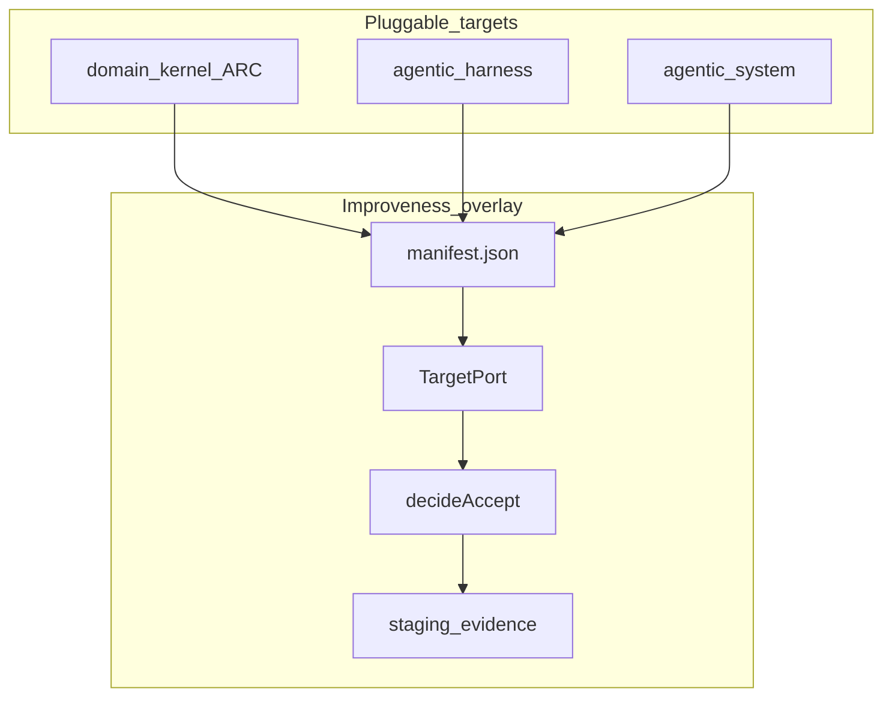
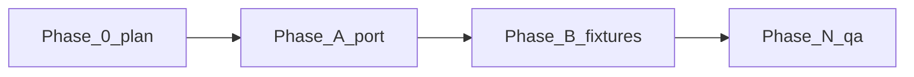

# P5 — TargetPort: improve domain kernels and any agentic system

Nawab **project** profile. Delivery: this file (do not replace the D15 contract in root `IMPLEMENTATION_PLAN.md`). Graph-of-loops: [LOOP_GRAPH.md](LOOP_GRAPH.md). Gate 0: [../planning/GATE_0.md](../planning/GATE_0.md). Product lock: [../planning/PRODUCT.md](../planning/PRODUCT.md).

---

## §0 Plan metadata

| Field | Value |
|-------|-------|
| **Profile** | project |
| **Mode** | feature |
| **Stack** | Bun + TypeScript overlay (`harness/omp/`) |
| **Base branch** | `main` |
| **Feature branch(es)** | `cursor/target-port-domain-kernels-eb86` |
| **User commit budget** | **8** |
| **Delivery** | repo `docs/plans/p5-target-port.md` |
| **Supersedes** | none (D15/D20 remain) |
| **Authority docs** | DECISIONS D7–D20, KERNEL.md, SURFACES.md, ARC README (external) |
| **Estimated commits** | 8 |
| **Lead agent** | this worker (loops executed lead-only; nested Tasks unavailable) |

---

## §1 North star & scope boundary

### Objective

Improveness can gate-improve a **domain kernel** (ARC as the motivating adapter) and any **agentic harness or agentic system** via a thin TargetPort, reusing `decideAccept`.

### Deliverables

- `harness/omp/target-port/` (types, manifest loader, improve driver)
- `harness/omp/targets/arc/` fixture + `generic-agentic/` fixture
- `bun harness/omp/drivers/improve-target.ts`
- D21 ADR + method note + README bullet
- Keyless tests

### Non-goals

- Vendor ARC; DSH as Arc runtime; public TB fitness; ninth architecture sim; weight training; kernel JIT

### Priority

| Priority | Items |
|----------|-------|
| **P0** | TargetPort, ARC fixture, generic agentic fixture, decideAccept reuse, tests |
| **P1** | Live `ARC_ROOT` eval, extra kernels, durable apply onto external trees |

---

## §2 Prerequisites & blockers

| Item | Status | Blocks | Resolution |
|------|--------|--------|------------|
| Coding-config pin 45a585d (graph-of-loops) | done | planning | commit 7508569 |
| ARC checkout in CI | missing | live gold | P1; fixture stands in |
| Nested maker/checker Tasks | unavailable | inner-loop spawn | lead runs Stop commands |

---

## §3 Authority & artifact map

| Document | Path | Role |
|----------|------|------|
| Gate 0 | `docs/planning/GATE_0.md` | Answers |
| Product lock | `docs/planning/PRODUCT.md` | P0 |
| This plan | `docs/plans/p5-target-port.md` | Scope |
| Loop graph | `docs/plans/LOOP_GRAPH.md` | Execute |
| D15 contract | `IMPLEMENTATION_PLAN.md` | Unchanged needles |
| ADRs | `DECISIONS.md` | D21 added |
| ARC (external) | https://github.com/Vinayak-RZ/ARC | Motivating kernel |

---

## §4 Architecture & system map



### Target layout

```text
harness/omp/target-port/     # types + loader + improve
harness/omp/targets/<id>/    # manifest + frozen eval + editable surfaces
harness/omp/drivers/improve-target.ts
```

### Trust boundaries

- Frozen prefixes are not writable by the evolver (kernel fence).
- Held-out ids never reach the proposer.
- Secrets stay env-only.
- External `ARC_ROOT` is optional; writes stay in Improveness staging unless a human later widens apply.

---

## §5 Workstreams

| ID | Name | Owns paths | Depends on | Lead / subagent |
|----|------|------------|------------|-----------------|
| WS-A | Config already shipped | `vendor/`, `.cursor/` | — | lead |
| WS-B | TargetPort | `harness/omp/target-port/`, `drivers/improve-target.ts`, allowlist | Gate 0 | lead |
| WS-C | Fixtures | `harness/omp/targets/` | WS-B types | lead |
| WS-D | Docs/catalog | DECISIONS, methods, README, CACD | WS-B/C tests | lead |

### WS-A — cursor config

Already committed.

### WS-B — TargetPort

Reuse `decideAccept`. New `assertTargetWrite`. Do not stretch HostPort.

### WS-C — Fixtures

ARC-shaped kernel + generic agentic-system. No ARC vendor.

### WS-D — Docs

D21, method page, README technique + limit, catalog needles.

---

## §6 Agent orchestration & subagent spawn map

N/A — lead executes §9 sequentially. Graph-of-loops maker/checker Tasks are collapsed to lead + Stop commands because this worker cannot spawn nested Tasks.

**Parallel limit:** 1 writer  
**File ownership:** lead owns all write paths

---

## §7 Phase map & dependencies



| Phase | Objective | Workstreams | Commits | Depends on | Exit gate |
|-------|-----------|-------------|---------|------------|-----------|
| 0 | Plan artifacts | all | 1 | config pin | files exist |
| A | TargetPort + tests | WS-B, WS-C | 1–2 | 0 | `bun test harness/omp/tests/target-port.test.ts` |
| B | Docs/catalog | WS-D | 1 | A | catalog needles |
| N | qa.sh | all | 1 | A,B | `bash harness/omp/scripts/qa.sh` |
| Cutover | N/A | — | — | — | N/A — library/CLI overlay, no consumer cutover |

---

## §8 Todo registry

```yaml
todos:
  - id: gate-0
    content: "Gate 0 defaults recorded"
    status: completed
  - id: phase-0-plan
    content: "Nawab + loop graph on disk"
    status: in_progress
  - id: phase-a-port
    content: "TargetPort + fixtures + tests"
    status: pending
  - id: phase-b-docs
    content: "D21 + README + catalog"
    status: pending
  - id: phase-n
    content: "qa.sh green"
    status: pending
```

---

## §9 Commit matrix

**User commit budget (from §0):** **8**

| # | WS | Commit | Contents | Tests (same commit) | Gate | Agent |
|---|-----|--------|----------|---------------------|------|-------|
| 1 | A | `chore(cursor): sync coding config to 45a585d` | vendor + `.cursor` | n/a | files exist | lead (done) |
| 2 | all | `docs(plan): TargetPort nawab + loop graph` | GATE_0, PRODUCT, p5, LOOP_GRAPH, loops | n/a | `test -f docs/plans/LOOP_GRAPH.md` | lead |
| 3 | B,C | `feat(target-port): gate improve for any agentic target` | port, ARC + generic fixtures, CLI, tests | `target-port.test.ts` | bun test that file | lead |
| 4 | D | `docs(target-port): D21 ADR and surfaces` | DECISIONS D21, methods, KERNEL/SURFACES, catalog | catalog | qa-repo needles | lead |
| 5 | D | `docs(readme): TargetPort technique` | README + EXTENSIVE + ledger | n/a | grep TargetPort README | lead |
| 6 | all | `test(target-port): boot and trial log` | R1_BOOT, T1_TRIALS | CLI run | files filled | lead |
| 7 | N | `chore(qa): TargetPort catalog and qa green` | leftover catalog/CI | `qa.sh` | qa.sh | lead |
| 8 | spare | coalesce leftovers | — | — | — | lead |

---

## §10 Test & CI strategy

| Tier | Purpose | Trigger | Command |
|------|---------|---------|---------|
| Fast | TargetPort unit | every PR | `bun test harness/omp/tests/target-port.test.ts` |
| Medium | overlay | PR | `bash harness/omp/scripts/validate.sh` |
| Slow | whole repo | PR | `bash harness/omp/scripts/qa.sh` |

**Test locations:** `harness/omp/tests/target-port.test.ts`  
**Contract-first:** fixtures + decideAccept before README claims

---

## §11 Research log & decisions

| Topic | Options | Choice | Source / skill | Record in |
|-------|---------|--------|----------------|-----------|
| Port vs HostPort | stretch / sibling | sibling TargetPort | HELIX, ponytail | D21 |
| ARC in-tree | vendor / fixture | fixture + ARC_ROOT later | ARC Apache-2.0 | D21 |
| Optimizer | GEPA/DSPy / decideAccept | reuse decideAccept | ACE/Self-Harness already here | D21 |
| Graph skill XOR | graph-engineering / graph-of-loops | graph-of-loops | user named it | GATE_0 |
| Kernel design | capability registry + frozen grader | fixture encodes that | ARC ARCHITECTURE.md | GATE_0 |

Actionable paper takeaways (not a dump):

- **Weng / Self-Harness:** keep held-in vs held-out; grader outside the loop.
- **ACE:** evolve playbooks, not slogans — TargetPort editable surfaces are playbook/skill/recipe files.
- **AHE:** do not make system-prompt the only surface; ARC’s `unchecked` / recipes are the analog of tools.
- **HELIX:** thin adapter; do not wrap ARC in Cordis.
- **GEPA/DSPy:** text-feedback optimizers; we already have traces + `decideAccept` — do not add a second optimizer.
- **How kernels are made (ARC):** host owns the loop; kernel owns capabilities, providers, gold, honest labels. Improveness adds the **improve gate** over kernel-owned files.

---

## §12 Documentation & artifact sync

| Event | Update |
|-------|--------|
| Plan compiled | this file + LOOP_GRAPH.md |
| D21 | DECISIONS.md |
| Behavior | README Core techniques, EXTENSIVE 3.x, methods/target-port.md |
| Phase done | PROGRESS.md, PHASE notes under docs/planning |

---

## §13 Quality gates & checkpoints

| Gate | When | Command / checklist | Blocks |
|------|------|---------------------|--------|
| Plan on disk | Phase 0 | `test -f docs/plans/LOOP_GRAPH.md` | Phase A |
| Unit | Phase A | `bun test harness/omp/tests/target-port.test.ts` | docs claims |
| QA | Phase N | `bash harness/omp/scripts/qa.sh` | PR |

### Human checkpoints (optional)

- None this graph (user: execute with defaults). Frozen physics still forbids auto-apply onto live ARC.

---

## §14 Validation & hardening

### Repo walkthrough

1. No writes to checker / DSH bundle / OMP packages
2. Fast tests then qa.sh
3. Adjacent: HostPort tests still pass
4. ponytail: no new package, no GEPA port
5. N/A speckit — not a runtime feature
6. Regression: 12/8 inventory unchanged
7. Manual: CLI `--help` + two `--target` runs

### Orchestrator

`bash harness/omp/scripts/qa.sh`

---

## §15 Rollout & cutover

N/A — overlay feature; no consumer cutover. Install path remains `dsh plugin --profile improveness add ./plugins/dsh-improveness`. TargetPort is an additional CLI.

---

## §16 Exit criteria

### P0 (must pass)

- [ ] TargetPort kinds include domain-kernel, agentic-harness, agentic-system
- [ ] ARC fixture improve path uses `decideAccept`
- [ ] Kernel write denied
- [ ] generic-agentic target works
- [ ] `qa.sh` green
- [ ] README names the boot command

### P1 (defer ok)

- [ ] Live ARC_ROOT eval
- [ ] Apply onto external ARC working tree after human flag

---

## §17 Risks & contingencies

| Risk | Likelihood | Impact | Mitigation | Contingency |
|------|------------|--------|------------|-------------|
| ARC API drift | med | low | fixture is the contract | remap manifest |
| HostPort confusion | med | med | D21 + method page | docs only |
| Catalog needles miss D21 | low | CI red | add needles same commit | fix |
| Over-building GEPA | low | high | ponytail non-goal | delete |

---

## §18 Execution protocol

§19 is filled as **graph-of-loops**. Do not run linear §18 as the primary loop. Lead still owns git, gates, PROGRESS, PR. Inner maker/checker Tasks collapse to lead + Stop commands in this worker.

---

## §19 Execution graph

**Skill:** graph-of-loops (XOR: graph-engineering not loaded).

The plan you read: [LOOP_GRAPH.md](LOOP_GRAPH.md). Loop plans are linked from that file.

Approving this graph starts execution immediately.
