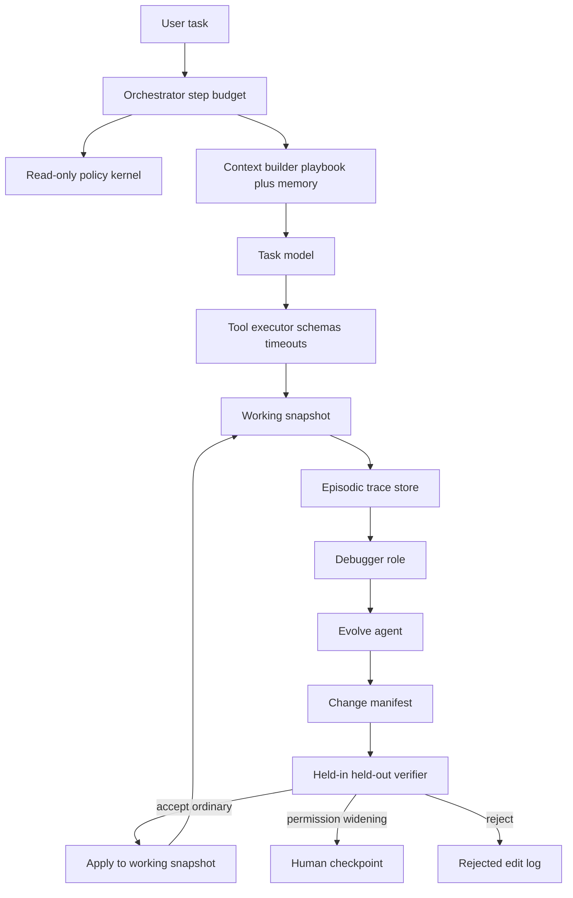

# Target architecture (any harness)

This is the loop to **specify**, then run against a working snapshot. Patterns: Supervisor + workers, ReAct with a step cap, gated apply to the snapshot, human-in-the-loop for permission-widening, episodic traces on disk (`agentic-system-design`).

## Roles

| Role | Job | Model tier |
|------|-----|------------|
| Task agent | Solve user/eval tasks under the current harness | Strongest you can afford |
| Debugger | Distill traces → per-task reports + overview | Mid/small (`smol`) |
| Evolver | Propose bounded file edits + a manifest | Mid/small is enough ([updating ≠ benefit](../methods/updating-vs-benefit.md)) |
| Verifier | Score held-in / held-out; never writable by evolver | Deterministic tests / harness-external judge |
| Apply | Write accepted ordinary edits onto the working snapshot | Deterministic driver (D14) |
| Human | Permission/network/destructive widening; never required for ordinary tool/skill/loop patches | — |

## Layers

| Layer | Owns |
|-------|------|
| Orchestrator | Step budget, which role runs, when to stop |
| Policy kernel | Permissions, model id, token budget, verifier paths — **read-only** |
| Context builder | ACE playbook + memory files + progressive disclosure |
| Tool executor | Timeouts, schemas, audit log |
| Trace store | One directory per rollout; messages + tool I/O + verifier outcome |
| Working snapshot | The agent being improved (`oh-my-pi/` or a user-supplied tree) |
| Editable surface | Snapshot tools/skills/orchestration/loop **except** kernel files; overlay playbook |

## What this is not

- Not a fork that pushes to OMP, OpenCode, Codex, or Claude Code upstream.
- Not a weight-update loop ([08](../08-joint-optimization.md)).
- Not DGM/AlphaEvolve until fitness is cheap and objective ([05-adoption-order.md](05-adoption-order.md)).
- Not “evidence forever in a review queue.” That was the P2 driver lag.

OMP instantiation: [02-omp-gap-analysis.md](02-omp-gap-analysis.md). Product: [06-snapshot-apply.md](06-snapshot-apply.md). Generic capability list: [01-generic-harness.md](01-generic-harness.md). Safety: [04-safety.md](04-safety.md).
